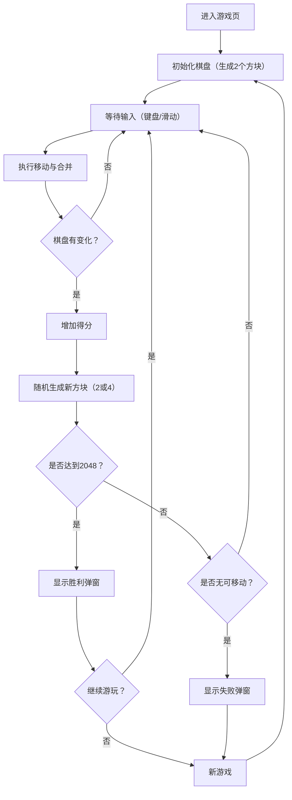

## 1. 产品概览
一个可在浏览器中游玩的 2048（4×4）小游戏：键盘/触摸滑动控制方块移动并合并，目标合成 2048，包含计分、最佳分保存、胜负提示与一键重开。

## 2. 核心功能

### 2.1 用户角色（如适用）
不区分角色，无登录。

### 2.2 功能模块
1. **游戏页（/）**：棋盘游玩、计分与最佳分、开始新游戏、胜负提示与继续游玩。

### 2.3 页面详情
| 页面名称 | 模块名称 | 功能描述 |
|---|---|---|
| 游戏页 | 顶部信息栏 | 显示标题、当前分数、最佳分数；提供 New Game 按钮 |
| 游戏页 | 棋盘区域 | 4×4 网格与方块；移动/合并动画；不可移动时反馈 |
| 游戏页 | 操作层 | 键盘方向键控制；移动端滑动控制；可选的方向按钮 |
| 游戏页 | 弹窗/提示 | 达成 2048 提示“胜利”；无可移动提示“失败”；提供继续或重开 |
| 游戏页 | 持久化 | 保存最佳分到 localStorage；可选保存当前局面用于刷新恢复 |

## 3. 核心流程
玩家打开页面，系统生成初始棋盘（2 个方块），玩家通过输入进行移动合并，系统计算得分并在有效移动后生成新方块；达到 2048 时提示胜利；无法移动时提示失败；玩家可重开或继续。

## 4. 用户界面设计
### 4.1 设计风格
- 主色：深墨绿/黑青（背景），辅色：米白/羊皮纸（面板），强调色：琥珀橙（关键按钮/高分）
- 风格关键词：复古终端 + 纸质说明书质感（细颗粒噪点、压印边框、低饱和）
- 按钮：轻微浮雕与按压反馈，圆角但不“糖果化”
- 字体：标题用更具性格的衬线/展示字体，正文与数字用等宽或紧致无衬线（后续以实际可用字体为准，避免通用模板观感）
- 布局：上方信息栏 + 中央棋盘 + 底部提示；内容居中但允许不对称细节（例如角标/版本号/快捷键提示）
- 图标：lucide-react，线性图标，统一笔画

### 4.2 页面设计概览
| 页面名称 | 模块名称 | UI 元素 |
|---|---|---|
| 游戏页 | 顶部信息栏 | 标题、分数卡片（当前/最佳）、New Game 主按钮、状态提示（Won/Lost） |
| 游戏页 | 棋盘区域 | 4×4 网格底板、方块（根据数值映射颜色/阴影/数字排版）、出现/合并动效 |
| 游戏页 | 操作与提示 | “方向键/滑动”提示、可选方向按钮、触摸设备提示 |
| 游戏页 | 弹窗 | 半透明遮罩、结果文案、继续/重开按钮、ESC 关闭（可选） |

### 4.3 响应式
- 桌面优先：棋盘约 420–520px 的视觉尺寸，分数与按钮同一行
- 移动端：棋盘自适应缩放，按钮改为堆叠；强化触摸滑动；防止页面滚动干扰

### 4.4 3D 场景指导（如适用）
不适用

