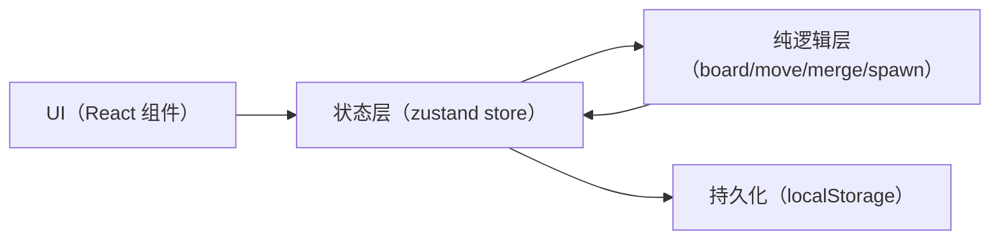

## 1. 架构设计
前端单页应用，核心逻辑使用纯函数模块实现（可测试、与 UI 解耦），UI 层通过 zustand 管理状态与动作分发；无后端、无外部服务依赖（除字体资源可选）。

## 2. 技术说明
- Frontend: React@18 + TypeScript + Vite + TailwindCSS
- State: zustand（集中管理 board/score/status 等）
- Testing: Vitest（对 `src/utils` 的纯逻辑做单测）
- Backend: None
- Data: localStorage（bestScore，及可选的当前局面快照）

## 3. 路由定义
| Route | Purpose |
|---|---|
| / | 游戏页：2048 主界面与游玩交互 |

## 4. API 定义（如有后端）
不适用

## 5. 服务端架构图（如有后端）
不适用

## 6. 数据模型（如适用）
### 6.1 数据模型定义
游戏数据为内存状态 + localStorage 持久化，不需要关系模型。建议的 TypeScript 形态：
- `board: number[]`（长度 16，0 表示空格）
- `score: number`
- `bestScore: number`
- `status: "playing" | "won" | "lost"`

### 6.2 数据定义语言
不适用

