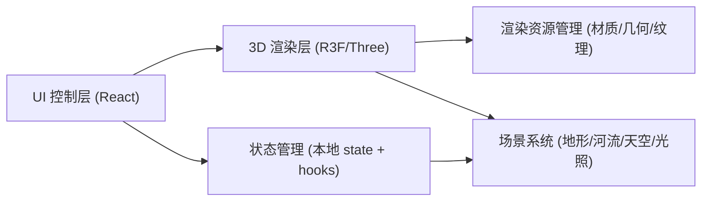

## 1. Architecture Design

## 2. Technology Description
- Frontend: React@18 + TypeScript + vite
- 3D: three + @react-three/fiber + @react-three/drei
- Postprocessing: @react-three/postprocessing（可按性能降级）
- Styling: CSS Modules 或 Vanilla CSS（用 CSS 变量管理主题与透明度）
- Initialization Tool: vite-init
- Backend: None
- Assets: 不依赖外部 3D 资源；程序化生成地形与河流；字体可用 Google Fonts（本地缓存）

## 3. Route Definitions
| Route | Purpose |
|-------|---------|
| / | 全屏 3D 山脉场景与控制面板 |

## 4. API Definitions (if backend exists)
无后端。

## 5. Server Architecture Diagram (if backend exists)
无后端。

## 6. Data Model (if applicable)
无持久化数据模型。仅包含运行时参数（时间、等高线开关/密度、雾强度、画质设置）。

## 7. Key Implementation Notes
- 地形：使用程序化高度场（多频噪声 + 断层函数/坡度掩膜）生成 BufferGeometry；顶点法线重算以获得平滑光照
- 悬崖：在特定区域引入高度突变与法线锐化；或用坡度阈值混合岩壁材质
- 河流：沿样条曲线生成带宽度的河道网格；水面使用自定义 ShaderMaterial（流动 UV、菲涅耳高光、深浅色混合）
- 等高线：方案 A（优先）：在片元着色中基于高度值生成周期线条并叠加；方案 B：生成多条等高线几何线段（根据阈值采样）
- 昼夜：用“时间参数 t∈[0,1)”驱动太阳方向、色温、天空渐变与雾；提供自动播放与手动滑杆
- 交互：drei 的 OrbitControls；启用阻尼与平滑；限制穿地；提供 reset
- 性能：按设备 DPR 动态调节；阴影与后处理可关闭；几何分辨率可降级
