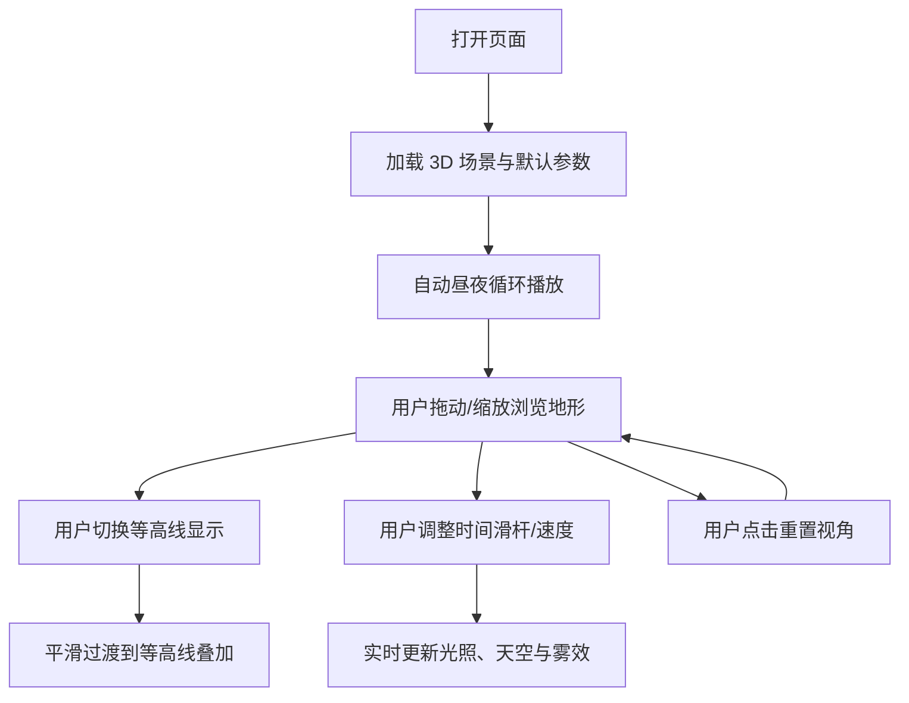

## 1. Product Overview
一个可交互的 3D HTML 山脉场景展示页，包含悬崖地形、河流与昼夜光照变化，并提供等高线/真实渲染两种观感切换。
- 目标用户：需要在浏览器中直观展示地形与氛围的设计/教学/作品集用户
- 价值：无需安装客户端即可获得高质量 3D 地形可视化与沉浸式日夜氛围

## 2. Core Features

### 2.1 Feature Module
1. **山脉场景页**：3D 山脉（悬崖/峡谷）、河流、昼夜光照与天空渐变、相机交互、等高线切换、动效过渡

### 2.2 Page Details
| Page Name | Module Name | Feature description |
|-----------|-------------|---------------------|
| 山脉场景页 | 3D 地形 | 程序化生成地形（高度场），包含可辨识悬崖断层与山脊起伏；地形颜色按海拔做真实感渐变 |
| 山脉场景页 | 河流 | 沿山谷路径生成河道（带河岸过渡），水面有流动高光与颜色分层（浅滩/深水） |
| 山脉场景页 | 昼夜光照 | 太阳/月亮方向光随时间旋转；环境光、雾效与天空渐变随昼夜变化；可手动暂停/加速时间 |
| 山脉场景页 | 交互控制 | 拖动旋转、滚轮缩放、右键平移；限制仰角避免穿地；支持双击聚焦/重置视角 |
| 山脉场景页 | 动画过渡 | 日夜切换、等高线开关、画质选项变化采用平滑过渡（颜色/强度/透明度插值） |
| 山脉场景页 | 等高线显示 | 可切换等高线模式：在地形表面叠加等高线（基于高度阈值/屏幕空间线条），支持线密度调节 |
| 山脉场景页 | 叠加 UI | 右上角控制面板：时间（昼夜/速度）、等高线开关、线密度、雾效强度、截图按钮 |

## 3. Core Process
用户进入页面即可看到自动播放的昼夜循环，并可通过交互查看地形细节；用户可切换等高线以观察地形高度结构；也可手动拖动时间滑杆在特定光照下浏览悬崖与河谷。

## 4. User Interface Design
### 4.1 Design Style
- 视觉方向：测绘等高线质感 + 电影级自然光（冷夜、暖昏、蓝调清晨），强调体积雾与地形层次
- 颜色：
  - 地表：深谷墨绿 → 森林绿 → 岩石赭灰 → 雪线冷白（随海拔渐变）
  - 水体：深青蓝 → 冷蓝高光（随深度与视角变化）
  - 天空：日出/日落暖橙紫过渡、正午高饱和天青、夜晚深靛蓝带星点
- 控件：半透明磨砂面板 + 细线刻度，状态变化用柔和发光与位移（不使用夸张拟物按钮）
- 字体：
  - 标题：Fraunces（地形标题/模式标签）
  - 正文：IBM Plex Sans（参数与说明）
- 布局：全屏画布 + 角落悬浮面板；左下角显示时间与海拔标尺提示
- 图标：线性图标（太阳/月亮、等高线、雾、相机）

### 4.2 Page Design Overview
| Page Name | Module Name | UI Elements |
|-----------|-------------|-------------|
| 山脉场景页 | 画布容器 | 全屏 WebGL 画布；加载时淡入；低端设备自动降级后处理 |
| 山脉场景页 | 控制面板 | 昼夜播放/暂停、速度、时间滑杆、等高线开关、线密度、雾强度、重置视角、截图 |
| 山脉场景页 | 状态提示 | 当前“时间段”标签（晨/昼/昏/夜）与小型色带图例（海拔→颜色） |

### 4.3 Responsiveness
桌面优先；移动端支持单指旋转、双指缩放，控件自动折叠为底部抽屉；降低像素比以控制发热与耗电。

### 4.4 3D Scene Guidance
- Environment/HDRI：不依赖外部 HDRI，使用程序化天空渐变与太阳盘；夜晚可增加低密度星点
- Lighting：DirectionalLight（太阳/月亮）+ Hemisphere/Environment 近似；昼夜切换时光强、色温、阴影柔度插值
- Camera：透视相机，FOV 中等（35–50），Orbit 控制；限制最小/最大距离与极角
- Composition：前景悬崖/岩壁、河流作为引导线，远景山脊层叠并叠加轻雾
- Interactions：拖动/缩放/平移、双击聚焦、重置；等高线切换与时间滑杆实时反馈
- Post-processing：轻微 Bloom、色调映射、微弱暗角与雾；提供“性能优先”开关
- Performance budgets：默认目标 60fps；地形网格 ≤ 200x200（可动态 LOD）；阴影贴图适中；后处理可降级或关闭
