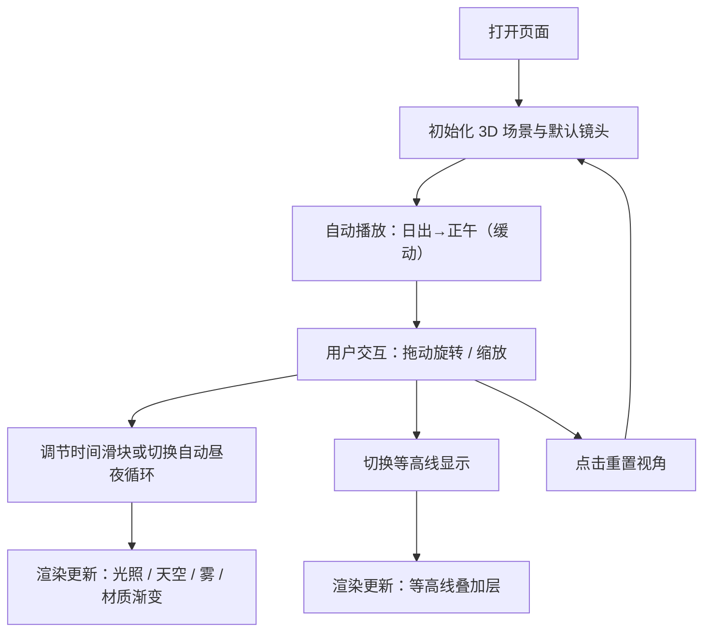

## 1. Product Overview
一个可交互的 3D HTML 山脉场景展示页，呈现悬崖、河流与昼夜光照变化，支持拖动缩放、动画过渡、真实感渐变色，并可切换等高线显示。
- 目标用户：需要在网页中演示地形/地理可视化的开发者、设计师与演示场景的内容创作者
- 产品价值：用较小体量代码实现“可玩、可看、可讲解”的 3D 地形卡片级演示，适合嵌入作品集或产品落地页

## 2. Core Features

### 2.1 Feature Module
1. **场景页（单页应用）**：3D 山脉、悬崖、河流、天空与昼夜循环
2. **控制面板（覆盖层 UI）**：时间/昼夜、等高线、雾效/氛围、动效强度与重置视角

### 2.2 Page Details
| Page Name | Module Name | Feature description |
|-----------|-------------|---------------------|
| Scene | 3D 地形 | 程序化生成地形（高度场），包含悬崖断层、山脊与山谷；高度驱动渐变色与材质粗糙度 |
| Scene | 河流 | 沿山谷路径生成带宽度的河带几何；流动法线/噪声制造“水流”动感；与地形融合 |
| Scene | 昼夜光照 | 太阳/月亮方向光与环境光随时间变化；天空颜色、雾与曝光随昼夜过渡；自动循环与手动拖动 |
| Scene | 交互 | 鼠标/触控拖动旋转、滚轮/捏合缩放、平滑阻尼；双击/按钮重置视角 |
| Scene | 动画过渡 | UI 参数变化（昼夜、等高线、雾）具备缓动过渡；进入页面有渐入与镜头轻微推近 |
| Scene | 等高线 | 一键切换等高线显示：基于高度分层生成线条/环带，随视角保持清晰；可调密度与强度 |
| Scene | 性能与质量 | 设备能力自适应（像素比上限、阴影开关、后期效果降级）；保持 60fps 目标 |

## 3. Core Process
用户进入页面后，默认看到“日出到正午”的地形镜头推近；拖动旋转观察悬崖与河谷；通过时间滑块体验昼夜光照变化；可打开等高线以获得“地图感”解读；随时重置视角回到推荐构图。

## 4. User Interface Design

### 4.1 Design Style
- 设计方向：现代“地形测绘板”风格（深色玻璃面板 + 冷暖对比天空渐变 + 细线地形刻度）
- 颜色：
  - 夜色基底：深石墨 #0B0F16
  - 日出高光：琥珀 #FFB657 与粉紫薄雾 #D7A6FF（仅用于天空/散射，不用于 UI 主色）
  - 地形低海拔：墨绿灰 #2E3A2F
  - 地形高海拔：岩灰 #7A7F86 → 雪顶白 #E9EEF5
  - 河流：青蓝 #2EC4FF（带深色边缘衰减）
- 字体：
  - 标题：具地理标注感的窄体展示字体（可用本地可用字体回退）
  - 正文/数值：等宽或半等宽，强调“仪表盘”感
- 动效：缓慢、克制的相机漂移与参数缓动，强调“自然变化”，避免夸张弹跳

### 4.2 Page Design Overview
| Page Name | Module Name | UI Elements |
|-----------|-------------|-------------|
| Scene | 顶部标题条 | 场景名称、当前时间（例如 14:20）、性能指示（可选） |
| Scene | 控制面板 | 时间滑块、昼夜自动播放开关、等高线开关、等高线密度、雾强度、重置视角按钮 |
| Scene | 交互提示 | 首次进入显示简短手势提示（拖动/滚轮/双指），3 秒后淡出 |

### 4.3 Responsiveness
- Desktop-first：默认桌面布局与鼠标交互
- Mobile-adaptive：触控拖动与双指缩放；面板折叠为底部抽屉；减少后期效果保证流畅

### 4.4 3D Scene Guidance
- 氛围：高对比天空穹顶与地形雾层，昼夜颜色连续变化
- 光照：方向光（太阳/月亮）+ 半球光 + 轻量环境贴图或近似环境光；阴影按设备能力启用
- 相机：透视相机，轻微俯视构图，焦点对准“悬崖断层 + 河谷弯道”形成视觉锚点
- 交互：Orbit 控制阻尼，限制极角避免穿地；提供重置视角
- 后期：轻量色调映射与微弱 Bloom（可降级关闭），配合雾实现层次
- 性能预算：地形网格 ≤ 200k triangles；等高线可用 instancing 或 shader/strip 降成本
