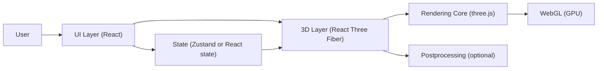

## 1. Architecture Design

## 2. Technology Description
- Frontend: React@18 + TypeScript + Vite
- Styling: TailwindCSS@3（用于覆盖层 UI 与排版），少量自定义 CSS 变量
- 3D: three + @react-three/fiber + @react-three/drei
- Post FX: @react-three/postprocessing（可选，按设备能力启用）
- State: 轻量状态（优先 React state；若交互状态复杂则引入 Zustand）
- Build target: 纯静态站点，无后端，无外部服务依赖

## 3. Route Definitions
| Route | Purpose |
|-------|---------|
| / | 3D 山脉场景与控制面板 |

## 4. API Definitions
无后端 API。所有数据为程序化生成参数（地形种子、等高线密度、时间进度等）。

## 5. Component / Module Design
- App
  - ScenePage
    - CanvasRoot：R3F Canvas 初始化、相机、渲染参数与 DPR 自适应
    - Terrain
      - heightField：高度场生成（噪声 + 断层/阶跃 + 侵蚀近似）
      - terrainMesh：地形几何与材质（高度渐变、坡度强调、雪线）
      - cliffAccent：悬崖区域增强（坡度阈值或断层线附近的法线/颜色处理）
    - River
      - riverPath：山谷路径生成（样条曲线）
      - riverMesh：带宽度 ribbon/strip，带流动噪声的 shader material
    - LightingCycle
      - sunMoonRig：方向光随时间旋转，强度/色温随昼夜变化
      - skyDome：天空渐变与地平线散射（shader 或渐变纹理）
      - fog：雾颜色/密度随时间变化（线性雾或指数雾）
    - Contours
      - contourOverlay：基于高度分层的等高线（shader/instanced planes/lines）
      - toggle & density：开关与密度参数，带缓动过渡
    - OverlayUI
      - TimeSlider：0..1 映射到 24h，支持自动播放/暂停
      - Toggles：等高线/雾/后期效果
      - ResetView：重置相机与控制器目标
      - HelpHint：首次进入的手势提示

## 6. Rendering & Performance Strategy
- DPR 自适应：上限 1.5（移动端 1.0），在性能不足时自动降低
- 阴影策略：默认启用软阴影但分辨率受限（1024/2048），移动端可关闭
- 网格密度：地形使用中等分辨率网格并通过法线细节增强“锐度”
- 等高线：避免为每条等高线生成高成本几何；优先 shader 分层或 instancing
- 后期：默认微弱 Bloom + 色调映射；低端设备降级关闭 FX

## 7. Interaction Model
- OrbitControls：启用阻尼、限制极角与缩放范围，防止穿地
- 输入：鼠标拖动/滚轮与触控拖动/双指缩放
- 动画：使用 requestAnimationFrame 驱动时间；UI 参数变化采用缓动插值（例如 exponential smoothing）

## 8. Testing / Verification
- 手动验收清单：
  - 拖动旋转与缩放稳定，无抖动与穿地
  - 昼夜滑块拖动时光照、天空、雾连续过渡，无明显跳变
  - 等高线开关能平滑淡入淡出，密度调节实时生效
  - 河流在不同角度下仍可识别，流动效果不刺眼
  - 移动端保持可交互帧率（目标 45–60fps）
