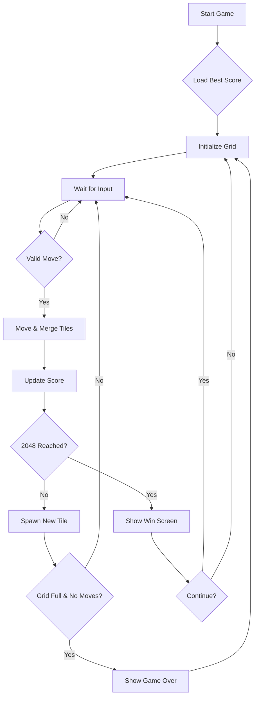

# Product Requirements Document: 2048 Cyberpunk Edition

## 1. Product Overview
A visually immersive, cyberpunk-themed version of the classic 2048 puzzle game.
- **Purpose**: Provide a familiar gameplay experience with a fresh, high-aesthetic "Cyberpunk" interface, featuring neon glows, glitch effects, and a dark, futuristic atmosphere.
- **Target Audience**: Puzzle game enthusiasts and users who appreciate distinctive, modern web design.

## 2. Core Features

### 2.1 User Roles
| Role | Registration Method | Core Permissions |
|------|---------------------|------------------|
| Player | None (Guest) | Play game, save high score locally |

### 2.2 Feature Module
1.  **Game Board**: The core 4x4 grid where the game is played.
2.  **Score System**: Real-time current score and persistent high score.
3.  **Game Controls**: innovative controls (keyboard, touch gestures, on-screen buttons).
4.  **Feedback System**: Visual and auditory (optional) feedback for merges, game over, and win states.

### 2.3 Page Details
| Page Name | Module Name | Feature description |
|-----------|-------------|---------------------|
| Main Game | Hero/Header | Title with glitch effect, Current Score, Best Score |
| Main Game | Grid Container | 4x4 grid, dynamic tile rendering, animations |
| Main Game | Game Over Overlay | "System Failure" message, Restart button |
| Main Game | Win Overlay | "System Hacked" message, Continue/Restart options |
| Main Game | Controls | Instructions for keyboard/touch |

## 3. Core Process
1.  **Initialization**: User opens the game -> Grid initializes with 2 random tiles -> Best score loaded from LocalStorage.
2.  **Gameplay**: User inputs direction (Arrow keys/Swipe) -> Tiles move and merge -> Score updates -> New tile spawns.
3.  **Win Condition**: A tile with value 2048 is created -> "Win" overlay appears -> User can continue or restart.
4.  **Loss Condition**: No valid moves remaining -> "Game Over" overlay appears -> User can restart.

## 4. User Interface Design

### 4.1 Design Style
-   **Theme**: Cyberpunk / Sci-Fi / Futurist.
-   **Colors**:
    -   Background: Deep dark blue/black (`#050510`).
    -   Accents: Neon Cyan (`#00f3ff`), Neon Pink (`#bc13fe`), Neon Yellow (`#f9f002`).
    -   Tiles: Glassmorphism effect with glowing borders.
-   **Typography**:
    -   Headings: "Orbitron" or similar sci-fi display font.
    -   Body: "Rajdhani" or tech-oriented sans-serif.
-   **Visual Effects**:
    -   CRT scanline overlay (subtle).
    -   Glitch effects on text hover/state changes.
    -   Neon glow on high-value tiles.

### 4.2 Page Design Overview
| Page Name | Module Name | UI Elements |
|-----------|-------------|-------------|
| Main Game | Header | "2048" with glitch animation. Score boxes with neon borders. |
| Main Game | Grid | Dark semi-transparent background. Grid lines as "circuit" traces. |
| Main Game | Tiles | Glowing numbers. Color shifts based on value (Cool -> Hot colors). |

### 4.3 Responsiveness
-   **Desktop**: Centered layout, keyboard controls.
-   **Mobile**: Full width/height adaptation, touch swipe controls, prevent scrolling.
