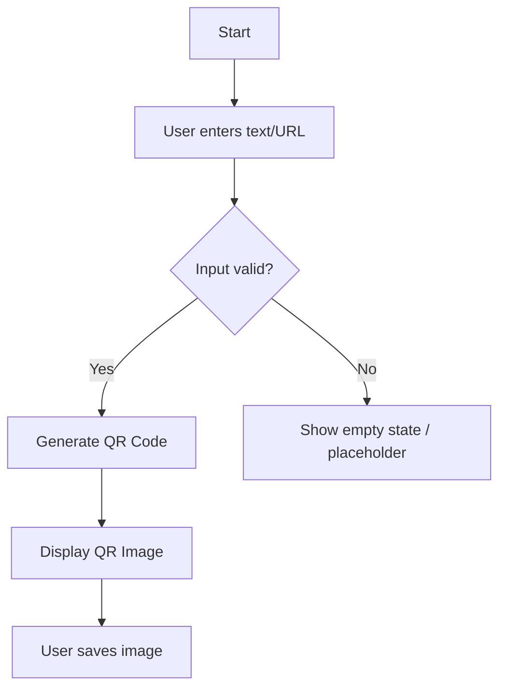

# Product Requirements Document (PRD)

## 1. Product Overview
A minimalist, privacy-focused online QR code generator. Users paste a URL or text, and a high-quality QR code is generated instantly. No registration, no login, no installation required. Pure utility, zero friction.

## 2. Core Features

### 2.1 User Roles
| Role | Registration Method | Core Permissions |
|------|---------------------|------------------|
| Guest | None (Anonymous) | Generate QR codes, Save images |

### 2.2 Feature Module
1. **Home Page**: The single interface containing the input area and the QR code display.

### 2.3 Page Details
| Page Name | Module Name | Feature Description |
|-----------|-------------|---------------------|
| Home Page | Input Area | Large, clear text input. Supports HTTP/HTTPS URLs and plain text. Placeholder text: "Paste your link or text here". |
| Home Page | QR Generator | Automatically generates QR code upon input (debounced ~500ms). |
| Home Page | QR Display | Displays the generated QR code. High contrast (Black on White). Sufficient padding (quiet zone). |
| Home Page | Save Action | Standard browser "Right-click to save" functionality supported. Options to download as PNG/JPG can be added as a button for better UX, but right-click is primary. |

## 3. Core Process
User opens site -> Pastes URL/Text into input box -> System validates input (optional) -> System generates QR Code instantly -> User right-clicks image to save or views it.

## 4. User Interface Design

### 4.1 Design Style
- **Aesthetic**: "Radical Minimalism" or "Industrial Utility".
- **Colors**: Monochrome. Stark Black (#000000) and White (#FFFFFF). Maybe a single accent color (e.g., Neon Green or Electric Blue) for focus states, but kept to a minimum.
- **Typography**: Large, bold, sans-serif fonts (e.g., Inter, Helvetica Now, or a monospaced font like JetBrains Mono for the input).
- **Layout**: Centered content. Split screen on desktop (Input Left, QR Right) or Stacked (Input Top, QR Bottom).
- **Input**: Massive text area, removing all unnecessary borders/shadows, focusing on the content.

### 4.2 Page Design Overview
| Page Name | Module Name | UI Elements |
|-----------|-------------|-------------|
| Home Page | Main Container | Centered layout, max-width constraints for readability. |
| Home Page | Input Section | Large font size input field. Minimalist placeholder. |
| Home Page | Result Section | The QR code appears dynamically. Smooth fade-in animation. |

### 4.3 Responsiveness
- **Desktop**: Side-by-side view (Input | QR) or Centered Vertical.
- **Mobile**: Stacked view (Input over QR). Input field adjusts to screen width.
- **Touch**: Input field easily tappable.

### 4.4 3D Scene Guidance (N/A)
Not applicable for this 2D utility tool.
