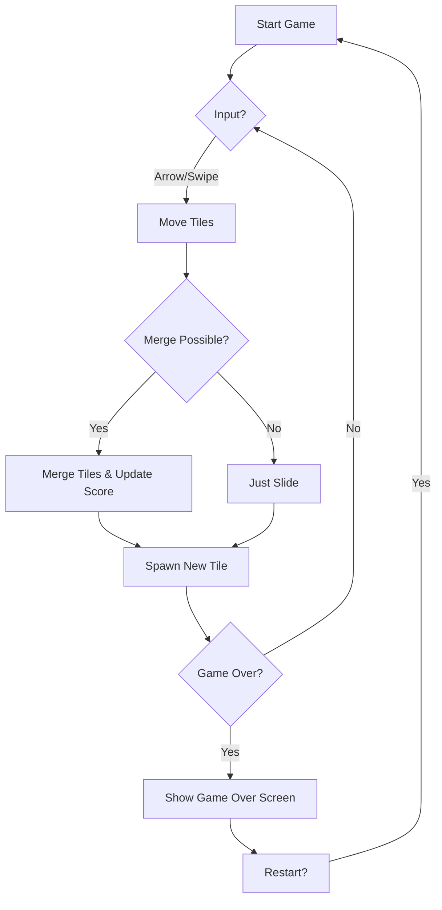

## 1. Product Overview
This project is a visually distinctive, web-based 2048 game featuring a "Glassmorphism" aesthetic with smooth animations.
- The main purpose is to provide a modern, engaging 2048 experience with exceptional polish and visual appeal.
- The target audience includes casual gamers and design enthusiasts who appreciate high-quality web interfaces.

## 2. Core Features

### 2.1 User Roles
| Role | Registration Method | Core Permissions |
|------|---------------------|------------------|
| Player | None (Guest) | Play game, save high score locally |

### 2.2 Feature Module
1. **Game Board**: 4x4 grid, tile merging logic, score display.
2. **Controls**: Keyboard arrow keys, touch swipe gestures, "New Game" button.
3. **State Management**: Win/Loss overlays, current score, best score persistence.

### 2.3 Page Details
| Page Name | Module Name | Feature description |
|-----------|-------------|---------------------|
| Home Page | Game Container | Main 4x4 grid with animated tiles. |
| Home Page | Header | Title, current score, best score, New Game button. |
| Home Page | Footer | Credits, instructions. |
| Home Page | Overlay | Game Over / You Win modal with "Play Again" button. |

## 3. Core Process
1. Player opens the game.
2. Grid initializes with 2 tiles.
3. Player uses arrow keys or swipes to move tiles.
4. Tiles slide and merge if values match.
5. New tile (2 or 4) spawns after every valid move.
6. Score updates.
7. If 2048 tile created -> Win state (can continue).
8. If no moves possible -> Game Over state.

## 4. User Interface Design
### 4.1 Design Style
- **Theme**: Glassmorphism (frosted glass effect) on a deep, rich gradient background (e.g., deep purple to teal).
- **Colors**: Neon accents for tiles (glow effects), semi-transparent whites for containers.
- **Typography**: "Space Grotesk" or similar modern sans-serif for numbers and UI.
- **Animations**: Smooth sliding transitions (Framer Motion), pop-in effects for spawning, scale-up for merging.
- **Layout**: Centered game board, responsive scaling.

### 4.2 Page Design Overview
| Page Name | Module Name | UI Elements |
|-----------|-------------|-------------|
| Home Page | Main Layout | Gradient background, centered glass container. |
| Home Page | Grid | 4x4 grid with gap, rounded corners. |
| Home Page | Tile | Colored based on value, glowing text, smooth motion. |

### 4.3 Responsiveness
- Desktop: Centered layout, keyboard controls.
- Mobile: Responsive grid size, touch swipe controls, prevent scrolling while playing.
