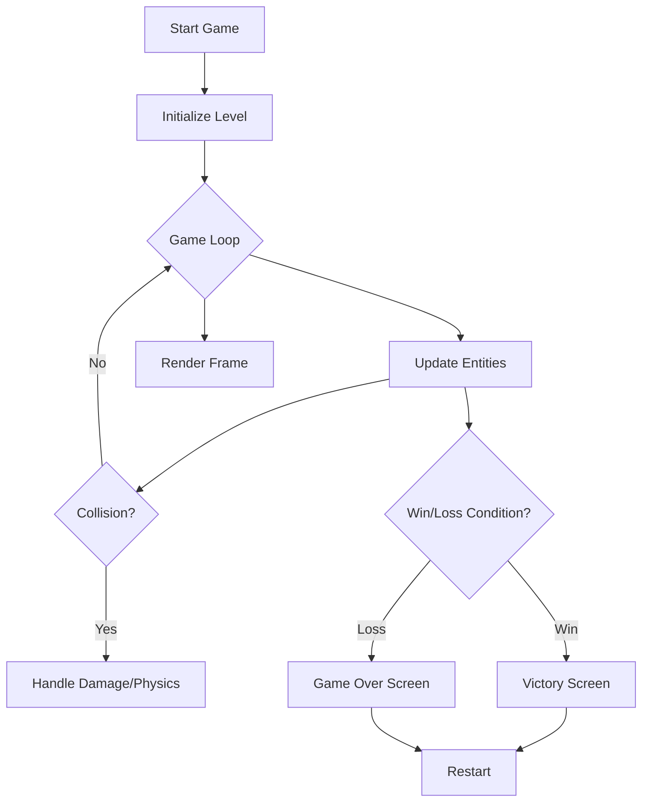

# Product Requirements Document (PRD)

## 1. Product Overview
A simplified, single-file "Battle City" (Tank 1990) browser game.
- **Purpose**: Provide a nostalgic, instantly playable tank battle experience without installation.
- **Target User**: Casual gamers, developers learning Canvas.
- **Value**: Demonstrates core game development concepts (loop, collision, AI) in a concise, portable format.

## 2. Core Features

### 2.1 User Roles
| Role | Registration Method | Core Permissions |
|------|---------------------|------------------|
| Player | None (Instant Play) | Control tank, shoot, pause, restart |

### 2.2 Feature Modules
1. **Game Loop**: Main cycle handling updates and rendering.
2. **Entity System**: Player tank, Enemy tanks, Bullets, Map tiles (Brick, Iron, Grass, Base).
3. **Collision System**: Precise hit detection between dynamic and static objects.
4. **UI Overlay**: Start screen, HUD (lives, score, enemies left), Game Over/Victory screens.

### 2.3 Page Details
| Page Name | Module Name | Feature description |
|-----------|-------------|---------------------|
| Index | Game Canvas | The primary 800x600 (or similar) rendering area. |
| Index | HUD | Displays Player Lives, Enemies Remaining, Current Stage. |
| Index | Controls | Keyboard listeners for WASD/Arrows + Space. |

## 3. Core Process
1. **Initialization**: Load assets (procedural generation or base64), generate map, spawn player.
2. **Gameplay**:
   - Player moves/shoots.
   - Enemies spawn periodically, move randomly, and shoot.
   - Bullets destroy bricks/enemies.
   - Items drop from specific enemies.
3. **End Condition**:
   - **Win**: Destroy all enemies.
   - **Loss**: Player dies or Base destroyed.
4. **Restart**: Reset game state.

## 4. User Interface Design

### 4.1 Design Style
- **Visuals**: Retro 8-bit aesthetic (using simple geometric shapes if images are too heavy, or pixel-art style drawing on canvas).
- **Colors**: High contrast. Player (Gold/Yellow), Enemy (Silver/Red), Brick (Orange), Iron (Gray), Grass (Green).
- **Typography**: Monospaced, retro font (e.g., "Courier New" or a pixel font stack).
- **Layout**: Centered canvas on a dark background.

### 4.2 Page Design Overview
| Page Name | Module Name | UI Elements |
|-----------|-------------|-------------|
| Main | Canvas | 13x13 grid map (standard Battle City) or simplified. |
| Main | Sidebar/Top bar | Text: "P1 Lives: 3", "Enemies: 20". |

### 4.3 Responsiveness
- Fixed aspect ratio canvas, centered in the viewport.
- Focus on Desktop (Keyboard controls).

### 4.4 Asset Strategy
- **Graphics**: Procedural drawing on Canvas (rectangles, circles, lines) to keep it single-file without external image dependencies.
- **Sound**: Optional (AudioContext synthesis) or silent for simplicity.
