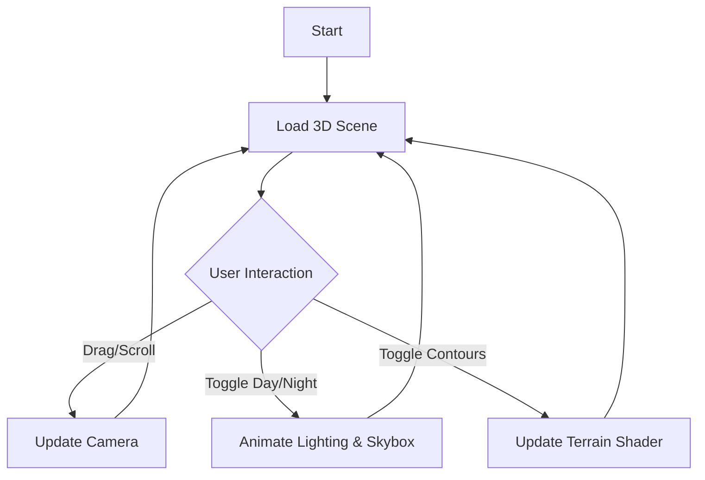

# Product Requirements Document (PRD)

## 1. Product Overview
A high-fidelity, interactive 3D mountain landscape viewer built with modern web technologies.
- Users can explore a procedurally generated terrain featuring cliffs, rivers, and dynamic lighting conditions (day/night cycle), with options to visualize topography via contour lines.
- Target audience: Creative coding enthusiasts, geography buffs, and users appreciative of aesthetic web experiences.

## 2. Core Features

### 2.1 Feature Module
1. **Interactive 3D Scene**: The main viewport rendering the mountain landscape.
2. **Control Panel**: Floating UI for user interactions (Day/Night toggle, Contour toggle).
3. **Navigation System**: Orbit controls for dragging, zooming, and rotating the view.

### 2.2 Page Details
| Page Name | Module Name | Feature description |
|-----------|-------------|---------------------|
| Main View | 3D Canvas | Renders the mountain mesh with custom shaders for cliffs and rivers. Supports PBR lighting. |
| Main View | Lighting System | Dynamic day/night cycle affecting sun position, ambient light, and shadow softness. Real-time transition. |
| Main View | Controls Overlay | Minimalist UI buttons/toggles for "Contour Lines" and "Day/Night" modes. |
| Main View | Interaction | Pan, Zoom, Rotate camera around the terrain. Smooth damping for premium feel. |

## 3. Core Process
1. **Initialization**: App loads, generating the terrain geometry and river paths.
2. **Exploration**: User drags to rotate, scrolls to zoom. The camera glides smoothly.
3. **Day/Night Cycle**: User toggles "Night Mode". The sun sets, stars appear, lighting shifts to cool blue/purple tones.
4. **Analysis**: User enables "Contour Lines". The terrain shader updates to overlay topographic lines on the geometry.

## 4. User Interface Design

### 4.1 Design Style
- **Aesthetic**: "Ethereal Topography". A blend of realistic lighting with stylized, data-viz inspired elements (contours).
- **Colors**:
    - Day: Warm golds, lush greens, stone grays, azure water.
    - Night: Deep indigos, silvers, bioluminescent river accents.
    - UI: Glassmorphism panels, crisp white typography, subtle blur effects.
- **Typography**: `Space Grotesk` for headers, `Inter` for UI labels (clean, legible).
- **Interactions**: Smooth transitions (0.5s - 1s) for all state changes. Hover effects on UI elements.

### 4.2 Page Design Overview
| Page Name | Module Name | UI Elements |
|-----------|-------------|-------------|
| Main View | HUD | Bottom-center floating dock. Glass background. Icons for "Sun/Moon", "Layers" (Contours). |
| Main View | Scene | Full-screen canvas. No borders. Immersive. |

### 4.3 Responsiveness
- **Desktop**: Full interactive controls. High-res textures.
- **Mobile**: Touch gestures for rotation/zoom. Simplified UI layout.
- **Performance**: Adaptive resolution or lower poly count if FPS drops (optional optimization).

### 4.4 3D Scene Guidance
- **Environment**: Procedural skybox that shifts from blue gradients (day) to starry void (night).
- **Lighting**: Main directional light (Sun/Moon) casting shadows. Hemisphere light for ambient fill.
- **Camera**: Perspective camera with `OrbitControls`. Restricted polar angle to prevent going under the terrain.
- **Composition**: Central mountain peak, winding river cutting through, cliffs defined by slope angle.
- **Shaders**: Custom shader material for the terrain to handle:
    - Slope-based texturing (grass vs rock/cliff).
    - Water reflection/refraction.
    - Contour line overlay (using fragment shader math).
