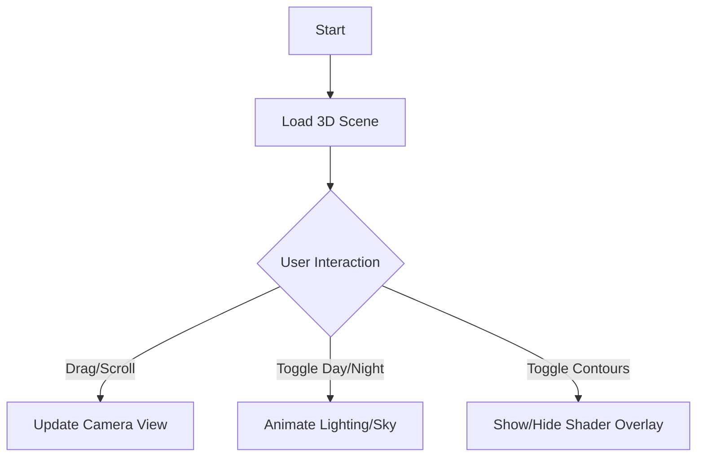

# Product Requirements Document (PRD)

## 1. Product Overview
Interactive 3D Mountain Landscape
- An immersive, browser-based 3D experience featuring a generated mountain terrain with rivers and cliffs.
- Showcases dynamic environmental effects like day/night cycles, realistic lighting, and interactive exploration.

## 2. Core Features

### 2.1 Feature Module
1. **3D Viewport**: Main canvas rendering the mountain scene.
2. **Control Panel**: Overlay interface for toggling features and adjusting settings.

### 2.2 Page Details
| Page Name | Module Name | Feature description |
|-----------|-------------|---------------------|
| Main Page | 3D Scene | Renders mountain mesh, water shader, sky/lighting system. Supports orbit controls (pan/zoom). |
| Main Page | Environment Control | Sliders/Toggles for Day/Night cycle, Contour lines visibility. |
| Main Page | Terrain Features | Procedural or heightmap-based terrain with distinct cliff and river areas. |

## 3. Core Process
User opens page -> 3D scene loads with dawn/morning lighting -> User drags to rotate/zoom view -> User toggles "Night Mode" -> Lighting shifts to moonlit scene -> User enables "Contour Lines" -> Terrain overlay appears.

## 4. User Interface Design

### 4.1 Design Style
- **Theme**: Nature-inspired, clean, minimalist overlay.
- **Colors**: Deep blues, slate grays, warm sunrise oranges for UI accents.
- **Typography**: "Space Grotesk" or similar modern sans-serif for headers, "Inter" for UI text.
- **Layout**: Full-screen canvas with floating control panel (glassmorphism effect).

### 4.2 Page Design Overview
| Page Name | Module Name | UI Elements |
|-----------|-------------|-------------|
| Main Page | HUD / Controls | Floating glass panel with toggle switches and sliders. Smooth hover states. |
| Main Page | Loading Screen | Minimalist progress indicator with atmospheric background color. |

### 4.3 Responsiveness
- Desktop-first experience.
- Mobile: Touch controls for camera, collapsible UI panel.

### 4.4 3D Scene Guidance
- **Environment**: Dynamic skybox/atmosphere responding to time of day.
- **Lighting**: Sun/Moon directional light + Ambient light. Shadow casting on terrain.
- **Materials**: Low-poly or stylized realism. Gradient textures for terrain elevation.
- **Water**: Reflective/refractive shader for rivers.
- **Post-processing**: Bloom for sun/moon, slight vignette, color correction.
