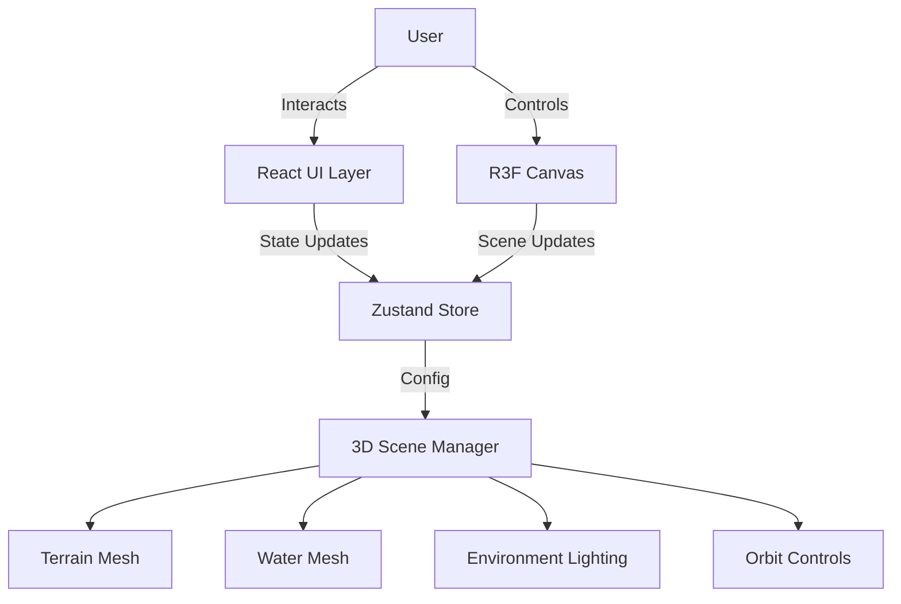

# Technical Architecture Document

## 1. Architecture Design

## 2. Technology Description
- **Frontend Framework**: React 18 + Vite
- **3D Engine**: Three.js + @react-three/fiber (R3F)
- **Helpers**: @react-three/drei (Controls, Environment, Stats, etc.)
- **Styling**: Tailwind CSS for UI overlay
- **State Management**: Zustand (for shared state between UI and 3D scene)
- **Shaders**: Custom GLSL (fragment/vertex) via `shaderMaterial` or `MeshStandardMaterial` hooks (using `onBeforeCompile` or `drei/shaderMaterial`).
- **Math**: `simplex-noise` for terrain generation.

## 3. Route Definitions
Single Page Application (SPA). No routing required beyond the root `/`.

| Route | Purpose |
|-------|---------|
| / | Main 3D Viewport & UI Overlay |

## 4. API Definitions
N/A - Client-side only procedural generation.

## 5. Data Model
- **TerrainConfig**:
    - `seed`: number (for procedural noise)
    - `scale`: vector3
    - `waterLevel`: number
    - `cliffThreshold`: number (slope angle)
- **LightingState**:
    - `isNight`: boolean
    - `sunPosition`: vector3
    - `ambientColor`: hex string
- **ViewOptions**:
    - `showContours`: boolean
    - `wireframe`: boolean (debug)

## 6. Implementation Strategy
1. **Setup**: Initialize Vite + React + Tailwind + R3F.
2. **Terrain Gen**: Implement a custom hook `useTerrain` that generates a `PlaneGeometry` and displaces vertices using Simplex Noise.
3. **Shaders**: Develop a custom shader material that:
    - Calculates slope for texturing (grass vs rock).
    - Mixes colors based on height.
    - Overlays contour lines based on height modulo.
    - Responds to lighting changes.
4. **Water**: Add a reflective plane at `waterLevel` with a simple water shader or `drei/MeshReflectorMaterial`.
5. **Lighting/Sky**: Create a component that animates `DirectionalLight` and `HemisphereLight` based on `isNight` state.
6. **UI**: Build a minimal control panel to toggle states in Zustand store.
