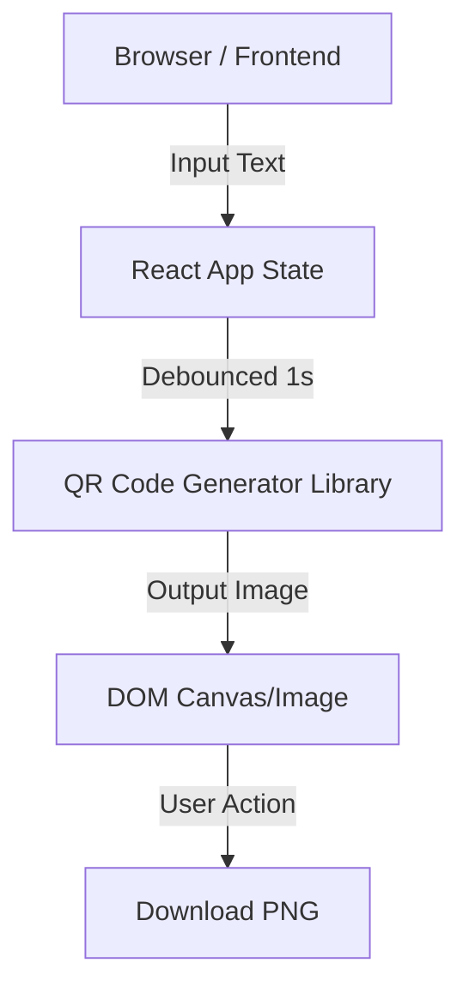

# Technical Architecture Document

## 1. Architecture Design

## 2. Technology Description
- **Frontend**: React@18 + tailwindcss@3 + vite
- **QR Code Library**: `qrcode.react` (or similar high-performance, client-side library)
- **State Management**: React `useState` + `useEffect` (sufficient for simple state)
- **Build Tool**: Vite
- **Deployment**: Static Site (e.g., Vercel/Netlify/GitHub Pages) - capable.

## 3. Route Definitions
| Route | Purpose |
|-------|---------|
| / | Home page with main content (Input + QR Display) |

## 4. API Definitions
None. Pure client-side application.

## 5. Server Architecture Diagram
None.

## 6. Data Model
None. No data persistence required.
