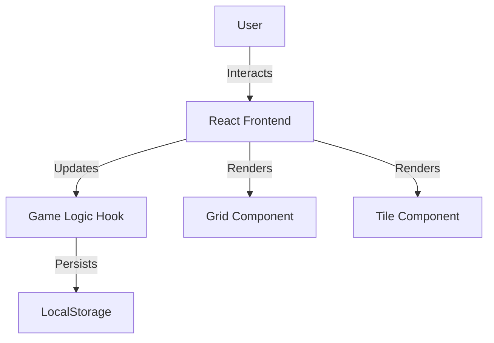

## 1. Architecture Design


## 2. Technology Description
- **Frontend**: React 18 + Tailwind CSS 3 + Vite.
- **State Management**: React `useReducer` for complex game state (grid, score, status).
- **Animations**: `framer-motion` for tile movements and merging effects.
- **Styling**: Tailwind CSS with custom config for glassmorphism utilities and neon colors.
- **Icons**: `lucide-react`.
- **Utils**: `lodash` (for cloning/throttling) or custom helpers.

## 3. Route Definitions
| Route | Purpose |
|-------|---------|
| / | Main game interface |

## 4. Data Model
### 4.1 Local Storage Schema
```json
{
  "gameState": {
    "grid": [[0,0,0,0], ...],
    "score": 120,
    "status": "playing" // or "won", "lost"
  },
  "bestScore": 2400
}
```
