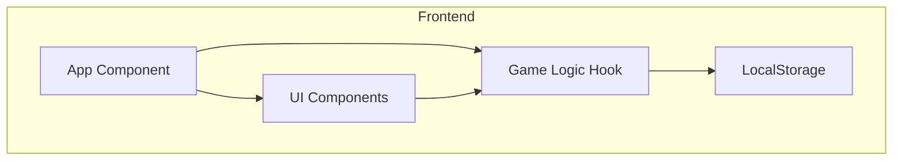

# Technical Architecture Document: 2048 Cyberpunk Edition

## 1. Architecture Design



## 2. Technology Description
-   **Frontend**: React 18 + TypeScript + Vite
-   **Styling**: Tailwind CSS (for layout and utility) + Custom CSS (for complex animations/glows).
-   **State Management**: React `useReducer` for complex game state transitions.
-   **Icons**: `lucide-react` or `react-icons`.
-   **Motion**: `framer-motion` for smooth tile transitions and overlay entrances.

## 3. Directory Structure
```
src/
├── components/
│   ├── Board/
│   │   ├── Grid.tsx
│   │   ├── Tile.tsx
│   │   └── Cell.tsx
│   ├── UI/
│   │   ├── Header.tsx
│   │   ├── ScoreBoard.tsx
│   │   └── Button.tsx
│   └── Overlays/
│       ├── GameOver.tsx
│       └── GameWon.tsx
├── hooks/
│   ├── useGameLogic.ts
│   └── useEvent.ts
├── utils/
│   ├── gameHelpers.ts
│   └── storage.ts
├── styles/
│   └── index.css
├── App.tsx
└── main.tsx
```

## 4. Key Logic & Algorithms
-   **Grid Representation**: 1D array of size 16 or 2D array [4][4].
-   **Movement Logic**:
    -   Rotate matrix to standard orientation based on direction.
    -   Shift non-zero tiles to the left.
    -   Merge adjacent equal tiles.
    -   Shift again.
    -   Rotate back.
-   **Tile Merging**:
    -   Each tile has a unique ID to track movement for animations.
    -   `mergedFrom` property to handle merge animations.

## 5. Data Model
### 5.1 Game State
```typescript
interface Tile {
  id: string; // Unique ID for key prop and animation tracking
  value: number;
  position: [number, number]; // [row, col]
  mergedFrom?: Tile[]; // Reference to tiles that created this one
  isNew?: boolean; // For spawn animation
}

interface GameState {
  grid: Tile[][]; // or flat array
  score: number;
  bestScore: number;
  status: 'playing' | 'won' | 'game-over';
}
```
