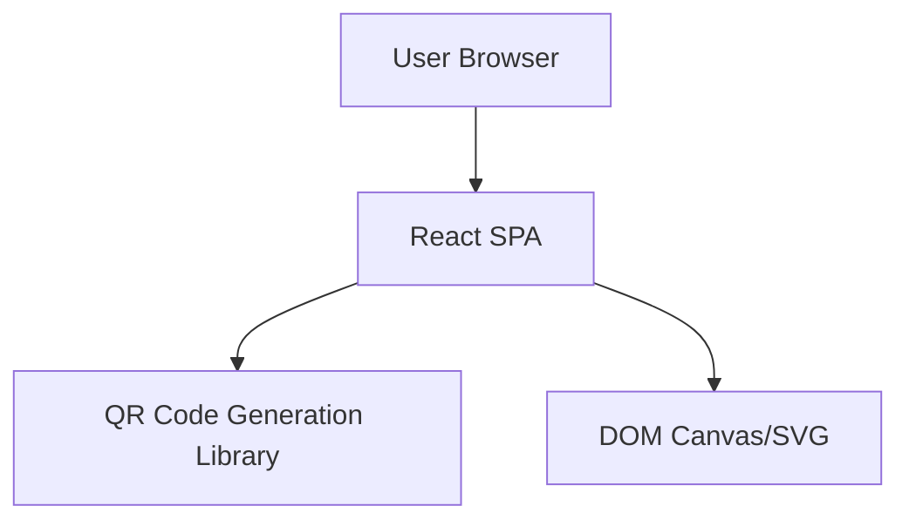

# Technical Architecture Document

## 1. Architecture Design

## 2. Technology Description

- **Frontend Framework**: React 18
- **Styling**: Tailwind CSS 3
- **Build Tool**: Vite
- **Language**: TypeScript (preferred for robustness) or JavaScript.
- **Key Libraries**:
    - `qrcode.react` (or `qrcode`): For generating QR codes on the client side.
    - `html-to-image` (optional): If a specific "Download" button is implemented to ensure high-quality PNG export, though right-click save is primary.
- **State Management**: React `useState`, `useEffect` (sufficient for this simple app).
- **Hosting**: Static hosting (Vercel, Netlify, GitHub Pages, etc.).

## 3. Route Definitions

| Route | Purpose |
|-------|---------|
| `/` | Home page. Contains the entire application logic. |

## 4. API Definitions
*No Backend API required. All logic is client-side.*

## 5. Server Architecture Diagram
*N/A - Serverless / Static Site*

## 6. Data Model
*N/A - No persistent data storage*
