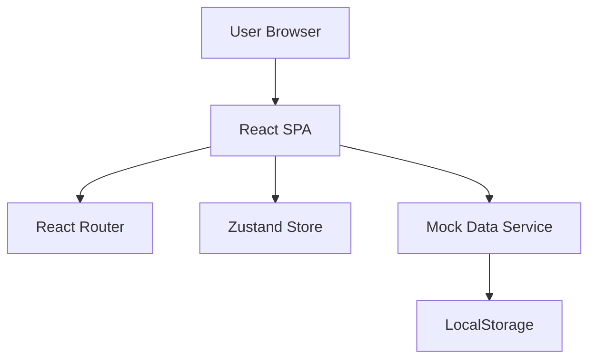

# Technical Architecture Document

## 1. Architecture Design
A client-side Single Page Application (SPA) using React. Data persistence is handled via LocalStorage to simulate a backend for the prototype phase.



## 2. Technology Stack
- **Frontend Framework**: React 18
- **Build Tool**: Vite
- **Styling**: Tailwind CSS (Utility-first) + Framer Motion (Animations)
- **Routing**: React Router DOM 6
- **State Management**: Zustand (Cart, User, UI state)
- **Icons**: Lucide React
- **Form Handling**: React Hook Form + Zod (Validation)
- **Mocking**: Faker.js (optional) or static JSON data

## 3. Route Definitions
| Route | Component | Purpose |
|-------|-----------|---------|
| `/` | `HomePage` | Landing page with hero and featured products. |
| `/login` | `LoginPage` | User authentication. |
| `/register` | `RegisterPage` | User registration. |
| `/products` | `ProductListPage` | Browse all products. |
| `/products/:id` | `ProductDetailPage` | View single product details. |
| `/cart` | `CartPage` | View and manage cart items. |
| `/checkout` | `CheckoutPage` | Enter shipping info and payment. |
| `/orders` | `OrderHistoryPage` | View past orders. |
| `/contact` | `ContactPage` | Contact support. |
| `*` | `NotFoundPage` | 404 Error page. |

## 4. Data Model (Mock)

### 4.1 Schemas (TypeScript Interfaces)

```typescript
// User
interface User {
  id: string;
  email: string;
  name: string;
  passwordHash: string; // Mock
}

// Product
interface Product {
  id: string;
  name: string;
  price: number;
  originalPrice?: number;
  category: string;
  images: string[];
  sizes: string[];
  description: string;
  reviews: Review[];
  isNew?: boolean;
  isBestSeller?: boolean;
}

// Review
interface Review {
  id: string;
  userId: string;
  userName: string;
  rating: number;
  comment: string;
  date: string;
}

// CartItem
interface CartItem extends Product {
  quantity: number;
  selectedSize: string;
}

// Order
interface Order {
  id: string;
  userId: string;
  items: CartItem[];
  total: number;
  status: 'pending' | 'paid' | 'shipped' | 'delivered';
  shippingAddress: Address;
  createdAt: string;
}

// Address
interface Address {
  fullName: string;
  phone: string;
  province: string;
  city: string;
  district: string;
  detail: string;
}
```

## 5. Directory Structure
```
src/
├── assets/          # Static assets (images, fonts)
├── components/      # Reusable UI components
│   ├── common/      # Buttons, Inputs, Modals
│   ├── layout/      # Navbar, Footer
│   └── product/     # ProductCard, ProductGrid
├── pages/           # Page components
├── hooks/           # Custom React hooks
├── store/           # Zustand stores (useCartStore, useUserStore)
├── services/        # Mock API services
├── types/           # TypeScript interfaces
├── utils/           # Helper functions
└── App.tsx          # Main entry point
```
