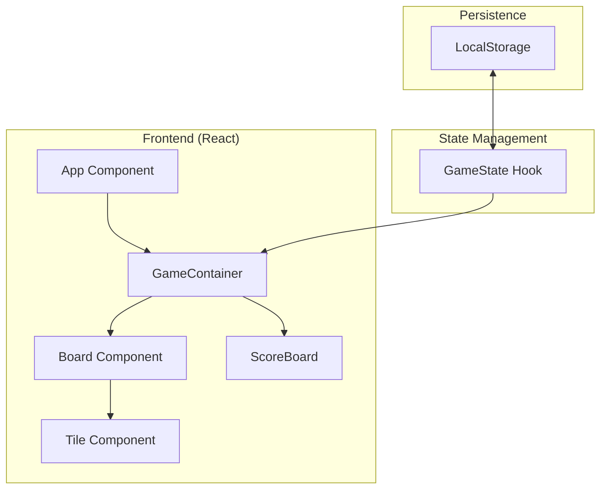

## 1. Architecture Design

## 2. Technology Description
- Frontend: React@18 + tailwindcss@3 + framer-motion (for animations)
- Initialization Tool: vite
- State Management: React Context or custom hooks for game logic
- Icons: Lucide-react

## 3. Route Definitions
| Route | Purpose |
|-------|---------|
| / | Main and only game page |

## 4. API Definitions
- N/A (Client-side game)

## 5. Data Model
- Game state: `board: (number | null)[][]`, `score: number`, `bestScore: number`, `status: 'playing' | 'won' | 'lost'`.
