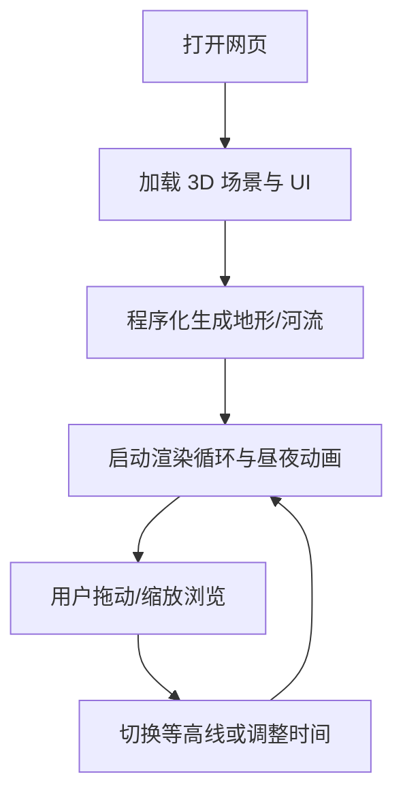

## 1. Product Overview
一个可交互的 3D 山脉场景网页：生成悬崖与河流地形，提供昼夜光照变化、等高线显示切换、平滑动画过渡与真实感渐变着色。
- 目标用户：需要在浏览器中演示或探索地形视觉效果的设计/技术人员与普通浏览者
- 价值：无需安装即可体验可控、可讲解、可展示的 3D 地貌场景（适合作品集、演示页、交互样例）

## 2. Core Features

### 2.1 Feature Module
1. **场景页（/）**：3D 山脉生成、悬崖与河流、昼夜循环、拖动缩放、等高线切换、参数面板与动效提示
2. **说明页（/help）**：操作说明、性能提示、快捷键与视觉模式解释

### 2.2 Page Details
| Page Name | Module Name | Feature description |
|-----------|-------------|---------------------|
| 场景页 | 地形生成 | 程序化生成高度场：主山脊+悬崖断层+侵蚀/噪声；输出网格与法线用于着色 |
| 场景页 | 河流系统 | 基于高度场的低洼路径生成河道曲线；沿曲线生成河床与水面，支持流动动画与反射高光 |
| 场景页 | 昼夜光照 | 太阳方向随时间变化；天空/雾/环境光随时间插值；支持自动播放与手动拖动时间 |
| 场景页 | 交互控制 | 鼠标/触控拖动旋转、滚轮缩放、右键平移；提供重置视角按钮 |
| 场景页 | 动画过渡 | 切换昼夜/等高线/视角重置时使用缓动过渡，避免突变 |
| 场景页 | 真实感渐变色 | 基于高度、坡度、朝向与湿度权重的渐变着色：岩壁、草地、积雪、河岸潮湿过渡 |
| 场景页 | 等高线显示 | 一键切换：叠加等高线线条/带状等高层；线条密度可调 |
| 说明页 | 指引与快捷键 | 展示鼠标/触控操作、键盘快捷键、性能与兼容性说明 |

## 3. Core Process
用户进入页面后默认自动播放昼夜循环；可拖动缩放探索场景；可切换等高线模式；可在任意时刻暂停并拖动时间滑块观察光照变化。

## 4. User Interface Design
### 4.1 Design Style
- 主题：地形测绘/地理观测风格（“测绘仪表盘 + 自然氛围”）
- 主色：深靛蓝夜空、石灰岩灰、苔藓绿；强调色：河流青蓝与日出暖橙
- 字体：标题使用具有测绘感的窄体展示字体，正文使用可读性更强的衬线/无衬线搭配
- 布局：全屏画布；左下角半透明控制面板；右上角状态胶囊（FPS/模式）
- 按钮：圆角小尺寸，细描边与轻微内发光；切换动作带微动效
- 图标：线性图标（指南针、太阳/月亮、等高线）

### 4.2 Page Design Overview
| Page Name | Module Name | UI Elements |
|-----------|-------------|-------------|
| 场景页 | 顶层 HUD | 模式指示（昼/夜）、等高线开关、重置视角、帮助入口 |
| 场景页 | 时间控制 | 时间滑块（0–24h）、播放/暂停、播放速度 |
| 场景页 | 视觉控制 | 等高线密度、雾强度、对比度/曝光（可选） |
| 说明页 | 操作说明 | 图示：旋转/缩放/平移；快捷键清单；兼容性说明 |

### 4.3 Responsiveness
- Desktop-first：默认布局适配 1200px+；面板不遮挡主体视野
- Mobile-adaptive：面板可折叠；触控操作提示；降低默认渲染负载（更低分辨率/更少后处理）

### 4.4 3D Scene Guidance
- 氛围：日间高对比清晰空气；夜间冷色月光+低密度体积雾
- 光照：方向光（太阳/月亮）+半球光；阴影开启且限制范围以控性能
- 相机：透视相机，默认俯视 35–55°；Orbit 控制启用阻尼
- 构图：主山脊偏画面 1/3；河流作为引导线；悬崖面朝向形成高光对比
- 交互：鼠标拖动/缩放；重置视角动画；昼夜与等高线切换渐变过渡
- 后处理：轻量色调映射、Bloom（可选）、Vignette（可选）
- 性能预算：桌面默认 60fps 目标；移动端 30fps 目标并自动降级
