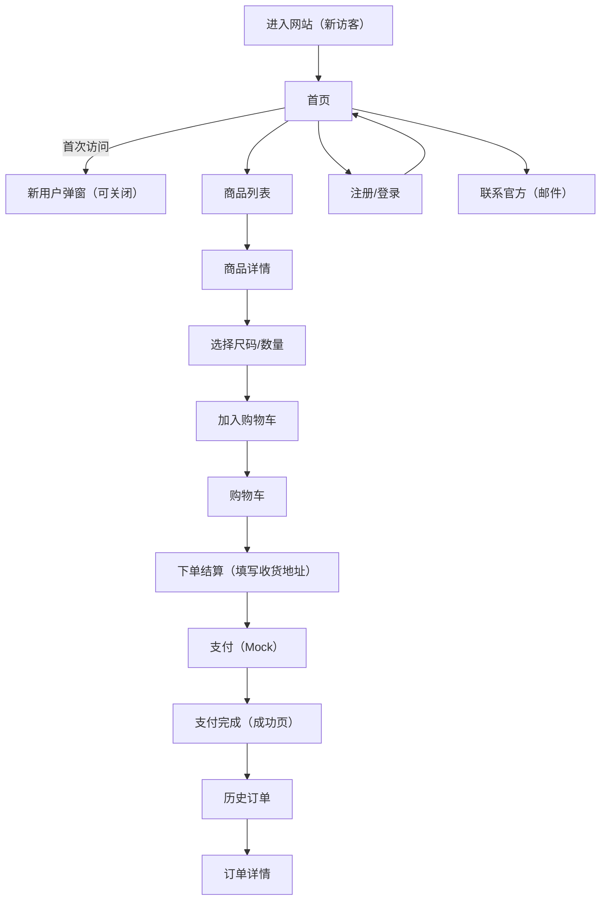

## 1. Product Overview
面向中国消费者的女装电商网站，风格参考 Zara / H&M 的简洁现代与大图陈列。
目标是让用户在手机端也能快速浏览、选码、下单，并以顺滑动效与统一视觉建立品牌质感。

## 2. Core Features

### 2.1 User Roles
| Role | Registration Method | Core Permissions |
|------|---------------------|------------------|
| 普通用户 | 邮箱注册/登录 | 浏览商品、加入购物车、下单结算、查看历史订单、联系官方 |

### 2.2 Feature Module
1. **首页**：顶部导航、轮播大图、新品推荐、热销商品、新用户弹窗
2. **注册/登录页**：邮箱注册、邮箱登录、基础表单校验
3. **商品列表页**：分类/筛选/排序、商品卡片大图、分页或无限滚动（二选一）
4. **商品详情页**：商品图集、价格与描述、尺码信息、评价列表
5. **购物车**：增减数量、删除、价格小计、前往结算
6. **下单结算**：填写收货地址、确认订单明细、提交订单
7. **支付（Mock）**：点击“支付”即完成付款并跳转成功结果
8. **历史订单**：订单列表、订单详情（基础信息+商品明细）
9. **联系官方（邮件）**：通过邮件方式联系官方（mailto 或表单触发邮件客户端）
10. **空状态/敬请期待**：未上线页面统一展示“敬请期待”

### 2.3 Page Details
| Page Name | Module Name | Feature description |
|-----------|-------------|---------------------|
| 首页 | 轮播图 | 自动轮播、可手动切换、支持触控滑动、首屏大图突出品牌氛围 |
| 首页 | 新品推荐 | 展示新品商品卡片，支持“加入购物车/查看详情”快捷入口 |
| 首页 | 热销商品 | 展示热销商品卡片，支持快速浏览与跳转详情 |
| 首页 | 新用户弹窗 | 首次访问弹窗（可关闭），内容为新人权益/订阅提示，支持不再提示（本地存储） |
| 注册/登录 | 邮箱注册 | 邮箱+密码+确认密码，错误提示明确，防重复提交 |
| 注册/登录 | 邮箱登录 | 邮箱+密码登录，登录态持久化（本地存储） |
| 商品列表 | 商品栅格 | 2–3 列自适应，优先移动端；大图比例统一，Hover/Press 动效克制 |
| 商品列表 | 筛选/排序 | 价格区间、尺码、颜色（可选）；排序支持：新品/热销/价格升降 |
| 商品详情 | 图集 | 多图切换、支持缩略图/滑动；加载骨架与渐入动画 |
| 商品详情 | 尺码信息 | 尺码表/尺码建议，支持选择尺码后加入购物车 |
| 商品详情 | 用户评价 | 展示评分与评论列表（mock），支持按时间/评分排序（可选） |
| 购物车 | 结算入口 | 显示小计与运费提示（可 mock），按钮固定在底部（移动端） |
| 下单结算 | 收货地址 | 收货人、手机号、地区选择（省市区可简化为文本输入）、详细地址、默认地址选项（可选） |
| 下单结算 | 订单确认 | 商品明细、优惠信息（可空状态）、应付金额，提交订单后进入支付 |
| 支付（Mock） | 一键完成 | 点击支付即标记订单为“已支付”，生成订单号，跳转支付成功页 |
| 历史订单 | 列表 | 展示订单号、时间、状态、金额；点击进入详情 |
| 联系官方 | 邮件联系 | 提供官方邮箱、主题/内容快捷填写，支持从订单详情页带入订单号 |
| 未上线页面 | 空状态 | 统一空状态组件：“敬请期待”，提供返回首页入口 |

## 3. Core Process
用户从首页进入商品列表，浏览并进入详情，选择尺码加入购物车；在购物车确认数量后进入结算；结算页填写收货地址并提交订单；支付页采用 mock，点击支付后直接完成付款并生成可在历史订单查看的订单记录；用户可在任意页面进入“历史订单”查看订单。

## 4. User Interface Design

### 4.1 Design Style
- 主色：黑/白/灰（高对比、低饱和）
- 点缀色：柔和米色（Beige）与深蓝（Navy）二选一或搭配使用（用于按钮高亮、标签与重点信息）
- 版式：极简栅格 + 大图陈列，留白充足，文本克制
- 字体：中文优先的无衬线正文 + 有张力的展示字体（用于标题/价格），字号层级明确
- 按钮：细边框或纯色块两套体系；主按钮强调点缀色，次按钮以描边/灰阶呈现
- Icon：风格统一的线性图标（购物袋/搜索/用户/心愿单可选），不使用 emoji
- 动效：过渡短促自然（120–220ms）、淡入/上移的进入动画、图片加载渐入；避免夸张弹跳
- 图片：商品主图优先全宽大图，列表中保持统一比例与裁切

### 4.2 Page Design Overview
| Page Name | Module Name | UI Elements |
|-----------|-------------|-------------|
| 首页 | 轮播图 | 全宽大图、轻薄分页指示、触控滑动、文字叠层小而精 |
| 首页 | 新品/热销 | 统一商品卡片（大图+名称+价格+快捷操作），滚动进入渐显 |
| 注册/登录 | 表单 | 居中窄版表单、清晰错误提示、按钮层级分明 |
| 商品列表 | 栅格 | 移动端 2 列为主，筛选/排序使用底部抽屉或顶部轻量栏 |
| 商品详情 | 图集与购买区 | 图集占比高；尺码选择清晰；底部固定购买条（移动端） |
| 购物车 | 列表与汇总 | 列表信息精简，小计与结算按钮固定可见 |
| 结算 | 地址与确认 | 表单分组、可折叠订单明细、提交按钮突出 |
| 支付 | 结果导向 | 简洁支付卡片，点击即完成，成功页强调订单号与去订单按钮 |
| 历史订单 | 列表 | 极简列表/卡片，状态以灰阶+点缀色标签呈现 |
| 联系官方 | 邮件 | 官方邮箱明确展示，提供“复制邮箱/发邮件”按钮 |

### 4.3 Responsiveness
移动端优先体验：触控友好（按钮高度、间距）、底部固定操作区（购物车/详情购买/结算）、图片懒加载与骨架屏、列表自适应列数；桌面端保持更大留白与更宽栅格，交互一致但 hover 细节更丰富。

