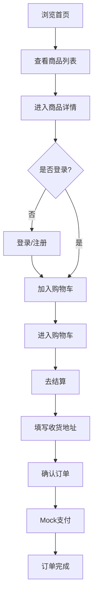
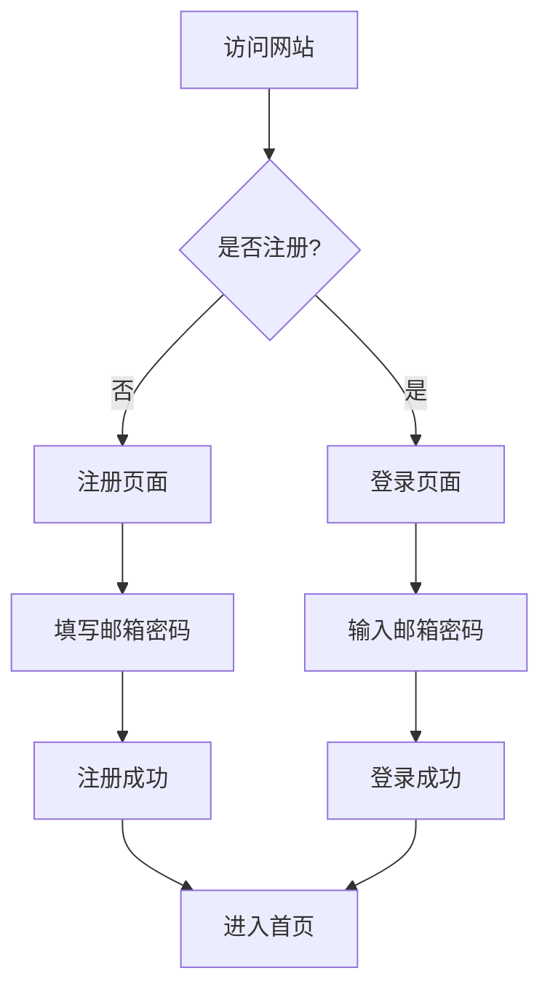

# 产品需求文档 (PRD)

## 项目概述

### 项目名称
LUMIÈRE - 女装电商平台

### 项目背景
打造一个面向中国消费者的女装电商网站，整体风格参考 Zara 和 H&M，提供简洁现代的购物体验。

### 目标用户
- 中国女性消费者（18-45岁）
- 追求时尚、注重品质的现代都市女性
- 习惯移动端购物的用户群体

## 核心功能需求

### 1. 首页
- **轮播图区域**：展示品牌活动、新品上市、促销信息
- **新品推荐**：展示最新上架商品
- **热销商品**：展示销量最高的商品
- **新用户弹窗**：首次访问时显示欢迎弹窗，引导注册

### 2. 注册/登录页
- **邮箱注册**：用户使用邮箱地址注册账号
- **邮箱登录**：用户使用邮箱和密码登录
- **表单验证**：实时验证输入格式

### 3. 商品列表页
- **商品展示**：网格布局展示商品
- **分类筛选**：按品类筛选商品
- **排序功能**：按价格、销量、新品排序

### 4. 商品详情页
- **商品图片**：大图展示，支持多图切换
- **尺码信息**：尺码选择器和尺码指南
- **用户评价**：展示用户购买评价
- **加入购物车**：选择尺码后加入购物车

### 5. 购物车
- **商品列表**：展示已添加商品
- **数量调整**：增减商品数量
- **价格计算**：实时计算总价

### 6. 结算流程
- **收货地址**：填写收货人信息
- **订单确认**：确认订单详情
- **支付**：Mock支付（点击即完成）

### 7. 订单管理
- **历史订单**：查看所有订单记录
- **订单详情**：查看单个订单详情

### 8. 联系我们
- **邮件联系**：通过邮件方式联系官方

## 视觉设计规范

### 色彩体系
- **主色调**：黑色 (#1A1A1A)、白色 (#FFFFFF)、灰色 (#6B6B6B)
- **点缀色**：米色 (#E8E0D5)、深蓝色 (#1E3A5F)
- **背景色**：浅灰 (#F5F5F5)、纯白 (#FFFFFF)

### 字体规范
- **标题字体**：Playfair Display（衬线字体，优雅气质）
- **正文字体**：Noto Sans SC（中文友好，现代简洁）

### 设计原则
- 大图展示商品，突出视觉冲击力
- 页面布局简洁，留白充足
- 交互动效自然流畅
- 使用风格统一的线性图标
- 移动端优先响应式设计

### 未上线页面
- 显示"敬请期待"空状态页面

## 技术约束

### 前端技术栈
- React 18 + TypeScript
- Vite 构建工具
- React Router v6 路由管理
- Zustand 状态管理
- Tailwind CSS 样式框架
- Framer Motion 动画库

### 数据存储
- LocalStorage 存储用户数据和购物车
- Mock 数据模拟商品和订单

### 响应式设计
- 移动端优先（375px - 1440px）
- 断点：sm(640px), md(768px), lg(1024px), xl(1280px)

## 页面路由规划

| 路由 | 页面 | 说明 |
|------|------|------|
| `/` | 首页 | 轮播图、新品、热销 |
| `/login` | 登录页 | 邮箱登录 |
| `/register` | 注册页 | 邮箱注册 |
| `/products` | 商品列表 | 全部商品 |
| `/products/:id` | 商品详情 | 单品详情 |
| `/cart` | 购物车 | 购物车管理 |
| `/checkout` | 结算页 | 填写地址、支付 |
| `/orders` | 订单列表 | 历史订单 |
| `/orders/:id` | 订单详情 | 单个订单 |
| `/contact` | 联系我们 | 邮件联系 |

## 用户流程

### 购物流程

### 用户认证流程

## 里程碑规划

### Phase 1: 基础架构
- 项目初始化
- 路由配置
- 全局样式
- 公共组件

### Phase 2: 核心页面
- 首页
- 商品列表页
- 商品详情页

### Phase 3: 用户系统
- 注册登录页
- 用户状态管理

### Phase 4: 购物流程
- 购物车
- 结算页
- 订单管理

### Phase 5: 完善优化
- 动画效果
- 响应式适配
- 性能优化
