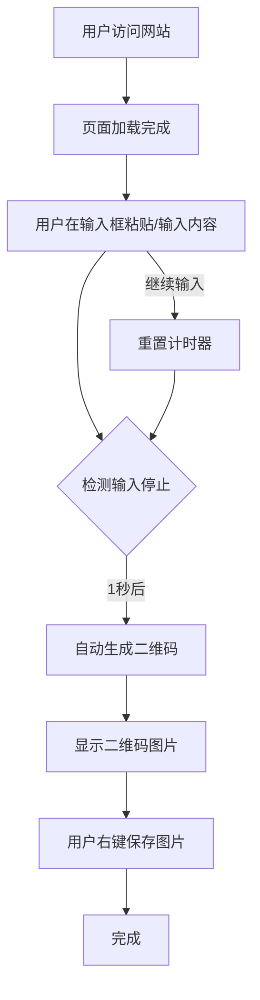

# 产品需求文档 (PRD)

## 项目名称
QR Code Generator - 极简在线二维码生成工具

## 1. 产品概述

### 1.1 产品定位
一个极简主义的在线二维码生成工具，专注于"输入即生成"的核心体验。用户无需注册、登录或安装任何软件，只需粘贴网址或文本，即可即时获得可保存的二维码图片。

### 1.2 目标用户
- 需要快速生成二维码的普通用户
- 营销人员、内容创作者
- 需要分享链接的商务人士
- 不想安装额外软件的轻量用户

### 1.3 核心价值主张
**零门槛、零等待、零干扰** — 三秒内完成从输入到获得二维码的全过程

---

## 2. 功能需求

### 2.1 核心功能

#### F1: 文本输入框
| 属性 | 要求 |
|------|------|
| 尺寸 | 大而清晰，占据视觉焦点 |
| 占位提示 | "粘贴你的网址或文本链接" |
| 支持内容 | HTTP/HTTPS链接、任意纯文本 |
| 交互 | 支持粘贴、键盘输入 |

#### F2: 即时生成
| 属性 | 要求 |
|------|------|
| 触发机制 | 输入停止后 1 秒自动生成 |
| 无需按钮 | 不设置"生成"按钮 |
| 反馈 | 生成过程中显示加载状态 |

#### F3: 二维码显示
| 属性 | 要求 |
|------|------|
| 位置 | 输入框下方 |
| 尺寸 | 最小 200x200px，建议 256x256px |
| 格式 | PNG 格式优先 |
| 质量 | 高清晰度，扫描成功率 > 99% |
| 容错级别 | H级（30%容错） |

#### F4: 保存功能
| 属性 | 要求 |
|------|------|
| 方式 | 右键保存图片 |
| 格式 | PNG |
| 文件名 | qrcode-[timestamp].png |

### 2.2 非功能需求

#### NFR1: 无需注册/登录
- 所有功能匿名可用
- 不收集用户数据
- 不设置用户系统

#### NFR2: 无需安装
- 纯 Web 应用
- 无浏览器插件依赖
- 无桌面软件依赖

#### NFR3: 极简界面
- 单一功能聚焦
- 减少视觉干扰
- 清晰的视觉层次

#### NFR4: 响应式设计
| 设备 | 断点 | 布局 |
|------|------|------|
| 桌面 | ≥1024px | 输入框与二维码并排 |
| 平板 | 768px-1023px | 输入框与二维码并排 |
| 手机 | <768px | 垂直堆叠布局 |

#### NFR5: 性能要求
| 指标 | 目标值 |
|------|--------|
| 首屏加载 | < 1.5s |
| 二维码生成 | < 500ms |
| 总体包大小 | < 100KB (gzip) |

#### NFR6: 安全性
- 前端生成，数据不离开客户端
- 无服务器端数据传输
- HTTPS 加密传输

---

## 3. 用户流程



---

## 4. 界面设计规范

### 4.1 设计原则
- **极简主义**: 去除一切非必要元素
- **功能导向**: 每个元素都有明确用途
- **视觉舒适**: 柔和配色，清晰对比

### 4.2 配色方案
采用深色主题，营造专注氛围：
- 背景: 深灰/近黑色 (#0a0a0a)
- 前景: 浅灰/白色 (#fafafa)
- 强调色: 青色 (#00d4aa)
- 卡片背景: 半透明深色

### 4.3 字体选择
- 主标题: Space Grotesk (现代几何感)
- 正文: 系统默认 (优化加载)

### 4.4 布局结构
```
┌─────────────────────────────────────────┐
│              Logo / 标题                 │
├─────────────────────────────────────────┤
│                                         │
│    ┌─────────────┐    ┌───────────┐    │
│    │             │    │           │    │
│    │  输入框      │    │  二维码    │    │
│    │             │    │           │    │
│    └─────────────┘    └───────────┘    │
│                                         │
│              提示文字                    │
└─────────────────────────────────────────┘
```

---

## 5. 技术约束

### 5.1 技术栈
- 框架: React 18 + Vite
- 二维码库: qrcode (npm)
- 样式: CSS Modules / Tailwind CSS
- 部署: 静态托管

### 5.2 浏览器兼容性
- Chrome 90+
- Firefox 88+
- Safari 14+
- Edge 90+

---

## 6. 验收标准

### 6.1 功能验收
- [ ] 输入框正常接收文本
- [ ] 输入停止1秒后自动生成二维码
- [ ] 二维码清晰可扫描
- [ ] 右键可保存PNG图片

### 6.2 性能验收
- [ ] 首屏加载 < 1.5s
- [ ] 二维码生成 < 500ms
- [ ] 包大小 < 100KB

### 6.3 兼容性验收
- [ ] 桌面端正常显示
- [ ] 移动端正常显示
- [ ] 主流浏览器兼容

---

## 7. 里程碑

| 阶段 | 内容 | 预计时间 |
|------|------|----------|
| M1 | 项目初始化与基础架构 | Day 1 |
| M2 | 核心功能开发 | Day 1 |
| M3 | 样式优化与响应式 | Day 1 |
| M4 | 测试与优化 | Day 1 |
