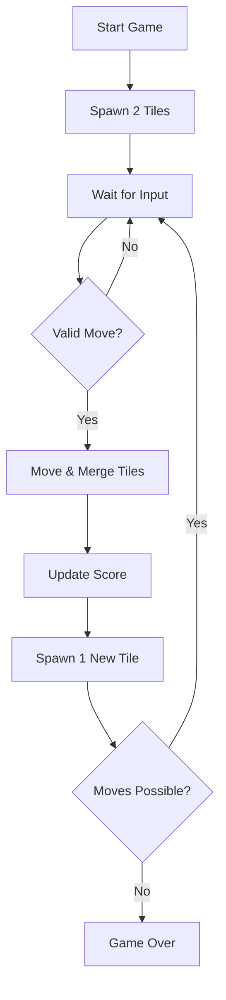

## 1. Product Overview
A retro-futuristic 2048 game with neon aesthetics and synthwave vibes.
- Goal: Create a production-grade 2048 game that is visually striking and engaging.
- Target: Fans of puzzle games and retro-futuristic design.

## 2. Core Features

### 2.1 User Roles
| Role | Registration Method | Core Permissions |
|------|---------------------|------------------|
| Player | None (Guest) | Play game, track score, restart game |

### 2.2 Feature Module
1. **Game Board**: 4x4 grid for tile movement and merging.
2. **Score System**: Real-time score tracking and best score storage.
3. **Controls**: Keyboard (arrow keys, WASD) and touch swipe support.
4. **Visual Effects**: Neon glow, tile merge animations, and smooth transitions.

### 2.3 Page Details
| Page Name | Module Name | Feature description |
|-----------|-------------|---------------------|
| Game Page | Header | Logo, Current Score, Best Score, New Game button |
| Game Page | Board | 4x4 grid with animated tiles |
| Game Page | Game Over | Modal overlay with final score and restart option |
| Game Page | Footer | How to play instructions |

## 3. Core Process
1. Player starts a new game.
2. Two random tiles (2 or 4) are spawned.
3. Player moves tiles using keyboard or touch.
4. Matching tiles merge into a single tile with the sum.
5. Score increases by the value of the merged tile.
6. Game ends when no moves are possible or 2048 is reached (optional "keep playing" mode).

## 4. User Interface Design
### 4.1 Design Style
- **Primary Colors**: Deep obsidian background (#0a0a0a), Neon Cyan (#00f3ff), Neon Magenta (#ff00ff).
- **Secondary Colors**: Electric Purple (#bc00ff), Amber Glow (#ffaa00).
- **Button Style**: Border-lit glowing buttons with glassmorphism effects.
- **Font**: 'Orbitron' for headers, 'Space Mono' for scores and instructions.
- **Layout Style**: Centered single-page layout with a prominent game board.
- **Animations**: CSS transitions for tile movement, scale-up for merges, and neon flicker for game over.

### 4.2 Page Design Overview
| Page Name | Module Name | UI Elements |
|-----------|-------------|-------------|
| Game Page | Board | Dark glass background, glowing grid lines, vibrant neon tiles with inner glow |
| Game Page | Tiles | Distinctive neon colors for each power of 2, using a synthwave gradient palette |

### 4.3 Responsiveness
- Desktop: Full keyboard support, centered board.
- Mobile: Touch swipe gestures, scaled board to fit screen width.

### 4.4 Visual Effects
- Background: Animated starfield or scanline overlay.
- Audio: Subtle retro synth sound effects for move/merge (optional).
