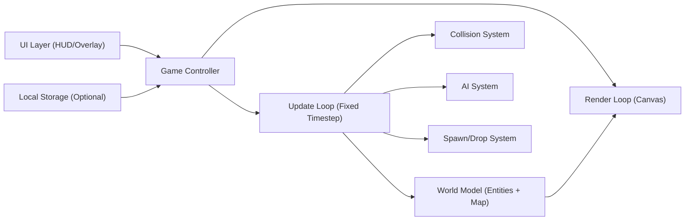

## 1. Architecture Design
本项目按用户约束实现为单文件原生 HTML/CSS/JavaScript（Canvas），不引入 React/Vite，以保证“可直接运行的 index.html”。

## 2. Technology Description
- Frontend: 原生 HTML + CSS + JavaScript（Canvas 2D）
- Initialization Tool: 无（单文件直接打开）
- Backend: None
- Data: 内存状态；可选 localStorage 持久化

## 3. Route Definitions
| Route | Purpose |
|-------|---------|
| / (index.html) | 单页运行游戏、展示 HUD 与结算层 |

## 4. API Definitions (if backend exists)
无后端。

## 5. Server Architecture Diagram (if backend exists)
无后端。

## 6. Data Model (if applicable)
### 6.1 Data Model Definition
主要对象（JS 内存结构）：
- Map：tile grid（砖墙/铁墙/草地/空地/基地）
- Entity：PlayerTank / EnemyTank / Bullet / Pickup / Explosion
- GameState：lives、killCount、targetKills、difficulty、timer、cooldowns

### 6.2 Data Definition Language
无数据库。

