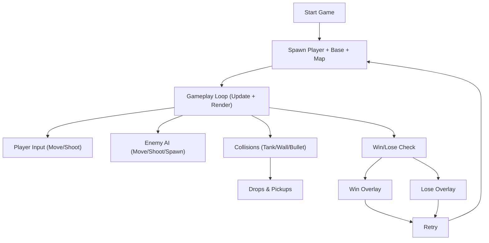

## 1. Product Overview
单文件（index.html）Canvas 版简化“坦克大战”。玩家移动与射击，摧毁敌方坦克并保护底部基地。
面向希望快速运行与学习 Canvas 游戏基础（地图、碰撞、AI、胜负判定）的用户。

## 2. Core Features

### 2.1 Feature Module
1. **Game Screen（单页）**：Canvas 渲染地图与实体、HUD、暂停/结算层、重试

### 2.2 Page Details
| Page Name | Module Name | Feature description |
|-----------|-------------|---------------------|
| Game Screen | Canvas World | 网格地图、砖墙/铁墙/草地、基地、玩家与敌人、子弹与爆炸效果 |
| Game Screen | Controls | 方向键移动，空格射击；带射速与转向/移动约束 |
| Game Screen | AI | 敌方定时生成；随机移动与射击；与地图/玩家/基地交互 |
| Game Screen | Collision | 坦克与墙体阻挡；子弹命中敌人/砖墙可摧毁；铁墙阻挡（停止/反弹不穿透） |
| Game Screen | Drops & Items | 击毁指定敌人概率掉落：攻击提升、生命增加；拾取立即生效；提供叠加/持续规则说明 |
| Game Screen | Win/Lose | 达成击杀数量胜利；基地被毁或玩家生命耗尽失败；展示结算界面与重试 |
| Game Screen | Optional | 3 分钟限时平局；难度参数分层；本地存档（localStorage）可选实现/注释说明 |

## 3. Core Process
玩家开始一局 → 操作坦克移动/射击 → 子弹与实体/墙体碰撞 → 敌人生成并随机移动/射击 → 击毁敌人计数与掉落拾取 → 满足胜负条件 → 展示结算层 → 重试/重新开始

## 4. User Interface Design
### 4.1 Design Style
- Primary / Secondary colors: 深色复古屏幕底色 + 高对比像素风配色（青绿/琥珀/红）
- Buttons: 像素边框按钮，按下态微位移
- Font and sizes: 使用浏览器默认等宽字体栈，突出复古 HUD
- Layout: 单页居中 Canvas，右侧/顶部 HUD 信息（生命、击杀、剩余敌人、攻击等级、时间）
- Icon style: 简单几何图形，避免外部资源

### 4.2 Page Design Overview
| Page Name | Module Name | UI Elements |
|-----------|-------------|-------------|
| Game Screen | HUD | 生命/击杀/目标数/攻击等级/（可选）倒计时，简洁对齐与高对比描边 |
| Game Screen | Overlay | 半透明遮罩 + 标题 + 统计信息 + 重试按钮 + 快捷键提示 |

### 4.3 Responsiveness
桌面优先：Canvas 固定像素倍数缩放适配窗口；移动端可保留基础展示但不强制触控优化（可注释扩展思路）。

