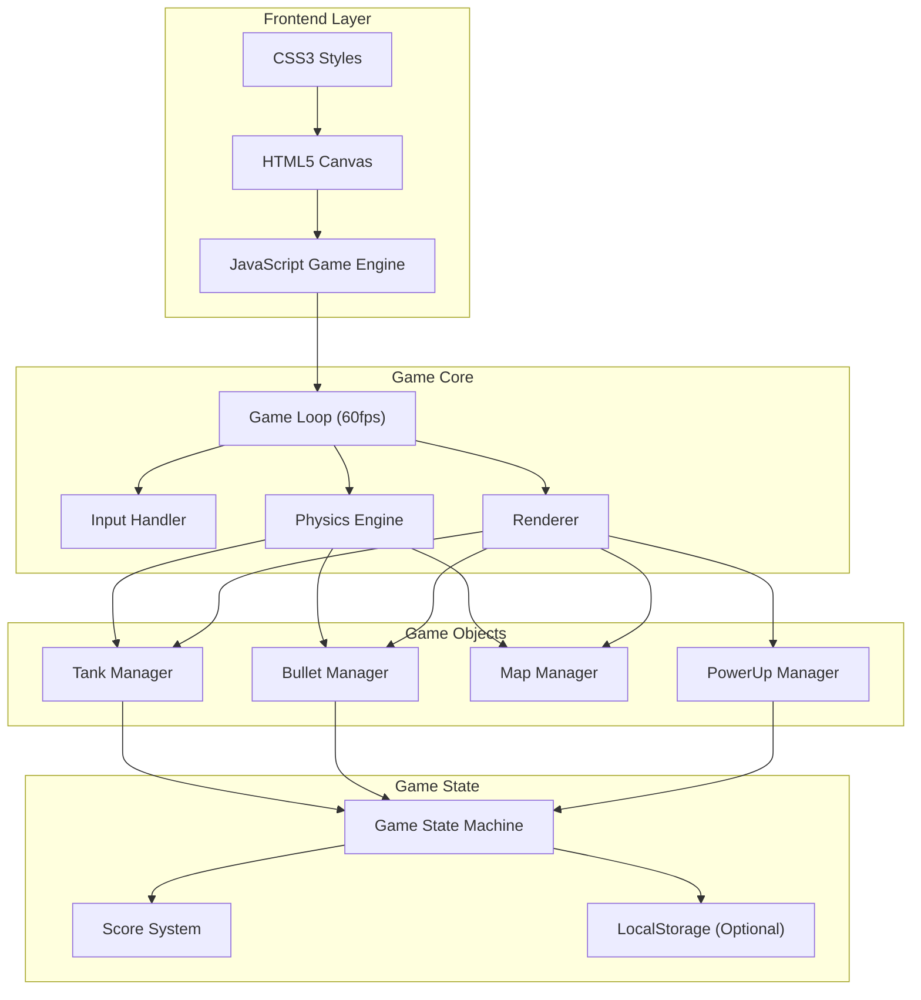

## 1. 架构设计



## 2. 技术说明

- **前端**: 纯 HTML5 + CSS3 + JavaScript (ES6+)
- **渲染引擎**: HTML5 Canvas 2D API
- **构建工具**: 无需构建，直接运行
- **后端**: 无（单机游戏）
- **数据存储**: localStorage（可选，用于进度保存）

## 3. 文件结构

```
/workspace/
├── index.html          # 主游戏文件（包含HTML/CSS/JS）
└── .trae/
    └── documents/
        ├── tank-battle-prd.md
        └── tank-battle-tech.md
```

## 4. 核心模块设计

### 4.1 游戏主循环
```javascript
class GameLoop {
    lastTime: number
    deltaTime: number
    update(): void      // 更新游戏状态
    render(): void      // 渲染游戏画面
    loop(timestamp): void  // 主循环
}
```

### 4.2 坦克类
```javascript
class Tank {
    x: number           // X坐标
    y: number           // Y坐标
    direction: enum     // 方向 (UP/DOWN/LEFT/RIGHT)
    speed: number       // 移动速度
    bulletSpeed: number // 子弹速度
    lastShot: number    // 上次射击时间
    shootCooldown: number // 射击冷却
    isPlayer: boolean   // 是否玩家
    lives: number       // 生命值
    move(): void        // 移动
    shoot(): Bullet     // 射击
    draw(): void        // 绘制
}
```

### 4.3 子弹类
```javascript
class Bullet {
    x: number
    y: number
    direction: enum
    speed: number
    owner: Tank         // 发射者
    update(): void      // 更新位置
    draw(): void        // 绘制
}
```

### 4.4 地图管理
```javascript
class MapManager {
    tileSize: number    // 瓦片大小 (32px)
    width: number       // 地图宽度
    height: number      // 地图高度
    tiles: Array        // 瓦片数组
    generate(): void    // 生成地图
    getTile(x, y): Tile // 获取瓦片
    destroyTile(x, y): void // 摧毁瓦片
    draw(): void        // 绘制地图
}
```

### 4.5 碰撞检测
```javascript
class CollisionDetector {
    checkTankWall(tank, map): boolean
    checkBulletWall(bullet, map): boolean
    checkTankTank(tank1, tank2): boolean
    checkBulletTank(bullet, tank): boolean
    checkBulletBase(bullet, base): boolean
}
```

### 4.6 道具系统
```javascript
class PowerUp {
    x: number
    y: number
    type: enum          // ATTACK_BOOST / LIFE_UP
    duration: number    // 持续时间
    apply(tank): void   // 应用效果
    draw(): void        // 绘制
}
```

### 4.7 AI控制器
```javascript
class AIController {
    tank: Tank
    changeDirectionTimer: number
    update(): void      // 更新AI行为
    randomMove(): void  // 随机移动
    tryShoot(): void    // 尝试射击
}
```

### 4.8 游戏状态机
```javascript
class GameState {
    state: enum         // MENU / PLAYING / PAUSED / VICTORY / DEFEAT
    score: number
    lives: number
    enemiesRemaining: number
    startTime: number
    elapsedTime: number
}
```

## 5. 数据模型

### 5.1 瓦片类型
```javascript
const TILE_TYPES = {
    EMPTY: 0,       // 空地
    BRICK: 1,       // 砖墙
    STEEL: 2,       // 铁墙
    GRASS: 3,       // 草地
    BASE: 4,        // 基地
    WATER: 5        // 水域（可选）
}
```

### 5.2 方向枚举
```javascript
const DIRECTIONS = {
    UP: 0,
    RIGHT: 1,
    DOWN: 2,
    LEFT: 3
}
```

### 5.3 道具类型
```javascript
const POWERUP_TYPES = {
    ATTACK_BOOST: {
        name: '攻击提升',
        bulletSpeedMultiplier: 2,
        duration: 10000
    },
    LIFE_UP: {
        name: '生命增加',
        livesToAdd: 1,
        duration: 0  // 永久
    }
}
```

### 5.4 游戏配置
```javascript
const GAME_CONFIG = {
    CANVAS_WIDTH: 640,
    CANVAS_HEIGHT: 640,
    TILE_SIZE: 32,
    PLAYER_SPEED: 2,
    PLAYER_BULLET_SPEED: 4,
    PLAYER_SHOOT_COOLDOWN: 500,
    ENEMY_SPEED: 1.5,
    ENEMY_BULLET_SPEED: 3,
    ENEMY_SHOOT_COOLDOWN: 1000,
    ENEMY_SPAWN_INTERVAL: 3000,
    MAX_ENEMIES_ON_SCREEN: 4,
    TOTAL_ENEMIES: 20,
    INITIAL_LIVES: 3,
    POWERUP_DROP_CHANCE: 0.3
}
```

## 6. 渲染层级

```
Layer 0: 地图底层（空地、砖墙、铁墙、基地）
Layer 1: 子弹
Layer 2: 坦克
Layer 3: 道具
Layer 4: 草地（遮挡层）
Layer 5: UI层（状态栏、游戏结束界面）
```

## 7. 输入处理

### 7.1 键盘映射
| 按键 | 功能 |
|------|------|
| ↑ / W | 向上移动 |
| ↓ / S | 向下移动 |
| ← / A | 向左移动 |
| → / D | 向右移动 |
| Space | 射击 |
| P | 暂停/继续 |
| R | 重新开始（游戏结束时） |

### 7.2 触摸控制（移动端）
- 左侧虚拟摇杆：控制移动方向
- 右侧射击按钮：发射子弹

## 8. 性能优化

### 8.1 渲染优化
- 使用 requestAnimationFrame 保证流畅动画
- 只重绘变化区域（脏矩形渲染）
- 离屏Canvas缓存静态地图元素

### 8.2 碰撞检测优化
- 空间分区：将地图划分为网格，只检测相邻格子
- AABB碰撞检测：使用轴对齐包围盒

### 8.3 内存管理
- 对象池：复用子弹和爆炸效果对象
- 及时清理：移除屏幕外的对象

## 9. 可选功能实现

### 9.1 局时限制
```javascript
const TIME_LIMIT = 180000; // 3分钟
function checkTimeLimit() {
    if (elapsedTime >= TIME_LIMIT) {
        gameState = 'DRAW';
    }
}
```

### 9.2 进度保存
```javascript
function saveProgress() {
    localStorage.setItem('tankBattle', JSON.stringify({
        score, lives, enemiesRemaining, mapState
    }));
}

function loadProgress() {
    const saved = localStorage.getItem('tankBattle');
    if (saved) {
        return JSON.parse(saved);
    }
    return null;
}
```

### 9.3 难度配置
```javascript
const DIFFICULTY = {
    EASY: {
        enemySpeed: 1.0,
        enemyShootCooldown: 1500,
        totalEnemies: 15,
        maxEnemiesOnScreen: 3
    },
    NORMAL: {
        enemySpeed: 1.5,
        enemyShootCooldown: 1000,
        totalEnemies: 20,
        maxEnemiesOnScreen: 4
    },
    HARD: {
        enemySpeed: 2.0,
        enemyShootCooldown: 700,
        totalEnemies: 30,
        maxEnemiesOnScreen: 5
    }
};
```

## 10. 错误处理

### 10.1 Canvas不支持
```javascript
if (!canvas.getContext) {
    alert('您的浏览器不支持Canvas，请使用现代浏览器');
}
```

### 10.2 游戏异常
- 捕获所有可能的异常
- 提供友好的错误提示
- 支持游戏重置

## 11. 测试要点

### 11.1 功能测试
- [ ] 玩家移动和射击正常
- [ ] 敌人生成和AI行为正常
- [ ] 碰撞检测准确
- [ ] 道具效果正确
- [ ] 胜负判定正确

### 11.2 边界测试
- [ ] 坦克不能移出地图边界
- [ ] 子弹移出屏幕后正确销毁
- [ ] 同时生成多个敌人时正常

### 11.3 性能测试
- [ ] 60fps流畅运行
- [ ] 内存无泄漏
- [ ] 长时间运行稳定
