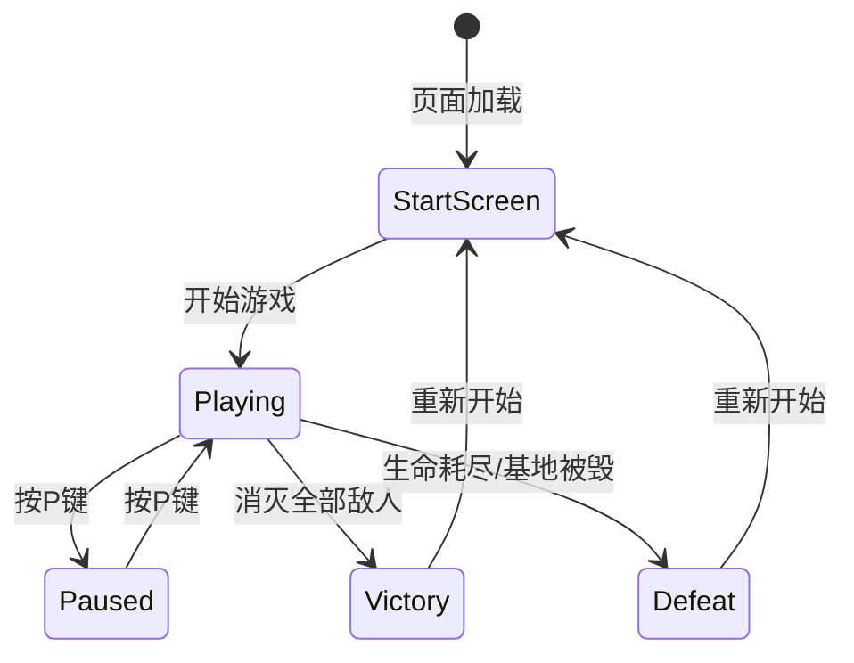

# 坦克大战游戏 - 技术架构文档

## 1. 系统架构

### 1.1 整体架构
```
┌─────────────────────────────────────────────────────┐
│                    index.html                        │
├─────────────────────────────────────────────────────┤
│  ┌─────────────┐  ┌─────────────┐  ┌─────────────┐  │
│  │   HTML      │  │    CSS      │  │ JavaScript  │  │
│  │  结构层     │  │   样式层    │  │   逻辑层    │  │
│  └─────────────┘  └─────────────┘  └─────────────┘  │
└─────────────────────────────────────────────────────┘
```

### 1.2 模块划分
```
Game (游戏主控)
├── Canvas (画布管理)
├── Input (输入处理)
├── Map (地图系统)
├── Tank (坦克类)
│   ├── PlayerTank (玩家坦克)
│   └── EnemyTank (敌方坦克)
├── Bullet (子弹类)
├── PowerUp (道具类)
└── UI (界面渲染)
```

## 2. 核心类设计

### 2.1 游戏主控类 (Game)
```javascript
class Game {
    constructor()
    init()           // 初始化游戏
    start()          // 开始游戏
    pause()          // 暂停游戏
    resume()         // 继续游戏
    reset()          // 重置游戏
    update()         // 更新游戏状态
    render()         // 渲染画面
    gameLoop()       // 游戏主循环
    checkWin()       // 检查胜利条件
    checkLose()      // 检查失败条件
}
```

### 2.2 坦克基类 (Tank)
```javascript
class Tank {
    constructor(x, y, direction)
    // 属性
    x, y             // 位置
    width, height    // 尺寸
    direction        // 方向 (up/down/left/right)
    speed            // 移动速度
    health           // 生命值
    shootCooldown    // 射击冷却
    
    // 方法
    move(direction)  // 移动
    shoot()          // 射击
    turn(direction)  // 转向
    draw(ctx)        // 绘制
    checkCollision() // 碰撞检测
}
```

### 2.3 玩家坦克类 (PlayerTank)
```javascript
class PlayerTank extends Tank {
    constructor(x, y)
    lives            // 生命数
    powerUp          // 当前道具效果
    respawn()        // 重生
    handleInput()    // 处理输入
}
```

### 2.4 敌方坦克类 (EnemyTank)
```javascript
class EnemyTank extends Tank {
    constructor(x, y)
    aiUpdate()       // AI更新逻辑
    randomMove()     // 随机移动
    randomShoot()    // 随机射击
}
```

### 2.5 子弹类 (Bullet)
```javascript
class Bullet {
    constructor(x, y, direction, owner)
    update()         // 更新位置
    draw(ctx)        // 绘制
    checkCollision() // 碰撞检测
}
```

### 2.6 道具类 (PowerUp)
```javascript
class PowerUp {
    constructor(x, y, type)
    type             // 道具类型 (attack/life)
    lifetime         // 存在时间
    update()         // 更新状态
    draw(ctx)        // 绘制
}
```

### 2.7 地图类 (Map)
```javascript
class Map {
    constructor()
    tiles[][]        // 地图瓦片数组
    TILE_SIZE        // 瓦片大小
    
    // 地形常量
    EMPTY = 0
    BRICK = 1
    STEEL = 2
    GRASS = 3
    BASE = 4
    
    generate()       // 生成地图
    draw(ctx)        // 绘制地图
    getTile(x, y)    // 获取瓦片
    destroyTile(x, y)// 摧毁瓦片
}
```

## 3. 游戏流程

### 3.1 状态流转图


### 3.2 游戏主循环
```javascript
function gameLoop(timestamp) {
    // 1. 计算时间增量
    deltaTime = timestamp - lastTime
    
    // 2. 更新游戏状态
    updateInput()
    updateTanks()
    updateBullets()
    updatePowerUps()
    checkCollisions()
    checkWinLose()
    
    // 3. 渲染画面
    clearCanvas()
    drawMap()
    drawTanks()
    drawBullets()
    drawPowerUps()
    drawUI()
    
    // 4. 继续循环
    requestAnimationFrame(gameLoop)
}
```

## 4. 碰撞检测系统

### 4.1 碰撞检测算法
```javascript
// AABB 矩形碰撞检测
function checkAABB(rect1, rect2) {
    return rect1.x < rect2.x + rect2.width &&
           rect1.x + rect1.width > rect2.x &&
           rect1.y < rect2.y + rect2.height &&
           rect1.y + rect1.height > rect2.y
}
```

### 4.2 碰撞响应表
| 碰撞对象A | 碰撞对象B | 响应 |
|-----------|-----------|------|
| 玩家坦克 | 砖墙/铁墙 | 阻挡移动 |
| 敌方坦克 | 砖墙/铁墙 | 阻挡移动 |
| 玩家子弹 | 砖墙 | 砖墙消失，子弹消失 |
| 玩家子弹 | 铁墙 | 子弹消失 |
| 玩家子弹 | 敌方坦克 | 敌方坦克受伤/消失 |
| 敌方子弹 | 玩家坦克 | 玩家坦克受伤 |
| 敌方子弹 | 基地 | 基地被毁，游戏失败 |

## 5. AI 行为设计

### 5.1 敌方坦克 AI 逻辑
```javascript
class EnemyAI {
    // 移动决策
    decideDirection() {
        // 1. 优先向基地方向移动
        // 2. 遇障碍物随机转向
        // 3. 小概率随机改变方向
    }
    
    // 射击决策
    decideShoot() {
        // 1. 玩家在前方时射击
        // 2. 随机间隔射击
        // 3. 遇障碍物射击
    }
}
```

### 5.2 难度参数配置
```javascript
const DIFFICULTY = {
    easy: {
        enemySpeed: 1,
        enemyShootInterval: 2000,
        enemyCount: 15
    },
    normal: {
        enemySpeed: 1.5,
        enemyShootInterval: 1500,
        enemyCount: 20
    },
    hard: {
        enemySpeed: 2,
        enemyShootInterval: 1000,
        enemyCount: 30
    }
}
```

## 6. 数据结构

### 6.1 地图数据结构
```javascript
// 地图二维数组 (26x26 瓦片)
const mapData = [
    [0, 0, 1, 1, 0, 0, ...],  // 行0
    [0, 2, 1, 1, 2, 0, ...],  // 行1
    // ...
]

// 瓦片类型常量
const TILE = {
    EMPTY: 0,  // 空地
    BRICK: 1,  // 砖墙
    STEEL: 2,  // 铁墙
    GRASS: 3,  // 草地
    BASE: 4,   // 基地
    WATER: 5   // 水域（可选）
}
```

### 6.2 游戏状态
```javascript
const gameState = {
    score: 0,
    lives: 3,
    enemiesRemaining: 20,
    isPaused: false,
    isGameOver: false,
    currentLevel: 1,
    difficulty: 'normal'
}
```

## 7. 渲染系统

### 7.1 绘制顺序
1. 清空画布 (黑色背景)
2. 绘制地图底层 (空地、砖墙、铁墙、基地)
3. 绘制坦克 (玩家、敌人)
4. 绘制子弹
5. 绘制草地 (覆盖在坦克上方)
6. 绘制道具
7. 绘制 UI 层

### 7.2 精灵绘制
```javascript
// 坦克绘制方向
const TANK_SPRITES = {
    up:    [[x,y,w,h], ...],  // 向上帧序列
    down:  [[x,y,w,h], ...],  // 向下帧序列
    left:  [[x,y,w,h], ...],  // 向左帧序列
    right: [[x,y,w,h], ...]   // 向右帧序列
}
```

## 8. 输入处理

### 8.1 键盘事件映射
```javascript
const KEY_MAP = {
    ArrowUp: 'up',
    ArrowDown: 'down',
    ArrowLeft: 'left',
    ArrowRight: 'right',
    Space: 'shoot',
    KeyP: 'pause'
}
```

### 8.2 输入状态管理
```javascript
const inputState = {
    up: false,
    down: false,
    left: false,
    right: false,
    shoot: false
}
```

## 9. 性能优化

### 9.1 渲染优化
- 使用 requestAnimationFrame
- 离屏 Canvas 缓存静态元素
- 减少重绘区域

### 9.2 碰撞检测优化
- 空间分区 (网格划分)
- 只检测相邻区域的碰撞

## 10. 扩展功能实现思路

### 10.1 进度保存 (localStorage)
```javascript
// 保存进度
function saveProgress() {
    localStorage.setItem('tankGame', JSON.stringify(gameState))
}

// 加载进度
function loadProgress() {
    const saved = localStorage.getItem('tankGame')
    return saved ? JSON.parse(saved) : null
}
```

### 10.2 局时限制
```javascript
const GAME_TIME = 180 // 3分钟

function checkTime() {
    if (elapsedTime >= GAME_TIME) {
        showDrawScreen()
    }
}
```
