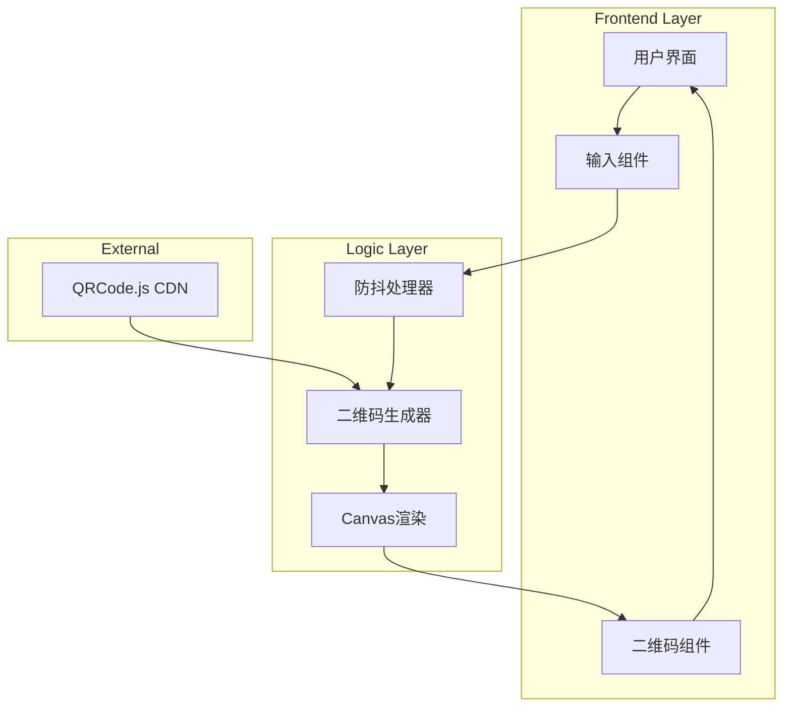
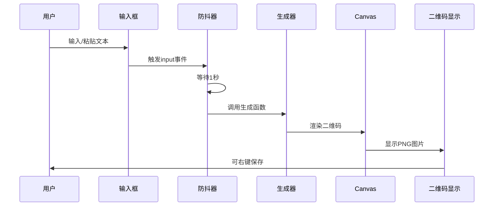

# 技术架构文档

## 项目名称
QR Snap - 极简在线二维码生成工具

## 1. 技术栈

### 1.1 核心技术
| 层级 | 技术 | 版本 | 说明 |
|------|------|------|------|
| 结构层 | HTML5 | - | 语义化标签 |
| 样式层 | CSS3 | - | CSS变量、Flexbox、Grid |
| 行为层 | Vanilla JavaScript | ES6+ | 无框架依赖 |
| 二维码 | QRCode.js | 1.5.3 | 轻量级二维码库 |

### 1.2 外部依赖
```html
<!-- QRCode.js from CDN -->
<script src="https://cdn.jsdelivr.net/npm/qrcode@1.5.3/build/qrcode.min.js"></script>
```

## 2. 项目结构

```
qr-snap/
├── index.html          # 单页应用入口
├── styles.css          # 样式文件
├── script.js           # 主逻辑脚本
└── .trae/
    └── documents/
        ├── prd.md
        └── tech-arch.md
```

## 3. 架构设计

### 3.1 系统架构图



### 3.2 数据流图



## 4. 核心模块设计

### 4.1 输入模块
```javascript
// 防抖函数
function debounce(func, wait) {
    let timeout;
    return function executedFunction(...args) {
        const later = () => {
            clearTimeout(timeout);
            func(...args);
        };
        clearTimeout(timeout);
        timeout = setTimeout(later, wait);
    };
}
```

### 4.2 二维码生成模块
```javascript
// 二维码生成配置
const qrConfig = {
    type: 'image/png',
    quality: 1.0,
    width: 300,
    height: 300,
    margin: 2,
    color: {
        dark: '#000000',
        light: '#ffffff'
    }
};
```

### 4.3 Canvas 渲染模块
- 使用 HTMLCanvasElement 生成图像
- 转换为 PNG DataURL
- 支持右键保存

## 5. 响应式设计

### 5.1 断点设计
```css
:root {
    --breakpoint-mobile: 480px;
    --breakpoint-tablet: 768px;
    --breakpoint-desktop: 1024px;
}
```

### 5.2 布局策略
- **桌面端 (>768px)**: 水平布局，输入框与二维码并排
- **移动端 (<768px)**: 垂直布局，输入框在上，二维码在下

## 6. 性能优化

### 6.1 加载优化
- 使用 CDN 加载 QRCode.js
- 最小化 CSS 和 JS
- 无阻塞渲染

### 6.2 运行时优化
- 防抖处理避免频繁生成
- Canvas 离屏渲染
- 内存管理：清除旧 Canvas

## 7. 安全考虑

### 7.1 前端安全
- 无用户数据传输
- 无 Cookie 存储
- 无第三方追踪
- Content Security Policy (CSP) 就绪

### 7.2 输入验证
- 最大输入长度限制 (建议 2048 字符)
- XSS 防护：纯文本处理，无 HTML 渲染

## 8. 浏览器兼容性

### 8.1 最低支持版本
| 浏览器 | 最低版本 |
|--------|----------|
| Chrome | 60+ |
| Firefox | 55+ |
| Safari | 11+ |
| Edge | 79+ |

### 8.2 关键 API
- Canvas API
- ES6+ JavaScript
- CSS Flexbox/Grid
- CSS Custom Properties

## 9. 部署方案

### 9.1 静态托管
- 可部署至任何静态文件服务器
- 推荐：GitHub Pages, Vercel, Netlify
- 无需后端服务

### 9.2 文件大小预估
| 文件 | 大小 |
|------|------|
| index.html | ~2KB |
| styles.css | ~3KB |
| script.js | ~2KB |
| QRCode.js (CDN) | ~15KB |
| **总计** | ~22KB |

## 10. 开发规范

### 10.1 代码风格
- 使用 ES6+ 语法
- 函数式编程风格
- 语义化命名

### 10.2 CSS 规范
- BEM 命名约定
- CSS 变量管理主题
- 移动优先媒体查询

### 10.3 文件组织
- 关注点分离
- 单一职责原则
- 模块化结构
