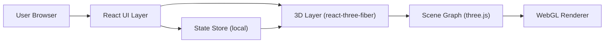

## 1. Architecture Design



## 2. Technology Description
- Frontend: React@18 + TypeScript + Vite
- Styling: Tailwind CSS（或 CSS Modules，依项目现状选择其一）
- 3D: three + @react-three/fiber + @react-three/drei
- Post-processing (optional): @react-three/postprocessing
- Backend: None
- Data: 纯程序化生成（无外部资源依赖；可选使用小型噪声纹理内置为静态资源）

## 3. Route Definitions
| Route | Purpose |
|-------|---------|
| / | 3D 山脉主场景与控制面板 |
| /help | 操作说明与模式解释 |

## 4. API Definitions (if backend exists)
无后端 API。

## 5. Server Architecture Diagram (if backend exists)
无。

## 6. Data Model (if applicable)
无持久化数据模型；运行时状态仅存在于前端内存中。

### 6.1 Runtime State (TypeScript)
- 视图状态：相机位置/目标点、是否自动播放、时间值（0–24h）、播放速度
- 渲染状态：等高线开关与密度、雾强度、曝光/对比度（可选）
- 场景缓存：高度场参数、河流路径、生成的几何体与材质引用（避免重复生成）

### 6.2 3D Implementation Notes
- Terrain: 规则网格平面 + 高度位移（CPU 生成 heightmap + 更新 BufferGeometry attribute）；法线重新计算或用导数近似
- Cliff: 在高度场中引入断层函数（cliff mask）形成陡峭坡度；着色时用坡度/曲率加强岩壁与裂隙
- River: 依据高度场寻找低洼路径（简化：从高处采样向下贪心/多点引导），生成 CatmullRom 曲线；沿曲线生成河床带状网格与水面
- Water: 轻量 ShaderMaterial 或 MeshStandardMaterial + 法线扰动；通过时间驱动 UV 扫动形成流动
- Day/Night: 以时间参数驱动方向光方位角/高度角；天空渐变、雾色、环境光强度使用插值曲线
- Contours: 两种实现路径
  - 材质叠加：在地形着色中对高度做分段，生成细线（screen-space 稳定性更好）
  - 额外线框：提取等高线条（Marching Squares on heightmap）生成 LineSegments（更真实但更重）
```
