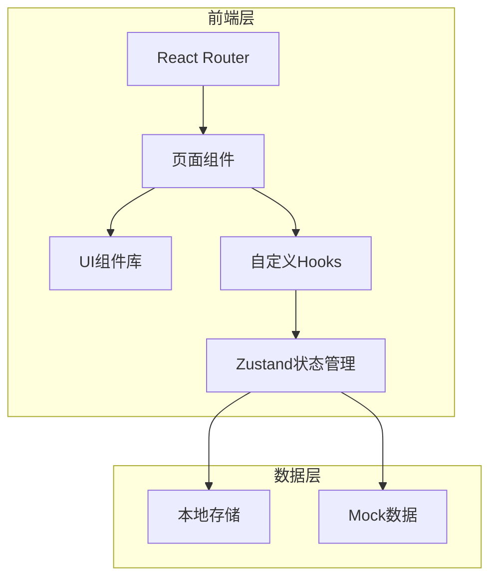
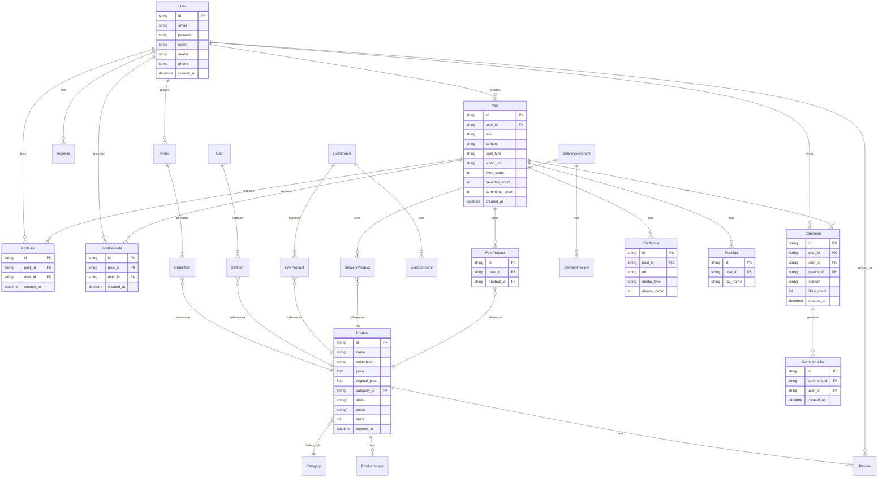

## 1. 架构设计



## 2. 技术说明

- **前端框架**：React 18 + TypeScript
- **样式方案**：Tailwind CSS 3 + CSS Variables
- **构建工具**：Vite
- **状态管理**：Zustand（轻量级，适合中小型应用）
- **路由管理**：React Router v6
- **动画库**：Framer Motion
- **图标库**：Lucide React（线性图标风格统一）
- **后端服务**：无（纯前端 Mock 数据）
- **数据存储**：LocalStorage（用户数据、购物车、订单、帖子）

## 3. 路由定义

| 路由 | 页面 | 描述 |
|------|------|------|
| `/` | 首页 | 品牌展示、新品、热销商品 |
| `/login` | 登录页 | 邮箱登录 |
| `/register` | 注册页 | 邮箱注册 |
| `/products` | 商品列表 | 分类浏览、筛选 |
| `/products/:id` | 商品详情 | 单品详情页 |
| `/cart` | 购物车 | 购物车管理 |
| `/checkout` | 结算页 | 地址填写、订单确认 |
| `/payment` | 支付页 | Mock支付 |
| `/orders` | 订单列表 | 历史订单 |
| `/orders/:id` | 订单详情 | 单个订单详情 |
| `/account` | 个人中心 | 账户信息 |
| `/contact` | 联系客服 | 邮件表单 |
| `/favorites` | 收藏夹 | 收藏商品列表 |
| `/live` | 直播购物 | 直播视频、互动、商品购买 |
| `/delivery` | 快递服务 | 快递商家列表 |
| `/delivery/:id` | 快递商家详情 | 商家商品选购 |
| `/community` | 社区帖子 | 帖子列表、瀑布流 |
| `/community/create` | 发布帖子 | 上传图片/视频、视频解析 |
| `/community/:id` | 帖子详情 | 内容展示、评论互动 |
| `*` | 404页面 | 页面不存在 |

## 4. 数据模型

### 4.1 数据模型定义



### 4.2 TypeScript 类型定义

```typescript
interface User {
  id: string;
  email: string;
  password: string;
  name: string;
  avatar?: string;
  phone?: string;
  createdAt: Date;
}

interface Product {
  id: string;
  name: string;
  description: string;
  price: number;
  originalPrice?: number;
  categoryId: string;
  sizes: string[];
  colors: string[];
  stock: number;
  images: string[];
  isNew?: boolean;
  isHot?: boolean;
  createdAt: Date;
}

interface Post {
  id: string;
  userId: string;
  userName: string;
  userAvatar?: string;
  title: string;
  content: string;
  postType: 'image' | 'video' | 'mixed';
  media: PostMedia[];
  videoUrl?: string;
  tags: string[];
  products: Product[];
  likesCount: number;
  favoritesCount: number;
  commentsCount: number;
  isLiked?: boolean;
  isFavorited?: boolean;
  createdAt: Date;
}

interface PostMedia {
  id: string;
  postId: string;
  url: string;
  mediaType: 'image' | 'video';
  displayOrder: number;
}

interface Comment {
  id: string;
  postId: string;
  userId: string;
  userName: string;
  userAvatar?: string;
  parentId?: string;
  content: string;
  likesCount: number;
  isLiked?: boolean;
  replies?: Comment[];
  createdAt: Date;
}

interface PostFilters {
  tag: string | null;
  postType: 'all' | 'image' | 'video';
  sortBy: 'latest' | 'popular';
}

interface VideoParseResult {
  success: boolean;
  videoUrl?: string;
  thumbnail?: string;
  title?: string;
  error?: string;
}
```

## 5. 状态管理设计

### 5.1 Store 结构

```typescript
interface AuthStore {
  user: User | null;
  isAuthenticated: boolean;
  login: (email: string, password: string) => Promise<boolean>;
  register: (email: string, password: string, name: string) => Promise<boolean>;
  logout: () => void;
}

interface CartStore {
  items: CartItem[];
  addItem: (item: CartItem) => void;
  removeItem: (productId: string, size: string) => void;
  updateQuantity: (productId: string, size: string, quantity: number) => void;
  clearCart: () => void;
  getTotal: () => number;
}

interface OrderStore {
  orders: Order[];
  addOrder: (order: Order) => void;
  getOrders: () => Order[];
}

interface AddressStore {
  addresses: Address[];
  addAddress: (address: Address) => void;
  updateAddress: (address: Address) => void;
  deleteAddress: (id: string) => void;
  setDefault: (id: string) => void;
}

interface FavoritesStore {
  items: Product[];
  addFavorite: (product: Product) => void;
  removeFavorite: (productId: string) => void;
  toggleFavorite: (product: Product) => void;
  isFavorite: (productId: string) => boolean;
  clearFavorites: () => void;
}

interface LiveStore {
  currentStream: LiveStream | null;
  liveProducts: LiveProduct[];
  comments: LiveComment[];
  viewerCount: number;
  addComment: (comment: LiveComment) => void;
  setViewerCount: (count: number) => void;
}

interface DeliveryStore {
  merchants: DeliveryMerchant[];
  currentMerchant: DeliveryMerchant | null;
  merchantProducts: DeliveryProduct[];
  filters: DeliveryFilters;
  setMerchants: (merchants: DeliveryMerchant[]) => void;
  setCurrentMerchant: (merchant: DeliveryMerchant | null) => void;
  setMerchantProducts: (products: DeliveryProduct[]) => void;
  setFilters: (filters: Partial<DeliveryFilters>) => void;
}

interface CommunityStore {
  posts: Post[];
  currentPost: Post | null;
  filters: PostFilters;
  setPosts: (posts: Post[]) => void;
  addPost: (post: Post) => void;
  setCurrentPost: (post: Post | null) => void;
  likePost: (postId: string) => void;
  unlikePost: (postId: string) => void;
  favoritePost: (postId: string) => void;
  unfavoritePost: (postId: string) => void;
  setFilters: (filters: Partial<PostFilters>) => void;
}
```

## 6. 项目目录结构

```
src/
├── components/
│   ├── common/
│   │   ├── Button.tsx
│   │   ├── Input.tsx
│   │   ├── Modal.tsx
│   │   ├── Loading.tsx
│   │   └── EmptyState.tsx
│   ├── layout/
│   │   ├── Header.tsx
│   │   ├── Footer.tsx
│   │   ├── Navigation.tsx
│   │   └── Layout.tsx
│   ├── product/
│   │   ├── ProductCard.tsx
│   │   ├── ProductGrid.tsx
│   │   ├── ProductGallery.tsx
│   │   ├── SizeSelector.tsx
│   │   └── ReviewList.tsx
│   ├── cart/
│   │   ├── CartItem.tsx
│   │   └── CartSummary.tsx
│   ├── home/
│   │   ├── HeroCarousel.tsx
│   │   ├── NewArrivals.tsx
│   │   ├── HotProducts.tsx
│   │   └── WelcomeModal.tsx
│   ├── live/
│   │   ├── LiveVideo.tsx
│   │   ├── LiveComments.tsx
│   │   ├── LiveProducts.tsx
│   │   └── LiveInteraction.tsx
│   ├── delivery/
│   │   ├── MerchantCard.tsx
│   │   ├── MerchantFilter.tsx
│   │   └── MerchantProductGrid.tsx
│   └── community/
│       ├── PostCard.tsx
│       ├── PostGrid.tsx
│       ├── PostMedia.tsx
│       ├── PostComments.tsx
│       ├── MediaUploader.tsx
│       ├── VideoParser.tsx
│       └── TagSelector.tsx
├── pages/
│   ├── Home.tsx
│   ├── Login.tsx
│   ├── Register.tsx
│   ├── Products.tsx
│   ├── ProductDetail.tsx
│   ├── Cart.tsx
│   ├── Checkout.tsx
│   ├── Payment.tsx
│   ├── Orders.tsx
│   ├── OrderDetail.tsx
│   ├── Account.tsx
│   ├── Contact.tsx
│   ├── Favorites.tsx
│   ├── Live.tsx
│   ├── Delivery.tsx
│   ├── DeliveryMerchant.tsx
│   ├── Community.tsx
│   ├── CreatePost.tsx
│   ├── PostDetail.tsx
│   └── NotFound.tsx
├── hooks/
│   ├── useAuth.ts
│   ├── useCart.ts
│   ├── useOrders.ts
│   └── useLocalStorage.ts
├── store/
│   ├── authStore.ts
│   ├── cartStore.ts
│   ├── orderStore.ts
│   ├── addressStore.ts
│   ├── favoritesStore.ts
│   ├── liveStore.ts
│   ├── deliveryStore.ts
│   └── communityStore.ts
├── data/
│   ├── products.ts
│   ├── categories.ts
│   ├── reviews.ts
│   ├── liveStreams.ts
│   ├── deliveryMerchants.ts
│   └── posts.ts
├── utils/
│   ├── format.ts
│   ├── validation.ts
│   └── videoParser.ts
├── styles/
│   └── globals.css
├── types/
│   └── index.ts
├── App.tsx
└── main.tsx
```

## 7. Mock 数据策略

- 商品数据：预定义 20-30 个商品，包含不同分类
- 分类数据：外套、连衣裙、上衣、裤装、裙装、配饰
- 用户评价：每个商品预置 3-5 条评价
- 用户数据：存储在 LocalStorage
- 购物车数据：存储在 LocalStorage
- 订单数据：存储在 LocalStorage
- 直播数据：预定义直播信息、直播商品、模拟弹幕
- 快递商家数据：预定义 5-8 个快递商家，包含商家信息、配送范围、专属商品
- 社区帖子数据：预定义 10-15 条帖子，包含图片/视频、标签、评论
- 帖子互动数据：存储在 LocalStorage（点赞、收藏）
