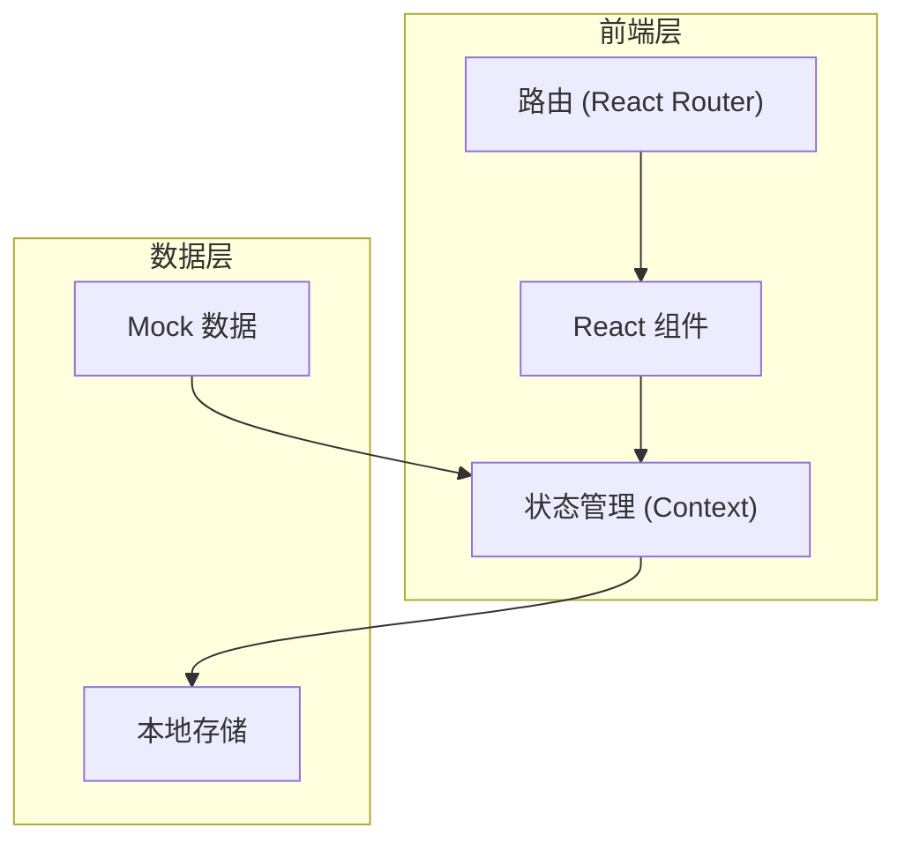
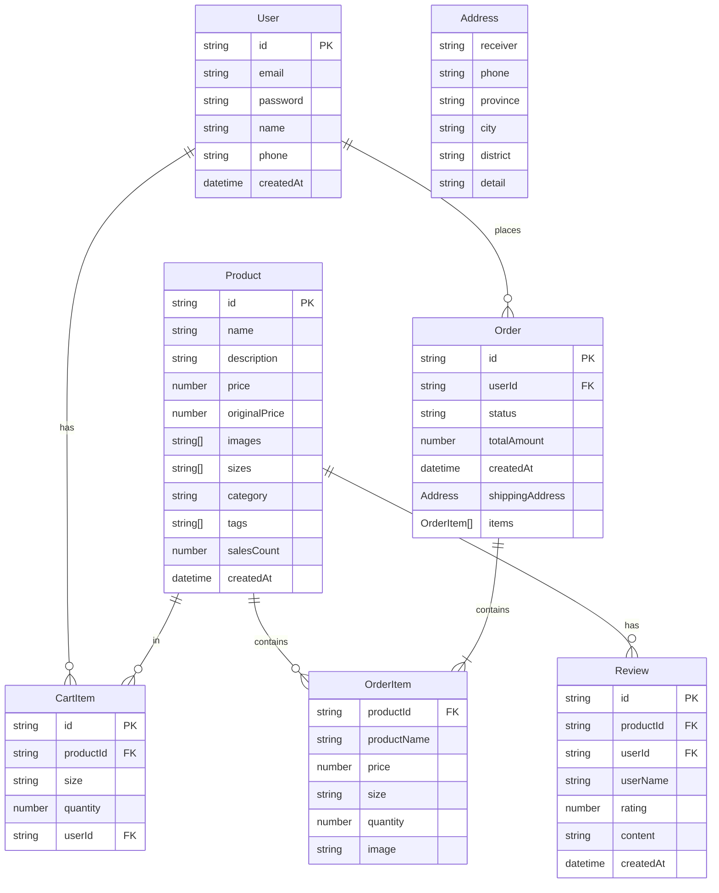

## 1. 架构设计



## 2. 技术说明

- **前端框架**: React@18 + TypeScript
- **样式方案**: Tailwind CSS@3
- **构建工具**: Vite
- **路由管理**: React Router@6
- **状态管理**: React Context + useReducer
- **动画库**: Framer Motion
- **图标库**: Lucide React（线性图标）
- **数据存储**: LocalStorage（用户数据、购物车、订单）
- **后端服务**: 无（纯前端 Mock 数据）

## 3. 路由定义

| 路由路径 | 页面名称 | 功能描述 |
|----------|----------|----------|
| `/` | 首页 | 轮播图、新品推荐、热销商品 |
| `/login` | 登录注册页 | 邮箱登录注册 |
| `/products` | 商品列表页 | 商品筛选和展示 |
| `/products/:id` | 商品详情页 | 商品详情、评价 |
| `/cart` | 购物车页 | 购物车管理 |
| `/checkout` | 结算页 | 地址填写、订单确认 |
| `/payment` | 支付页 | Mock支付 |
| `/orders` | 订单页 | 历史订单列表 |
| `/orders/:id` | 订单详情页 | 订单详情 |
| `/contact` | 联系我们页 | 邮件联系 |

## 4. 数据模型

### 4.1 数据模型定义



### 4.2 数据定义

#### 用户数据结构
```typescript
interface User {
  id: string;
  email: string;
  password: string;
  name: string;
  phone?: string;
  createdAt: string;
}
```

#### 商品数据结构
```typescript
interface Product {
  id: string;
  name: string;
  description: string;
  price: number;
  originalPrice?: number;
  images: string[];
  sizes: string[];
  category: string;
  tags: string[];
  salesCount: number;
  createdAt: string;
}
```

#### 购物车数据结构
```typescript
interface CartItem {
  id: string;
  productId: string;
  product: Product;
  size: string;
  quantity: number;
}
```

#### 订单数据结构
```typescript
interface Order {
  id: string;
  userId: string;
  status: 'pending' | 'paid' | 'shipped' | 'delivered' | 'cancelled';
  totalAmount: number;
  shippingAddress: Address;
  items: OrderItem[];
  createdAt: string;
  paidAt?: string;
}

interface OrderItem {
  productId: string;
  productName: string;
  price: number;
  size: string;
  quantity: number;
  image: string;
}

interface Address {
  receiver: string;
  phone: string;
  province: string;
  city: string;
  district: string;
  detail: string;
}
```

#### 评价数据结构
```typescript
interface Review {
  id: string;
  productId: string;
  userId: string;
  userName: string;
  rating: number;
  content: string;
  createdAt: string;
}
```

## 5. 项目目录结构

```
src/
├── components/          # 公共组件
│   ├── layout/         # 布局组件
│   │   ├── Header.tsx
│   │   ├── Footer.tsx
│   │   ├── BottomNav.tsx
│   │   └── Layout.tsx
│   ├── ui/             # UI组件
│   │   ├── Button.tsx
│   │   ├── Input.tsx
│   │   ├── Modal.tsx
│   │   ├── ProductCard.tsx
│   │   └── Loading.tsx
│   └── shared/         # 共享组件
│       ├── ImageCarousel.tsx
│       ├── SizeSelector.tsx
│       └── Rating.tsx
├── pages/              # 页面组件
│   ├── Home.tsx
│   ├── Login.tsx
│   ├── Products.tsx
│   ├── ProductDetail.tsx
│   ├── Cart.tsx
│   ├── Checkout.tsx
│   ├── Payment.tsx
│   ├── Orders.tsx
│   ├── OrderDetail.tsx
│   └── Contact.tsx
├── context/            # Context状态管理
│   ├── AuthContext.tsx
│   ├── CartContext.tsx
│   └── OrderContext.tsx
├── hooks/              # 自定义Hooks
│   ├── useAuth.ts
│   ├── useCart.ts
│   └── useLocalStorage.ts
├── data/               # Mock数据
│   ├── products.ts
│   ├── reviews.ts
│   └── banners.ts
├── utils/              # 工具函数
│   ├── storage.ts
│   ├── format.ts
│   └── validation.ts
├── types/              # TypeScript类型定义
│   └── index.ts
├── styles/             # 全局样式
│   └── globals.css
├── App.tsx
├── main.tsx
└── router.tsx
```

## 6. 关键技术实现

### 6.1 状态管理方案

使用 React Context + useReducer 进行全局状态管理：

- **AuthContext**: 用户登录状态、用户信息
- **CartContext**: 购物车商品列表、添加/删除/修改操作
- **OrderContext**: 订单列表、创建订单、更新订单状态

### 6.2 本地存储方案

使用 LocalStorage 持久化数据：

- `user`: 当前登录用户信息
- `cart`: 购物车数据
- `orders`: 订单历史
- `isNewUser`: 是否首次访问（用于弹窗判断）

### 6.3 Mock支付流程

1. 用户点击支付按钮
2. 显示加载动画（模拟支付处理）
3. 1.5秒后显示支付成功
4. 更新订单状态为已支付
5. 跳转到订单详情页

### 6.4 图片处理方案

使用 Unsplash API 获取高质量女装图片作为 Mock 数据，商品图片使用固定尺寸：
- 列表卡片: 400x500
- 详情页大图: 800x1000
- 轮播图: 1200x600
