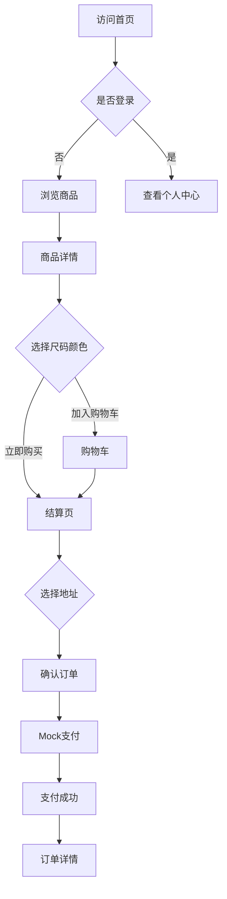
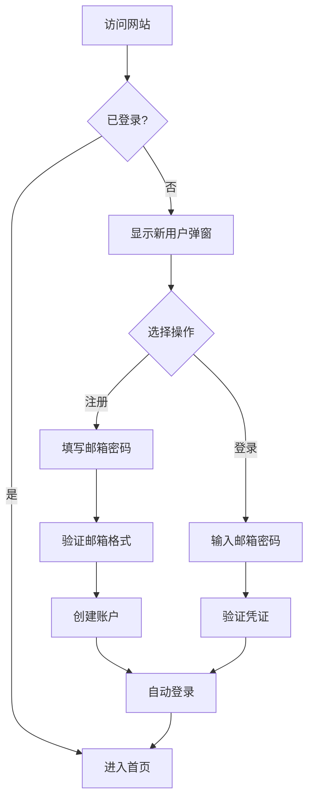

# 技术架构文档

## 项目概述

### 项目名称
LUXE - 高端女装电商平台

### 技术栈选型

| 类别 | 技术选型 | 版本 | 说明 |
|------|---------|------|------|
| 框架 | React | 18.x | 主流前端框架，生态完善 |
| 语言 | TypeScript | 5.x | 类型安全，提升代码质量 |
| 构建工具 | Vite | 5.x | 快速开发体验，热更新 |
| 样式方案 | Tailwind CSS | 3.x | 原子化CSS，快速开发 |
| 路由 | React Router | 6.x | 声明式路由 |
| 状态管理 | Zustand | 4.x | 轻量级状态管理 |
| 动画 | Framer Motion | 11.x | 流畅动画效果 |
| 图标 | Lucide React | Latest | 统一图标风格 |
| 工具库 | clsx, tailwind-merge | Latest | 类名合并工具 |

---

## 项目结构

```
luxe-fashion/
├── public/
│   └── images/           # 静态图片资源
├── src/
│   ├── assets/           # 需要编译的资源
│   ├── components/       # 通用组件
│   │   ├── common/       # 基础组件
│   │   │   ├── Button.tsx
│   │   │   ├── Input.tsx
│   │   │   ├── Modal.tsx
│   │   │   └── ...
│   │   ├── layout/       # 布局组件
│   │   │   ├── Header.tsx
│   │   │   ├── Footer.tsx
│   │   │   └── Layout.tsx
│   │   └── product/      # 商品相关组件
│   │       ├── ProductCard.tsx
│   │       ├── ProductGallery.tsx
│   │       └── ...
│   ├── pages/            # 页面组件
│   │   ├── Home.tsx
│   │   ├── Login.tsx
│   │   ├── Register.tsx
│   │   ├── Products.tsx
│   │   ├── ProductDetail.tsx
│   │   ├── Cart.tsx
│   │   ├── Checkout.tsx
│   │   ├── Orders.tsx
│   │   ├── OrderDetail.tsx
│   │   ├── Account.tsx
│   │   ├── Contact.tsx
│   │   └── ComingSoon.tsx
│   ├── stores/           # Zustand 状态管理
│   │   ├── useAuthStore.ts
│   │   ├── useCartStore.ts
│   │   ├── useProductStore.ts
│   │   └── useOrderStore.ts
│   ├── data/             # Mock 数据
│   │   ├── products.ts
│   │   └── users.ts
│   ├── types/            # TypeScript 类型定义
│   │   ├── product.ts
│   │   ├── user.ts
│   │   ├── order.ts
│   │   └── index.ts
│   ├── hooks/            # 自定义 Hooks
│   │   ├── useLocalStorage.ts
│   │   └── useScrollToTop.ts
│   ├── utils/            # 工具函数
│   │   ├── format.ts
│   │   └── validation.ts
│   ├── App.tsx           # 应用入口
│   ├── main.tsx          # 渲染入口
│   └── index.css         # 全局样式
├── index.html
├── tailwind.config.js
├── tsconfig.json
├── vite.config.ts
└── package.json
```

---

## 核心模块设计

### 1. 路由架构

```typescript
const routes = [
  { path: '/', element: <Home /> },
  { path: '/register', element: <Register /> },
  { path: '/login', element: <Login /> },
  { path: '/products', element: <Products /> },
  { path: '/products/:id', element: <ProductDetail /> },
  { path: '/cart', element: <Cart /> },
  { path: '/checkout', element: <Checkout />, protected: true },
  { path: '/payment/success', element: <PaymentSuccess /> },
  { path: '/orders', element: <Orders />, protected: true },
  { path: '/orders/:id', element: <OrderDetail />, protected: true },
  { path: '/account', element: <Account />, protected: true },
  { path: '/wishlist', element: <ComingSoon /> },
  { path: '/contact', element: <Contact /> },
]
```

### 2. 状态管理架构

#### 2.1 用户认证状态 (useAuthStore)

```typescript
interface AuthState {
  user: User | null
  isAuthenticated: boolean
  login: (email: string, password: string) => Promise<boolean>
  register: (email: string, password: string) => Promise<boolean>
  logout: () => void
}
```

#### 2.2 购物车状态 (useCartStore)

```typescript
interface CartState {
  items: CartItem[]
  addItem: (product: Product, size: string, color: string, quantity: number) => void
  removeItem: (itemId: string) => void
  updateQuantity: (itemId: string, quantity: number) => void
  clearCart: () => void
  getTotal: () => number
}
```

#### 2.3 商品状态 (useProductStore)

```typescript
interface ProductState {
  products: Product[]
  categories: string[]
  filters: FilterOptions
  setFilter: (filter: Partial<FilterOptions>) => void
  getFilteredProducts: () => Product[]
}
```

#### 2.4 订单状态 (useOrderStore)

```typescript
interface OrderState {
  orders: Order[]
  currentOrder: Order | null
  createOrder: (orderData: CreateOrderInput) => Order
  getOrdersByUser: (userId: string) => Order[]
}
```

---

## 数据模型设计

### Product 商品模型

```typescript
interface Product {
  id: string
  name: string
  description: string
  price: number
  originalPrice?: number
  images: string[]
  colors: ProductColor[]
  sizes: Size[]
  category: Category
  stock: number
  sales: number
  reviews: Review[]
  createdAt: string
}

interface ProductColor {
  name: string
  hex: string
}

type Size = 'XS' | 'S' | 'M' | 'L' | 'XL'
type Category = 'tops' | 'bottoms' | 'dresses' | 'outerwear' | 'accessories'
```

### User 用户模型

```typescript
interface User {
  id: string
  email: string
  nickname: string
  avatar?: string
  addresses: Address[]
  createdAt: string
}

interface Address {
  id: string
  recipient: string
  phone: string
  province: string
  city: string
  district: string
  detail: string
  isDefault: boolean
}
```

### Order 订单模型

```typescript
interface Order {
  id: string
  userId: string
  items: OrderItem[]
  address: Address
  status: OrderStatus
  paymentStatus: PaymentStatus
  totalAmount: number
  discountAmount: number
  finalAmount: number
  createdAt: string
  updatedAt: string
}

interface OrderItem {
  productId: string
  productName: string
  productImage: string
  size: Size
  color: string
  quantity: number
  price: number
}

type OrderStatus = 'pending' | 'paid' | 'shipped' | 'delivered' | 'cancelled'
type PaymentStatus = 'unpaid' | 'paid' | 'refunded'
```

### Review 评价模型

```typescript
interface Review {
  id: string
  userId: string
  userName: string
  rating: number
  content: string
  size: Size
  createdAt: string
}
```

---

## 组件设计规范

### 命名规范
- 组件文件：PascalCase（如 `ProductCard.tsx`）
- 样式类名：使用 Tailwind CSS 原子类
- 状态变量：camelCase（如 `isLoading`）

### 组件结构
```tsx
interface ComponentProps {
  // props 定义
}

export function Component({ props }: ComponentProps) {
  // hooks
  // state
  // effects
  // handlers
  // render
  return (
    // JSX
  )
}
```

### 样式规范
- 使用 Tailwind CSS 原子类
- 响应式设计：mobile-first
- 暗色模式支持（可选）
- 使用 CSS 变量定义主题色

---

## 页面流程图

### 用户购物流程



### 用户认证流程



---

## 性能优化策略

### 1. 代码分割
- 路由级别懒加载
- 第三方库按需引入

### 2. 图片优化
- 使用 WebP 格式
- 图片懒加载
- 响应式图片

### 3. 缓存策略
- LocalStorage 存储用户数据
- 购物车数据持久化

### 4. 渲染优化
- 虚拟列表（长列表场景）
- 防抖节流（搜索、滚动）

---

## 响应式断点

```css
/* Tailwind CSS 默认断点 */
sm: 640px   /* 手机横屏 */
md: 768px   /* 平板 */
lg: 1024px  /* 小屏电脑 */
xl: 1280px  /* 桌面 */
2xl: 1536px /* 大屏 */
```

---

## 开发规范

### Git 提交规范
```
feat: 新功能
fix: 修复bug
style: 样式调整
refactor: 代码重构
docs: 文档更新
test: 测试相关
chore: 构建/工具相关
```

### 代码风格
- 使用 ESLint + Prettier
- 遵循 Airbnb 风格指南
- TypeScript 严格模式

---

## 部署方案

### 构建命令
```bash
npm run build
```

### 输出目录
```
dist/
├── index.html
├── assets/
│   ├── index.js
│   └── index.css
└── images/
```

### 环境变量
```
VITE_APP_TITLE=LUXE
VITE_API_URL= (预留)
```
