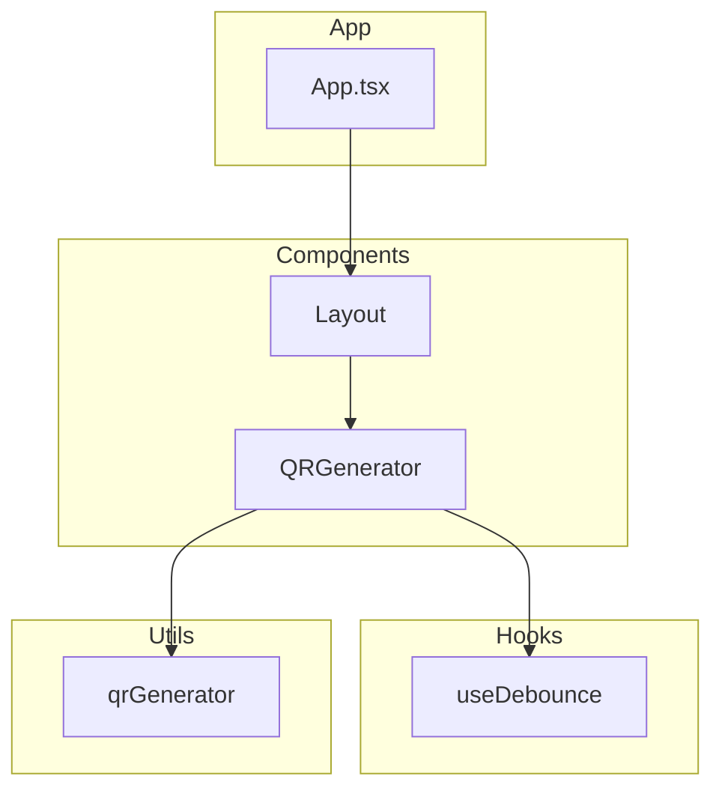
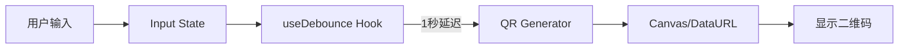

# 技术架构文档

## 项目名称
QR Code Generator - 极简在线二维码生成工具

---

## 1. 技术栈选择

### 1.1 核心技术栈
| 技术 | 版本 | 用途 |
|------|------|------|
| React | 18.x | UI 框架 |
| Vite | 5.x | 构建工具 |
| TypeScript | 5.x | 类型安全 |
| qrcode | 1.5.x | 二维码生成库 |
| CSS Modules | - | 样式隔离 |

### 1.2 开发工具
| 工具 | 用途 |
|------|------|
| ESLint | 代码检查 |
| Prettier | 代码格式化 |

---

## 2. 项目结构

```
qr-generator/
├── public/
│   └── favicon.svg
├── src/
│   ├── components/
│   │   ├── QRGenerator/
│   │   │   ├── index.tsx
│   │   │   └── styles.module.css
│   │   └── Layout/
│   │       ├── index.tsx
│   │       └── styles.module.css
│   ├── hooks/
│   │   └── useDebounce.ts
│   ├── utils/
│   │   └── qrGenerator.ts
│   ├── App.tsx
│   ├── App.css
│   ├── main.tsx
│   └── index.css
├── index.html
├── package.json
├── tsconfig.json
├── vite.config.ts
└── README.md
```

---

## 3. 架构设计

### 3.1 组件架构图



### 3.2 数据流图



### 3.3 核心组件说明

#### QRGenerator 组件
```typescript
interface QRGeneratorProps {
  debounceMs?: number;
  qrSize?: number;
  errorCorrectionLevel?: 'L' | 'M' | 'Q' | 'H';
}
```

**职责:**
- 管理输入状态
- 调用防抖逻辑
- 生成二维码
- 渲染结果

#### useDebounce Hook
```typescript
function useDebounce<T>(value: T, delay: number): T
```

**职责:**
- 延迟值更新
- 避免频繁生成

#### qrGenerator 工具
```typescript
async function generateQRCode(
  text: string,
  options?: QRCodeOptions
): Promise<string>
```

**职责:**
- 调用 qrcode 库
- 返回 Data URL

---

## 4. 状态管理

### 4.1 状态设计
采用 React 内置状态管理，无需额外库：

```typescript
interface AppState {
  inputText: string;
  qrDataUrl: string | null;
  isLoading: boolean;
  error: string | null;
}
```

### 4.2 状态流转
```
inputText (用户输入)
    ↓
debouncedText (防抖后)
    ↓
qrDataUrl (生成结果)
```

---

## 5. 关键实现细节

### 5.1 防抖实现
```typescript
function useDebounce<T>(value: T, delay: number): T {
  const [debouncedValue, setDebouncedValue] = useState(value);
  
  useEffect(() => {
    const timer = setTimeout(() => {
      setDebouncedValue(value);
    }, delay);
    
    return () => clearTimeout(timer);
  }, [value, delay]);
  
  return debouncedValue;
}
```

### 5.2 二维码生成
```typescript
import QRCode from 'qrcode';

async function generateQRCode(text: string): Promise<string> {
  return await QRCode.toDataURL(text, {
    width: 256,
    margin: 2,
    errorCorrectionLevel: 'H',
    color: {
      dark: '#000000',
      light: '#ffffff',
    },
  });
}
```

### 5.3 响应式布局
```css
.container {
  display: flex;
  flex-direction: row;
  gap: 2rem;
}

@media (max-width: 768px) {
  .container {
    flex-direction: column;
  }
}
```

---

## 6. 性能优化

### 6.1 加载优化
- 使用 Vite 的代码分割
- 动态导入大型依赖
- 压缩输出资源

### 6.2 运行时优化
- 防抖避免重复计算
- 使用 Canvas 渲染二维码
- 避免不必要的重渲染

### 6.3 资源优化
- 内联关键 CSS
- 使用 SVG 图标
- 最小化第三方依赖

---

## 7. 安全考虑

### 7.1 客户端安全
- 所有处理在客户端完成
- 不发送数据到服务器
- 无 XSS 风险（无用户输入渲染为 HTML）

### 7.2 依赖安全
- 定期更新依赖
- 使用 `npm audit` 检查漏洞

---

## 8. 部署方案

### 8.1 构建命令
```bash
npm run build
```

### 8.2 输出目录
```
dist/
├── index.html
├── assets/
│   ├── index-[hash].js
│   └── index-[hash].css
```

### 8.3 托管选项
- Vercel
- Netlify
- GitHub Pages
- Cloudflare Pages

---

## 9. 测试策略

### 9.1 单元测试
- useDebounce Hook 测试
- qrGenerator 工具测试

### 9.2 集成测试
- 完整生成流程测试
- 响应式布局测试

### 9.3 E2E 测试
- 用户输入到生成二维码
- 右键保存功能

---

## 10. 监控与日志

### 10.1 错误监控
- 全局错误边界
- Console 错误捕获

### 10.2 性能监控
- Web Vitals 指标
- 生成时间统计

---

## 11. 扩展性设计

### 11.1 未来功能预留
- 自定义二维码颜色
- 自定义二维码大小
- Logo 嵌入功能
- 批量生成功能

### 11.2 架构扩展点
- 插件式功能模块
- 配置化选项
