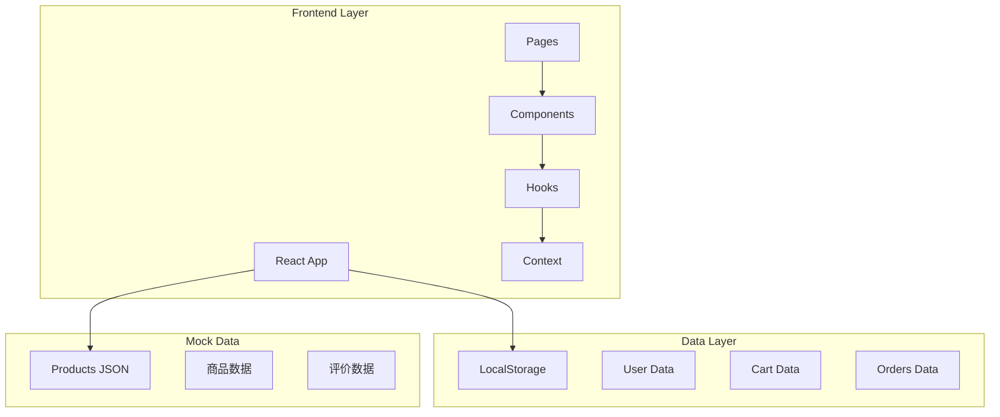
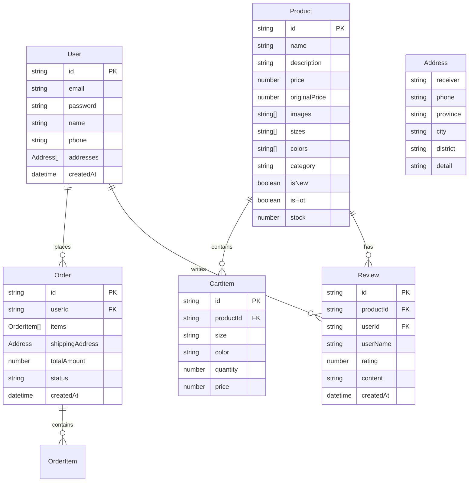
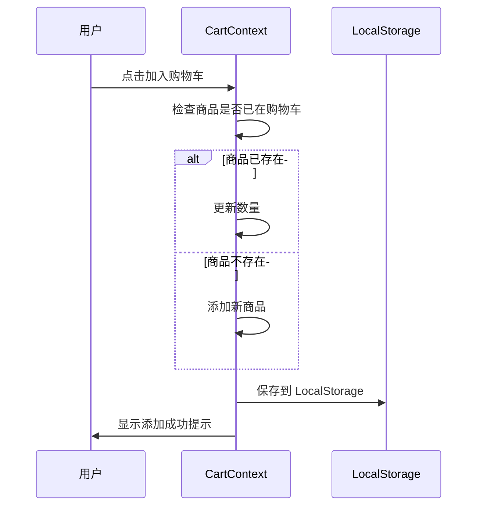
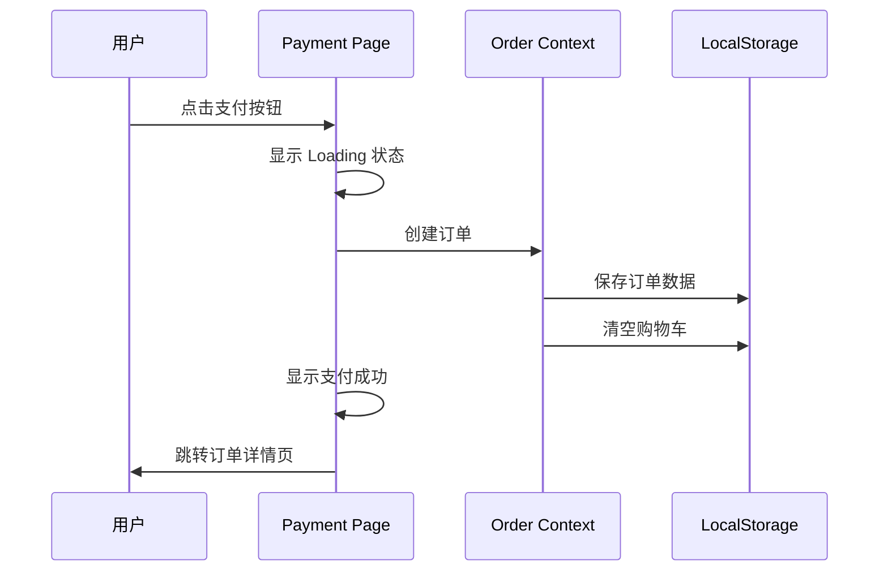

## 1. 架构设计



## 2. 技术说明

- **前端框架**：React@18 + TypeScript
- **样式方案**：Tailwind CSS@3 + CSS Variables
- **构建工具**：Vite
- **路由管理**：React Router@6
- **状态管理**：React Context + useReducer
- **动画库**：Framer Motion
- **图标库**：Lucide React（线性图标）
- **数据存储**：LocalStorage（用户、购物车、订单）
- **Mock数据**：本地 JSON 文件

## 3. 路由定义

| 路由路径 | 页面名称 | 功能描述 |
|----------|----------|----------|
| `/` | 首页 | 轮播图、新品、热销商品展示 |
| `/login` | 登录注册页 | 用户登录、注册功能 |
| `/products` | 商品列表页 | 商品筛选、分类浏览 |
| `/products/:id` | 商品详情页 | 商品详情、评价展示 |
| `/cart` | 购物车页 | 购物车商品管理 |
| `/checkout` | 结算页 | 地址填写、订单确认 |
| `/payment` | 支付页 | Mock支付流程 |
| `/orders` | 订单页 | 历史订单列表 |
| `/orders/:id` | 订单详情页 | 单个订单详情 |
| `/contact` | 联系我们页 | 邮件联系表单 |
| `*` | 空状态页 | 敬请期待提示 |

## 4. 数据模型

### 4.1 数据模型定义



### 4.2 数据类型定义

```typescript
interface User {
  id: string;
  email: string;
  password: string;
  name: string;
  phone?: string;
  addresses: Address[];
  createdAt: string;
}

interface Product {
  id: string;
  name: string;
  description: string;
  price: number;
  originalPrice?: number;
  images: string[];
  sizes: string[];
  colors: { name: string; hex: string }[];
  category: string;
  isNew: boolean;
  isHot: boolean;
  stock: number;
}

interface CartItem {
  id: string;
  productId: string;
  product: Product;
  size: string;
  color: string;
  quantity: number;
}

interface Order {
  id: string;
  userId: string;
  items: OrderItem[];
  shippingAddress: Address;
  totalAmount: number;
  status: 'pending' | 'paid' | 'shipped' | 'delivered';
  createdAt: string;
}

interface OrderItem {
  productId: string;
  productName: string;
  productImage: string;
  size: string;
  color: string;
  quantity: number;
  price: number;
}

interface Review {
  id: string;
  productId: string;
  userId: string;
  userName: string;
  rating: number;
  content: string;
  createdAt: string;
}

interface Address {
  id: string;
  receiver: string;
  phone: string;
  province: string;
  city: string;
  district: string;
  detail: string;
  isDefault: boolean;
}
```

## 5. 项目目录结构

```
src/
├── components/
│   ├── common/
│   │   ├── Button.tsx
│   │   ├── Input.tsx
│   │   ├── Modal.tsx
│   │   ├── Loading.tsx
│   │   └── EmptyState.tsx
│   ├── layout/
│   │   ├── Header.tsx
│   │   ├── Footer.tsx
│   │   ├── MobileNav.tsx
│   │   └── Layout.tsx
│   ├── home/
│   │   ├── HeroCarousel.tsx
│   │   ├── NewArrivals.tsx
│   │   ├── HotProducts.tsx
│   │   └── NewUserPopup.tsx
│   ├── product/
│   │   ├── ProductCard.tsx
│   │   ├── ProductFilter.tsx
│   │   ├── ProductGallery.tsx
│   │   ├── SizeSelector.tsx
│   │   └── ReviewList.tsx
│   ├── cart/
│   │   ├── CartItem.tsx
│   │   └── CartSummary.tsx
│   └── order/
│       ├── OrderCard.tsx
│       └── OrderStatus.tsx
├── pages/
│   ├── Home.tsx
│   ├── Login.tsx
│   ├── Products.tsx
│   ├── ProductDetail.tsx
│   ├── Cart.tsx
│   ├── Checkout.tsx
│   ├── Payment.tsx
│   ├── Orders.tsx
│   ├── OrderDetail.tsx
│   ├── Contact.tsx
│   └── ComingSoon.tsx
├── hooks/
│   ├── useAuth.ts
│   ├── useCart.ts
│   └── useLocalStorage.ts
├── context/
│   ├── AuthContext.tsx
│   └── CartContext.tsx
├── data/
│   ├── products.json
│   └── reviews.json
├── utils/
│   ├── storage.ts
│   └── helpers.ts
├── types/
│   └── index.ts
├── App.tsx
├── main.tsx
└── index.css
```

## 6. 状态管理设计

### 6.1 AuthContext

```typescript
interface AuthState {
  user: User | null;
  isAuthenticated: boolean;
  isLoading: boolean;
}

type AuthAction = 
  | { type: 'LOGIN'; payload: User }
  | { type: 'LOGOUT' }
  | { type: 'SET_LOADING'; payload: boolean }
  | { type: 'UPDATE_USER'; payload: Partial<User> };
```

### 6.2 CartContext

```typescript
interface CartState {
  items: CartItem[];
  totalItems: number;
  totalPrice: number;
}

type CartAction =
  | { type: 'ADD_ITEM'; payload: CartItem }
  | { type: 'REMOVE_ITEM'; payload: string }
  | { type: 'UPDATE_QUANTITY'; payload: { id: string; quantity: number } }
  | { type: 'CLEAR_CART' };
```

## 7. Mock 数据设计

### 7.1 商品数据示例

```json
{
  "products": [
    {
      "id": "1",
      "name": "经典黑色西装外套",
      "description": "优雅剪裁，适合职场与日常穿搭",
      "price": 599,
      "originalPrice": 799,
      "images": ["url1", "url2", "url3"],
      "sizes": ["XS", "S", "M", "L", "XL"],
      "colors": [
        { "name": "黑色", "hex": "#1a1a1a" },
        { "name": "深蓝", "hex": "#1e3a5f" }
      ],
      "category": "外套",
      "isNew": true,
      "isHot": false,
      "stock": 50
    }
  ]
}
```

### 7.2 评价数据示例

```json
{
  "reviews": [
    {
      "id": "1",
      "productId": "1",
      "userId": "user1",
      "userName": "小*美",
      "rating": 5,
      "content": "质量很好，版型正，很满意！",
      "createdAt": "2024-01-15T10:30:00Z"
    }
  ]
}
```

## 8. 关键交互流程

### 8.1 购物车流程



### 8.2 支付流程


