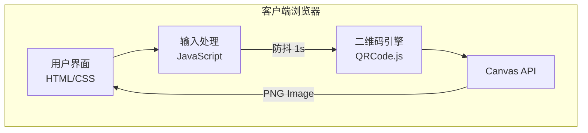
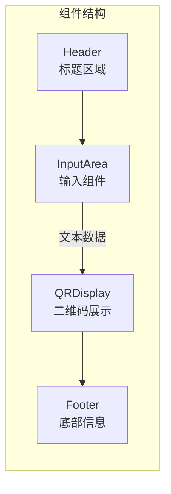
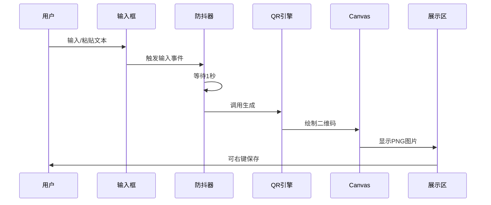

# QR Code Generator - Technical Architecture Document

## 1. System Overview

### 1.1 Architecture Type
Single Page Application (SPA) - 纯前端静态应用

### 1.2 Architecture Diagram



## 2. Technology Stack

### 2.1 Frontend Technologies
| Layer | Technology | Purpose |
|-------|------------|---------|
| Structure | HTML5 | 页面结构 |
| Styling | CSS3 | 视觉样式、动画 |
| Logic | Vanilla JavaScript | 交互逻辑 |
| QR Engine | qrcode.js | 二维码生成 |

### 2.2 External Dependencies
- **qrcode.js** (MIT License)
  - Version: 1.5.3
  - Size: ~15KB minified
  - Source: CDN or embedded

### 2.3 No Backend Required
- 所有处理在客户端完成
- 无服务器依赖
- 无数据库需求

## 3. Component Architecture

### 3.1 Component Structure



### 3.2 Component Details

#### InputArea Component
```javascript
// 职责
- 接收用户输入
- 防抖处理
- 触发生成事件

// 状态
- inputValue: string
- isGenerating: boolean
```

#### QRDisplay Component
```javascript
// 职责
- 渲染二维码
- 提供保存功能
- 错误处理

// 状态
- qrImage: canvas/blob
- error: string | null
```

## 4. Data Flow

### 4.1 Data Flow Diagram



### 4.2 State Management
```javascript
// 应用状态
const state = {
    input: '',           // 用户输入
    isGenerating: false, // 生成状态
    error: null,         // 错误信息
    qrDataUrl: null      // 二维码Data URL
};
```

## 5. API Design

### 5.1 Internal Functions

```javascript
// 核心函数
generateQRCode(text: string): Promise<string>
// 输入: 文本内容
// 输出: Data URL (PNG)

debounce(fn: Function, delay: number): Function
// 输入: 函数、延迟时间
// 输出: 防抖函数

validateInput(text: string): boolean
// 输入: 文本内容
// 输出: 是否有效
```

### 5.2 QRCode.js API Usage

```javascript
// 配置选项
const qrOptions = {
    text: string,           // 编码内容
    width: number,          // 宽度 (px)
    height: number,         // 高度 (px)
    colorDark: string,      // 前景色
    colorLight: string,     // 背景色
    correctLevel: string    // 容错级别
};
```

## 6. File Structure

```
/
├── index.html          # 主页面
├── css/
│   └── style.css       # 样式文件
├── js/
│   └── app.js          # 应用逻辑
└── lib/
    └── qrcode.min.js   # QR库 (可选CDN)
```

## 7. Performance Optimization

### 7.1 Loading Performance
- 单HTML文件内联所有代码
- 无外部请求
- 最小化代码体积

### 7.2 Runtime Performance
- 防抖减少生成次数
- Canvas高效渲染
- 无内存泄漏

### 7.3 Caching Strategy
- 浏览器缓存静态资源
- Service Worker (可选)

## 8. Security Considerations

### 8.1 Client-Side Security
- 无服务器通信，无数据泄露风险
- 输入验证防止XSS
- Content Security Policy

### 8.2 Privacy
- 无用户追踪
- 无数据收集
- 无第三方脚本

## 9. Browser Compatibility

### 9.1 Required APIs
| API | Support |
|-----|---------|
| Canvas 2D | All modern browsers |
| ES6+ | Chrome 80+, Firefox 75+, Safari 13+ |
| CSS Grid | All modern browsers |
| CSS Variables | All modern browsers |

### 9.2 Fallbacks
- 优雅降级处理
- 错误提示友好

## 10. Deployment

### 10.1 Hosting Options
- GitHub Pages
- Netlify
- Vercel
- Any static hosting

### 10.2 Build Process
- 无需构建
- 可选代码压缩

## 11. Testing Strategy

### 11.1 Manual Testing
- 功能测试
- 响应式测试
- 浏览器兼容性测试

### 11.2 Test Cases
| Case | Input | Expected |
|------|-------|----------|
| URL输入 | https://example.com | 生成有效二维码 |
| 纯文本 | Hello World | 生成有效二维码 |
| 空输入 | "" | 无二维码显示 |
| 长文本 | 1000字符 | 正常生成 |
