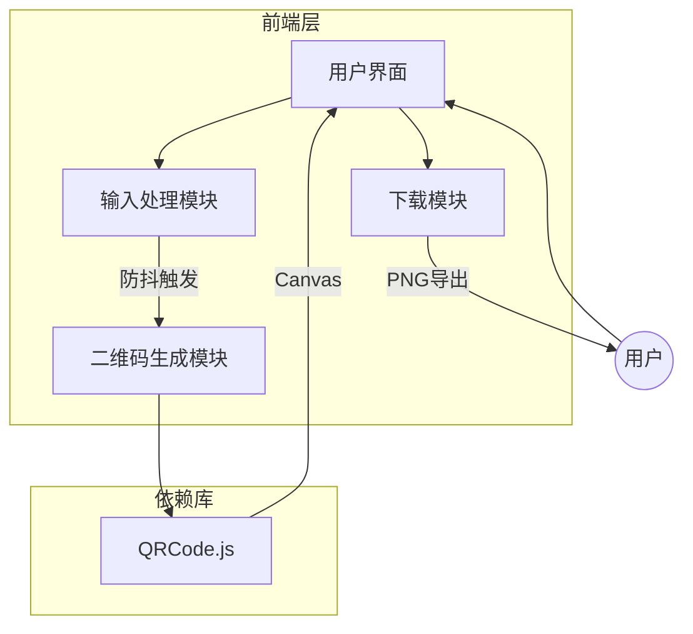
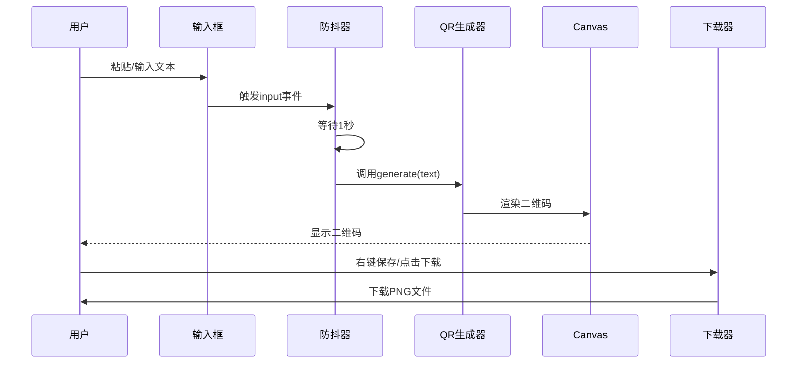
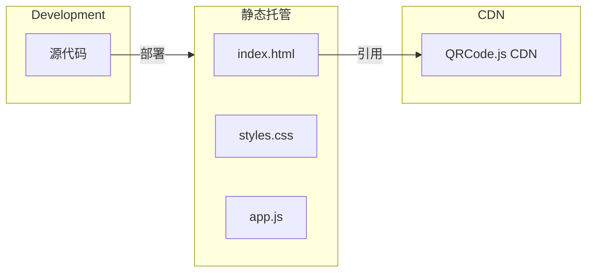

# 技术架构文档

## 项目名称
QR Code Generator - 极简在线二维码生成工具

## 1. 技术架构概览

### 1.1 架构图



### 1.2 技术选型

| 层级 | 技术选择 | 理由 |
|------|---------|------|
| 前端框架 | 无（原生JS） | 极简需求，无需框架 |
| QR生成库 | qrcode.js | 轻量、无依赖、支持Canvas |
| 样式方案 | 原生CSS + CSS变量 | 简单直接，无构建需求 |
| 部署方式 | 静态托管 | 无后端，成本最低 |

## 2. 项目结构

```
/workspace/
├── index.html          # 主页面
├── styles.css          # 样式文件
├── app.js              # 主逻辑
├── lib/
│   └── qrcode.min.js   # QR库（CDN备用）
└── .trae/
    └── documents/      # 文档目录
```

## 3. 核心模块设计

### 3.1 输入处理模块

```javascript
class InputHandler {
    constructor(options) {
        this.debounceDelay = options.debounceDelay || 1000;
        this.onGenerate = options.onGenerate;
        this.debounceTimer = null;
    }
    
    handleInput(text) {
        clearTimeout(this.debounceTimer);
        this.debounceTimer = setTimeout(() => {
            if (text.trim()) {
                this.onGenerate(text);
            }
        }, this.debounceDelay);
    }
}
```

**职责**:
- 监听输入事件
- 实现防抖逻辑
- 触发生成回调

### 3.2 二维码生成模块

```javascript
class QRGenerator {
    constructor(container) {
        this.container = container;
        this.qrInstance = null;
    }
    
    generate(text, options = {}) {
        const defaultOptions = {
            text: text,
            width: 256,
            height: 256,
            colorDark: '#000000',
            colorLight: '#ffffff',
            correctLevel: QRCode.CorrectLevel.H
        };
        
        this.clear();
        this.qrInstance = new QRCode(this.container, {
            ...defaultOptions,
            ...options
        });
    }
    
    clear() {
        if (this.qrInstance) {
            this.qrInstance.clear();
        }
        this.container.innerHTML = '';
    }
}
```

**职责**:
- 调用QR库生成二维码
- 管理Canvas元素
- 处理生成配置

### 3.3 下载模块

```javascript
class DownloadManager {
    static download(canvas, filename = 'qrcode.png') {
        const link = document.createElement('a');
        link.download = filename;
        link.href = canvas.toDataURL('image/png');
        link.click();
    }
    
    static getTimestamp() {
        return new Date().toISOString().replace(/[:.]/g, '-').slice(0, 19);
    }
}
```

**职责**:
- Canvas转PNG
- 触发浏览器下载
- 生成文件名

## 4. 数据流设计



## 5. 样式架构

### 5.1 CSS变量系统

```css
:root {
    --color-bg: #1a1a2e;
    --color-surface: #16213e;
    --color-primary: #0f3460;
    --color-accent: #00d9ff;
    --color-text: #eaeaea;
    --color-text-muted: #8892a0;
    
    --font-mono: 'JetBrains Mono', 'Fira Code', monospace;
    --font-sans: 'Inter', system-ui, sans-serif;
    
    --radius-sm: 8px;
    --radius-md: 16px;
    --radius-lg: 24px;
    
    --shadow-sm: 0 2px 8px rgba(0, 0, 0, 0.3);
    --shadow-md: 0 4px 16px rgba(0, 0, 0, 0.4);
    --shadow-glow: 0 0 20px rgba(0, 217, 255, 0.3);
}
```

### 5.2 响应式断点

```css
/* Mobile First */
/* 默认: 移动端 */

@media (min-width: 768px) {
    /* 平板 */
}

@media (min-width: 1024px) {
    /* 桌面 */
}
```

## 6. 性能优化策略

### 6.1 加载优化
- QR库使用CDN，带本地fallback
- 内联关键CSS
- 延迟加载非关键资源

### 6.2 运行时优化
- 防抖减少不必要的生成
- Canvas复用
- 避免频繁DOM操作

### 6.3 资源大小
| 资源 | 大小 |
|------|------|
| HTML | ~2KB |
| CSS | ~3KB |
| JS | ~2KB |
| QR库 | ~10KB |
| **总计** | **~17KB** |

## 7. 安全考量

### 7.1 前端安全
- 无用户数据收集
- 无第三方追踪
- 无外部API调用
- Content Security Policy (CSP) 配置

### 7.2 CSP配置示例
```html
<meta http-equiv="Content-Security-Policy" content="
    default-src 'self';
    script-src 'self' 'unsafe-inline' cdn.jsdelivr.net;
    style-src 'self' 'unsafe-inline' fonts.googleapis.com;
    font-src fonts.gstatic.com;
    img-src 'self' data:;
">
```

## 8. 浏览器兼容性

| 浏览器 | 最低版本 | 测试状态 |
|--------|---------|---------|
| Chrome | 80+ | ✅ |
| Firefox | 75+ | ✅ |
| Safari | 13+ | ✅ |
| Edge | 80+ | ✅ |

**关键API依赖**:
- Canvas API
- toDataURL()
- URL.createObjectURL()
- ES6+ (箭头函数、模板字符串、解构)

## 9. 部署架构



**推荐托管平台**:
1. GitHub Pages（免费）
2. Vercel（免费，自动HTTPS）
3. Netlify（免费，自动HTTPS）
4. Cloudflare Pages（免费，全球CDN）

## 10. 错误处理

### 10.1 错误类型

| 错误类型 | 处理方式 |
|---------|---------|
| 输入为空 | 不生成，清空二维码 |
| 文本过长 | 提示"文本过长，建议缩短" |
| QR库加载失败 | 显示"服务暂时不可用" |
| Canvas不支持 | 显示"浏览器版本过低" |

### 10.2 错误提示UI
```javascript
class ErrorHandler {
    static show(message, type = 'error') {
        // 显示临时提示，3秒后自动消失
    }
}
```

## 11. 可访问性实现

### 11.1 ARIA标签
```html
<textarea 
    aria-label="输入要生成二维码的文本或链接"
    aria-describedby="input-hint"
/>
<div 
    role="img" 
    aria-label="生成的二维码图片"
/>
<button 
    aria-label="下载二维码图片"
/>
```

### 11.2 键盘导航
- Tab: 焦点在输入框和下载按钮间切换
- Enter: 在输入框内按Enter可立即触发生成
- Space: 按钮激活

## 12. 监控与分析

### 12.1 性能指标
- 使用Performance API监控生成时间
- 上报关键性能指标（可选）

### 12.2 错误监控
- 全局错误捕获
- Console错误拦截（开发模式）
