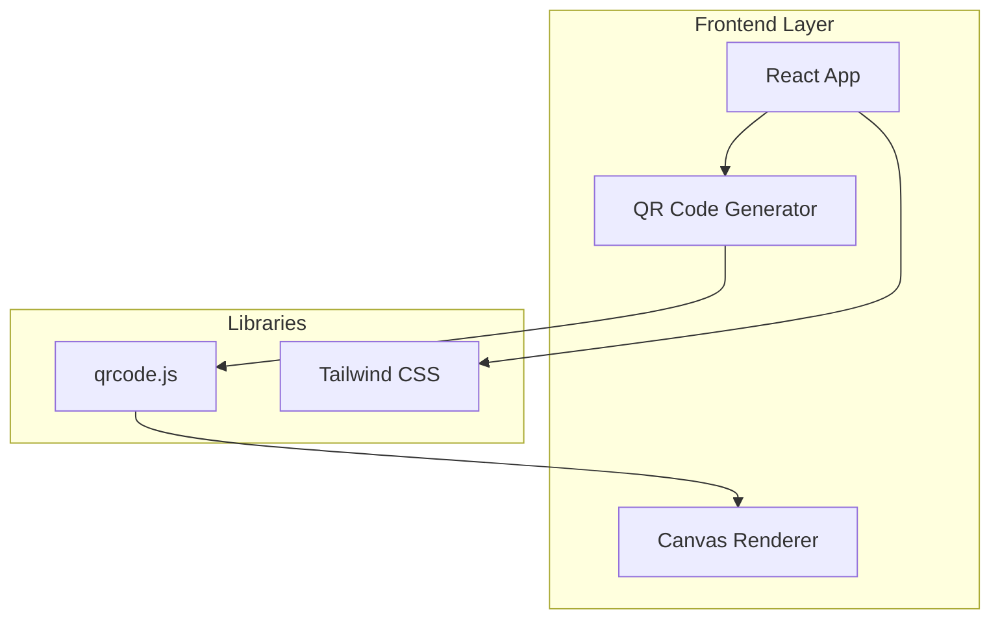
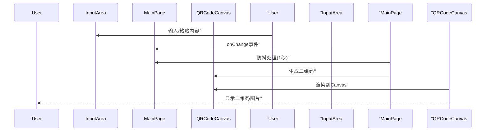

## 1. 架构设计



## 2. 技术说明

- **前端**: React@18 + Tailwind CSS@3 + Vite
- **初始化工具**: Vite (npm create vite@latest)
- **后端**: 无需后端，纯前端应用
- **数据库**: 无需数据库
- **二维码库**: qrcode (npm package) - 纯JavaScript二维码生成库

## 3. 路由定义

| 路由 | 用途 |
|-----|------|
| / | 主页面 - 二维码生成器 |

## 4. API 定义

无需后端API，所有功能在前端完成。

## 5. 核心组件架构

```mermaid
flowchart TD
    "App[App.tsx]" --> "MainPage[MainPage.tsx]"
    "MainPage[MainPage.tsx]" --> "InputArea[InputArea.tsx]"
    "MainPage[MainPage.tsx]" --> "QRCodeDisplay[QRCodeDisplay.tsx]"
    "QRCodeDisplay[QRCodeDisplay.tsx]" --> "QRCodeCanvas[QRCodeCanvas.tsx]"
```

### 5.1 组件说明

| 组件名称 | 功能描述 |
|---------|---------|
| App | 应用根组件，包含全局样式和布局 |
| MainPage | 主页面容器，管理状态和防抖逻辑 |
| InputArea | 输入框组件，处理用户输入 |
| QRCodeDisplay | 二维码展示组件，包含保存提示 |
| QRCodeCanvas | Canvas渲染组件，生成二维码图片 |

## 6. 数据流



## 7. 性能优化策略

- **防抖处理**: 用户停止输入1秒后才生成二维码，避免频繁生成
- **Canvas缓存**: 相同内容不重复生成
- **懒加载**: 无额外依赖，首屏加载极快
- **无外部请求**: 所有处理在本地完成，无网络延迟

## 8. 安全性考虑

- **无数据存储**: 不存储任何用户输入，保护隐私
- **纯前端处理**: 所有计算在浏览器本地完成
- **无第三方追踪**: 不集成任何分析或追踪代码
- **CSP友好**: 可配置严格的内容安全策略
