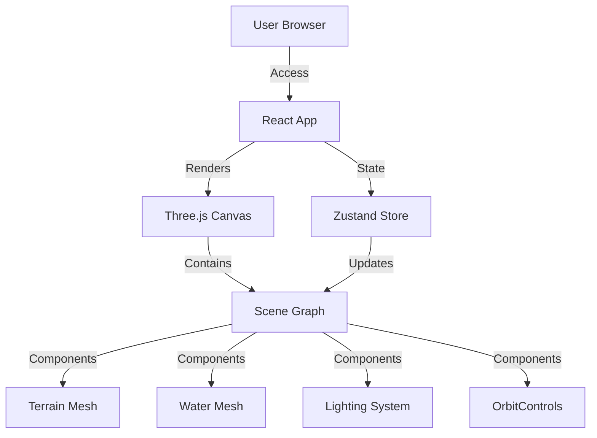

# Technical Architecture Document

## 1. Architecture Design

## 2. Technology Description
- **Frontend**: React 18, Vite, TailwindCSS
- **3D Engine**: Three.js, @react-three/fiber (R3F)
- **Helpers**: @react-three/drei (Controls, Environment, Shaders)
- **State Management**: Zustand (for UI <-> 3D state sync)
- **Styling**: Tailwind CSS (for UI overlay)
- **Math/Noise**: `simplex-noise` (if procedural generation is needed) or custom shaders.

## 3. Route Definitions
| Route | Purpose |
|-------|---------|
| / | Single page application hosting the 3D experience. |

## 4. Component Structure
- `App.tsx`: Main entry, layout.
- `Scene.tsx`: R3F Canvas setup.
- `World/Terrain.tsx`: Mountain geometry with custom shader material (gradients + contours).
- `World/Water.tsx`: River plane with flow shader.
- `World/Lighting.tsx`: Dynamic sun/moon and ambient lights.
- `UI/Overlay.tsx`: HTML controls for interaction.

## 5. Shader Strategy
- **Terrain Shader**: Vertex shader for displacement (optional) or prop-based coloring. Fragment shader for elevation-based gradients and contour line calculation (using `mod` of world Y position).
- **Water Shader**: Distortion based on time for waves/flow.
