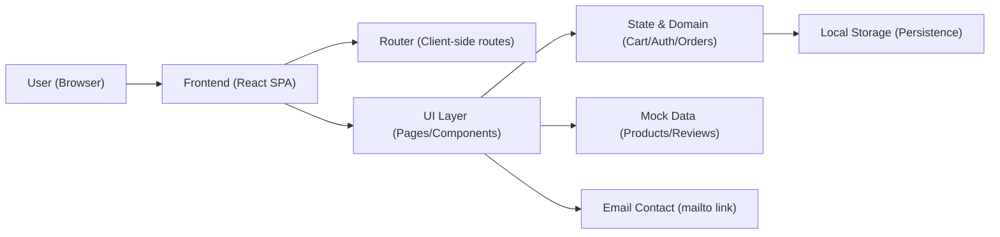
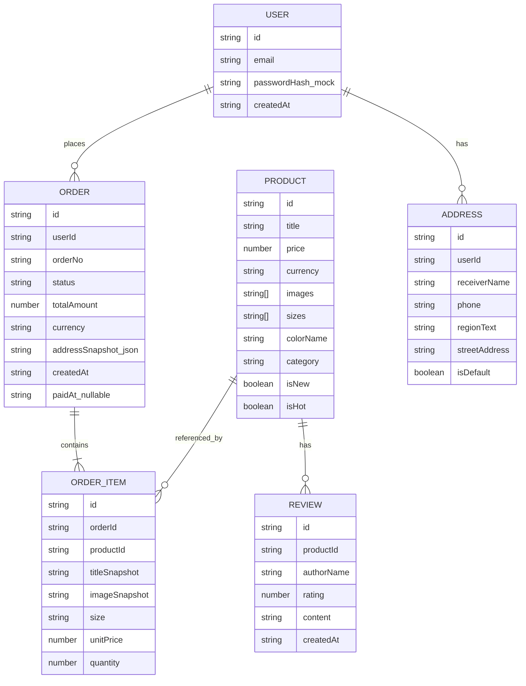

## 1. Architecture Design

## 2. Technology Description
- Frontend: React@18 + TypeScript + tailwindcss@3 + vite
- Routing: react-router-dom（客户端路由）
- State: 轻量状态管理（优先 React Context + useReducer；如复杂再引入小型库）
- Data: 本地 mock 数据（JSON/TS 模块），不依赖外部服务
- Persistence: localStorage（登录态、新用户弹窗状态、购物车、地址、订单）
- Payment: Mock 支付（前端状态机直接将订单置为“已支付”）

## 3. Route Definitions
| Route | Purpose |
|-------|---------|
| / | 首页（轮播、新品、热销、新用户弹窗） |
| /auth | 注册/登录（邮箱） |
| /products | 商品列表（筛选/排序） |
| /products/:id | 商品详情（图集、尺码、评价） |
| /cart | 购物车 |
| /checkout | 下单结算（地址、订单确认） |
| /payment | 支付（Mock） |
| /orders | 历史订单 |
| /orders/:id | 订单详情 |
| /contact | 联系官方（邮件） |
| /coming-soon | 敬请期待（空状态） |
| * | 404（可复用空状态或敬请期待风格） |

## 4. API Definitions
本项目默认无后端服务，页面通过本地 mock 数据与 localStorage 完成闭环。若后续需要接入真实服务，可在不改变路由与领域模型的前提下新增 API 层，并替换 mock 的 repository 实现。

## 5. Server Architecture Diagram
无服务端（SPA 静态部署）。

## 6. Data Model

### 6.1 Data Model Definition

### 6.2 Data Definition Language
无数据库 DDL（使用前端本地存储与 mock 数据）。

