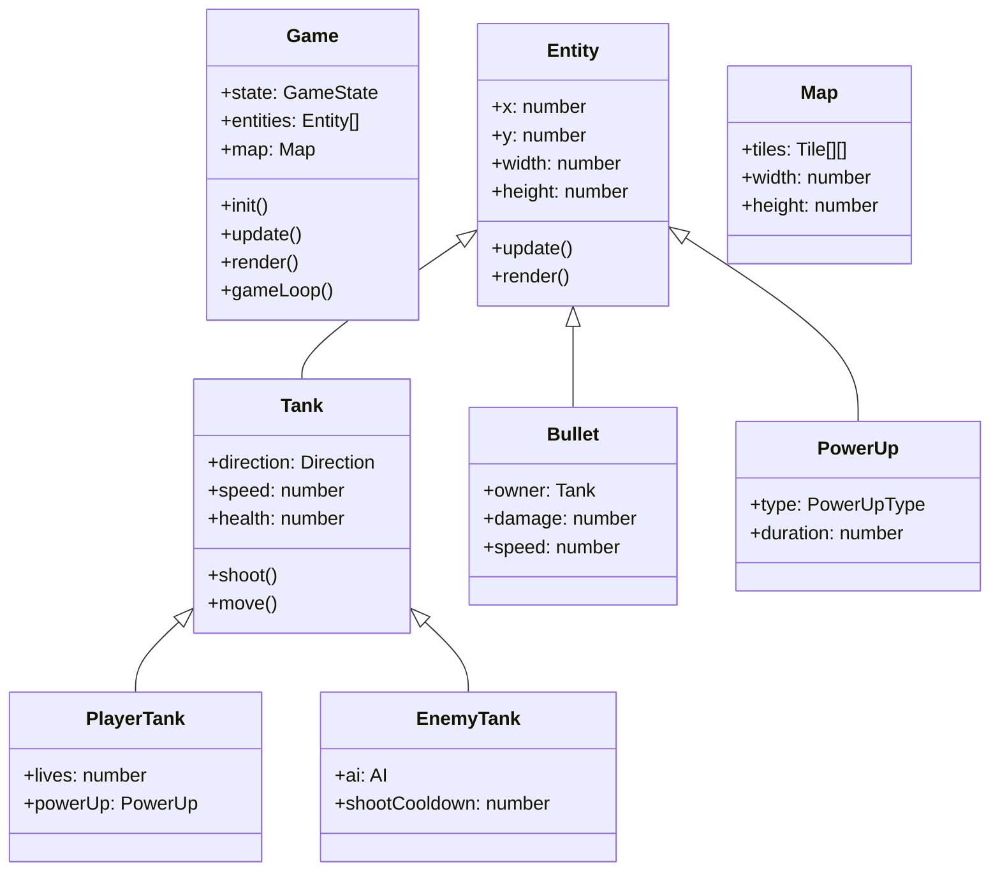
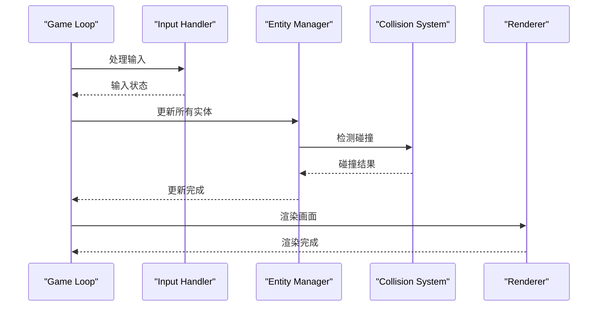

## 1. 架构设计

```mermaid
flowchart TB
    subgraph "Frontend Layer"
        "HTML/CSS"
        "Canvas Renderer"
        "Game Engine"
    end
    
    subgraph "Game Engine"
        "Input Handler"
        "Game Loop"
        "Entity Manager"
        "Collision System"
        "AI System"
    end
    
    subgraph "Data Layer"
        "Game State"
        "localStorage"
    end
    
    "Input Handler" --> "Game Loop"
    "Game Loop" --> "Entity Manager"
    "Entity Manager" --> "Collision System"
    "Collision System" --> "Game State"
    "AI System" --> "Entity Manager"
    "Game State" --> "localStorage"
    "Game Loop" --> "Canvas Renderer"
```

## 2. 技术说明

- **前端**: 纯HTML5 + CSS3 + JavaScript (ES6+)
- **渲染**: Canvas 2D API
- **构建工具**: 无需构建，单文件直接运行
- **后端**: 无
- **数据存储**: localStorage（可选进度保存）

## 3. 代码架构

### 3.1 模块划分

| 模块名称 | 职责 |
|---------|------|
| Game | 游戏主循环、状态管理 |
| Input | 键盘输入处理 |
| Renderer | Canvas渲染 |
| Entity | 游戏实体（坦克、子弹、道具） |
| Map | 地图数据与渲染 |
| Collision | 碰撞检测 |
| AI | 敌方AI行为 |
| UI | 界面显示（菜单、HUD） |

### 3.2 类设计



## 4. 数据结构

### 4.1 地图数据
```javascript
// 地图格子类型
const TILE_TYPES = {
    EMPTY: 0,
    BRICK: 1,    // 砖墙 - 可被摧毁
    IRON: 2,     // 铁墙 - 不可摧毁
    GRASS: 3,    // 草地 - 只遮挡视线
    WATER: 4,    // 水域 - 不可通过（可选）
    BASE: 5      // 基地 - 被摧毁则失败
};

// 地图尺寸：20x20格子，每格32像素 = 640x640像素
```

### 4.2 游戏状态
```javascript
const GameState = {
    MENU: 'menu',
    PLAYING: 'playing',
    PAUSED: 'paused',
    VICTORY: 'victory',
    GAME_OVER: 'game_over'
};
```

### 4.3 方向枚举
```javascript
const Direction = {
    UP: 0,
    RIGHT: 1,
    DOWN: 2,
    LEFT: 3
};
```

## 5. 游戏循环



## 6. 性能优化

### 6.1 渲染优化
- 使用requestAnimationFrame实现流畅动画
- 只渲染可视区域内的实体
- 子弹和爆炸效果使用对象池

### 6.2 碰撞检测优化
- 使用网格划分减少检测次数
- 只检测相邻格子内的碰撞

## 7. 可选功能实现说明

### 7.1 局时限制
```javascript
// 可通过配置开关启用
const CONFIG = {
    timeLimit: 180, // 3分钟（秒）
    enableTimeLimit: false // 默认关闭
};
```

### 7.2 进度保存
```javascript
// localStorage保存格式
const saveData = {
    highScore: 0,
    lastGame: null // 可选：保存当前游戏状态
};
```

### 7.3 难度分层
```javascript
const DIFFICULTY = {
    EASY: {
        enemySpeed: 1,
        enemyShootInterval: 3000,
        enemyCount: 10
    },
    NORMAL: {
        enemySpeed: 1.5,
        enemyShootInterval: 2000,
        enemyCount: 15
    },
    HARD: {
        enemySpeed: 2,
        enemyShootInterval: 1000,
        enemyCount: 20
    }
};
```

## 8. 文件结构

```
index.html
├── <style> CSS样式
├── <canvas> 游戏画布
├── <script> JavaScript代码
│   ├── 配置常量
│   ├── 工具函数
│   ├── 地图模块
│   ├── 实体类
│   ├── 碰撞系统
│   ├── AI系统
│   ├── 渲染器
│   ├── 输入处理
│   ├── UI模块
│   └── 游戏主类
```
