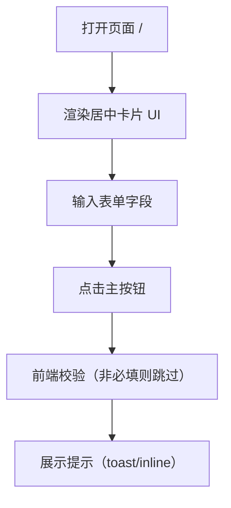

## 1. Product Overview
基于用户提供的参考图片，100%还原对应的单页 Web UI（纯前端）。目标是实现像素级一致的布局、颜色、阴影、圆角、字体层级与表单交互状态。
- 解决问题：快速获得可运行、可复用的 UI 静态实现，用于展示/切图对照/二次开发
- 目标用户：需要前端页面还原与展示的开发者/设计师/产品同学

## 2. Core Features

### 2.1 Feature Module
1. **UI 还原页**：居中卡片式布局（左右分栏）、装饰性背景元素、表单区域、按钮与链接

### 2.2 Page Details
| Page Name | Module Name | Feature description |
|-----------|-------------|---------------------|
| UI 还原页 | 布局容器 | 视口居中，卡片阴影、圆角、内外边距与比例与参考图一致 |
| UI 还原页 | 左侧视觉区 | 深色底+渐变/光斑/圆形装饰，文案/Logo（如参考图存在） |
| UI 还原页 | 右侧表单区 | 标题、副标题、输入框（placeholder/label）、主按钮、辅助链接（如参考图存在） |
| UI 还原页 | 交互状态 | 输入框聚焦描边与阴影、按钮 hover/active、链接 hover，下发简单提示（不接后端） |

## 3. Core Process
用户打开页面 → 看到居中卡片 → 在表单中输入 → 点击主按钮 → 前端展示“已点击/校验结果”的非阻塞提示。

## 4. User Interface Design
### 4.1 Design Style
- 主色：深色蓝黑/靛蓝（左侧视觉区），辅色：白/浅灰（右侧表单区），强调色：紫色按钮与焦点态（以参考图为准）
- 按钮：大圆角矩形，实心填充，轻微阴影或内发光（以参考图为准）
- 字体：优先选用与参考图接近的无衬线字体（如 Poppins / Plus Jakarta Sans），标题更粗更大，正文更轻更小
- 布局：桌面端左右分栏卡片（左视觉、右表单），整体居中；卡片外有柔和投影
- 图形元素：左侧包含圆形/光斑/渐变装饰；右侧保持干净的表单排版

### 4.2 Page Design Overview
| Page Name | Module Name | UI Elements |
|-----------|-------------|-------------|
| UI 还原页 | 卡片 | 两栏比例、圆角、阴影、背景色与分割线（如有） |
| UI 还原页 | 左侧视觉区 | 渐变光斑、圆形装饰、可能的 Logo/标题/说明文字 |
| UI 还原页 | 表单 | 标题/副标题、输入框样式、主按钮样式、辅助链接位置与间距 |
| UI 还原页 | 动效 | 首屏轻微淡入；hover/focus/active 微交互（不影响像素一致性） |

### 4.3 Responsiveness
- Desktop-first：≥1024px 按参考图固定最大宽度与比例渲染
- 768px~1023px：整体等比缩放或减小卡片宽度，保持两栏
- ≤767px：卡片上下堆叠（左视觉区在上），保留圆角与阴影，间距适配触摸

