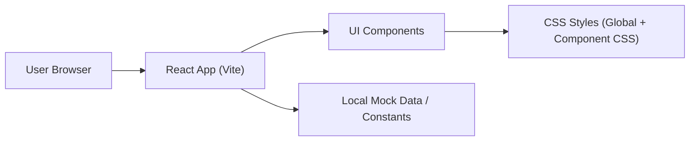

## 1. Architecture Design
纯前端单页应用：本地静态资源 + 组件化 UI + 本地状态（无后端、无持久化）。

## 2. Technology Description
- Frontend: React@18 + TypeScript + Vite + CSS（不依赖后端）
- Styling: 手写 CSS（变量/渐变/阴影/圆角），必要时使用现代 CSS（clamp、aspect-ratio）
- Assets: 内置 SVG/CSS 形状与渐变（优先不引入图片以便像素对齐与可编辑）
- Backend: None

## 3. Route Definitions
| Route | Purpose |
|-------|---------|
| / | 单页 UI 还原展示与基础交互 |

## 4. API Definitions (if backend exists)
无（纯前端，无网络请求；按钮点击仅触发前端提示与校验）。

## 5. Server Architecture Diagram (if backend exists)
无。

## 6. Data Model (if applicable)
无需数据模型；仅包含前端常量与临时表单状态（例如 email/password 文本）。

