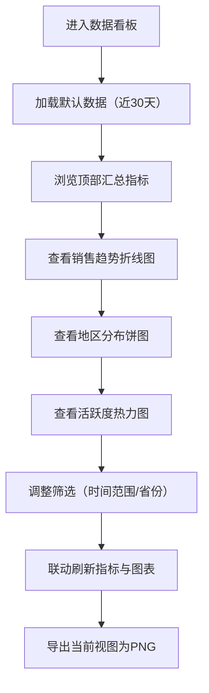

## 1. Product Overview
面向运营/销售团队的网页数据看板，用统一卡片化布局快速洞察近30天销售趋势、地区分布与用户活跃度。
目标是用最少操作完成“发现异常 → 定位原因 → 导出分享”的日常分析闭环。

## 2. Core Features

### 2.1 Feature Module
1. **数据看板页**：顶部汇总指标、销售趋势折线图、地区分布饼图、用户活跃度热力图、筛选与导出

### 2.2 Page Details
| Page Name | Module Name | Feature description |
|-----------|-------------|---------------------|
| 数据看板页 | 顶部汇总指标 | 展示用户数、转化率、日均收入；支持与筛选联动刷新 |
| 数据看板页 | 销售趋势折线图（近30天） | 默认展示近30天日销售额/订单量（可切换）；悬浮提示、峰值标注 |
| 数据看板页 | 地区分布饼图（不同省份） | 展示各省份贡献占比；支持点击图例筛选省份、联动热力图与指标 |
| 数据看板页 | 用户活跃度热力图（日-小时分布） | 7天×24小时或30天×24小时的活跃强度；悬浮提示、颜色阈值自适应 |
| 数据看板页 | 筛选与导出 | 时间范围切换（7/30/90天）；一键刷新；导出当前视图为图片（PNG） |

## 3. Core Process
用户打开看板后，先读顶部指标，再按需切换时间范围与省份维度，最后导出图表用于汇报。

## 4. User Interface Design
### 4.1 Design Style
- 视觉基调：深色“控制室”风格，强调信息密度与可读性；卡片简洁、边界克制、层次清晰
- 主色：深石墨黑（背景）、雾蓝灰（文字）、冷青（强调）、琥珀黄（警示/峰值）
- 组件风格：圆角卡片、细描边、轻量阴影与微弱噪点背景；交互以 hover/press 反馈为主
- 字体建议：标题使用 "Archivo"（更有结构感），正文使用 "Source Sans 3"，数字与指标使用 "Spline Sans Mono"
- 布局：顶部指标三卡横排；下方两列网格（左大右小），热力图占整行或右侧加宽
- 图表风格：统一暗色主题、细网格线、浅色轴线与高对比 tooltip；图例可点击

### 4.2 Page Design Overview
| Page Name | Module Name | UI Elements |
|-----------|-------------|-------------|
| 数据看板页 | 顶部工具条 | 标题、时间范围切换（7/30/90）、刷新按钮、导出按钮 |
| 数据看板页 | 顶部汇总指标 | 3张指标卡（数值+同比/环比小标记），数字使用等宽字体 |
| 数据看板页 | 销售趋势卡片 | 折线图、指标切换（销售额/订单量）、峰值点强调、tooltip |
| 数据看板页 | 地区分布卡片 | 饼图、图例、点击高亮与筛选状态展示 |
| 数据看板页 | 活跃度卡片 | 热力图、颜色刻度条、悬浮提示（日期+小时+活跃值） |

### 4.3 Responsiveness
桌面优先；宽屏为两列栅格（趋势图更大），窄屏自动变为单列纵向堆叠；图表自适应容器宽度并保持可读字号。
