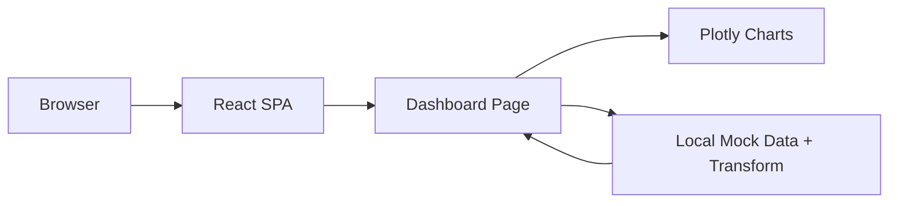
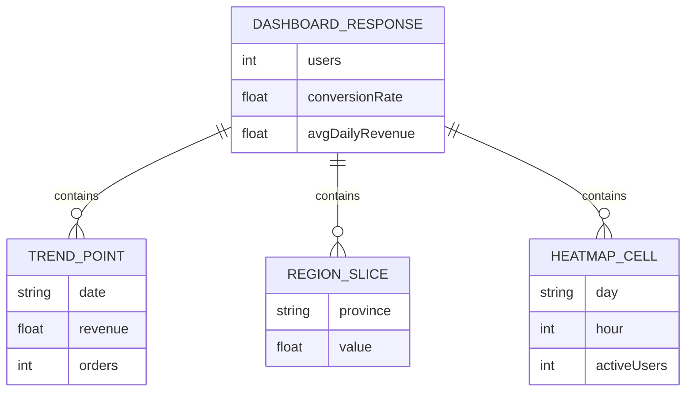

## 1. Architecture Design

## 2. Technology Description
- Frontend: React@18 + TypeScript + tailwindcss@3 + vite
- Charting: plotly.js-dist-min（折线图、饼图、热力图统一实现）
- State: React state（筛选条件、选中省份、指标切换）
- Data: 本地 mock 数据（可替换为真实 API）
- Backend: None

## 3. Route Definitions
| Route | Purpose |
|-------|---------|
| / | 数据看板单页应用入口 |

## 4. API Definitions (if backend exists)
无后端。后续接入时建议提供一个聚合接口：
- GET /api/dashboard?range=30&province=all
  - 返回：kpi、trendSeries、regionBreakdown、activityMatrix

## 5. Server Architecture Diagram (if backend exists)
无

## 6. Data Model (if applicable)
### 6.1 Data Model Definition

### 6.2 Data Definition Language
无数据库。mock 数据通过静态 JSON/TS 常量生成。

## 7. Frontend Structure
- src/pages/Dashboard.tsx：页面布局与交互状态（时间范围、指标切换、选中省份）
- src/components/KpiCard.tsx：统一 KPI 卡片
- src/components/charts/TrendLine.tsx：Plotly 折线图封装
- src/components/charts/RegionPie.tsx：Plotly 饼图封装
- src/components/charts/ActivityHeatmap.tsx：Plotly 热力图封装
- src/lib/mockData.ts：生成/提供 mock 数据与维度映射
- src/styles/theme.css：CSS 变量（颜色、阴影、描边、图表主题）
