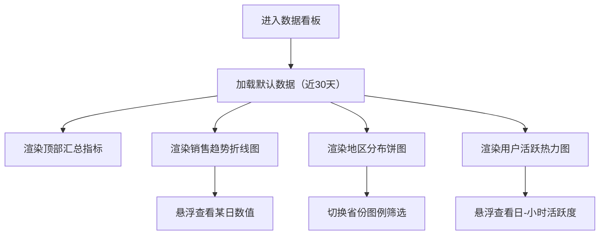

## 1. 产品概述
面向运营/销售团队的网页数据看板，用于快速掌握近30天销售走势、各省份贡献与用户活跃分布。
核心价值：用统一、简洁现代的卡片化视觉，在单页内提供可读性强的关键指标与图表洞察。

## 2. 核心功能

### 2.1 功能模块
1. **数据看板页（Dashboard）**：顶部汇总指标、销售趋势折线图、地区分布饼图、用户活跃度热力图。

### 2.2 页面明细
| 页面名称 | 模块名称 | 功能描述 |
|---|---|---|
| 数据看板页 | 顶部汇总指标 | 展示用户数、转化率、日均收入；支持与下方图表联动的基础时间范围（默认近30天） |
| 数据看板页 | 销售趋势折线图 | 展示近30天每日收入/销售额趋势；支持悬浮提示（日期、数值、环比/同比可选） |
| 数据看板页 | 地区分布饼图 | 展示不同省份收入/订单占比；支持图例开关与悬浮提示（省份、占比、数值） |
| 数据看板页 | 用户活跃度热力图 | 展示“周几 × 小时”活跃强度；支持悬浮提示（日、小时、活跃度）与颜色图例 |

## 3. 核心流程
用户打开看板，先查看顶部关键指标，再通过三张图表进行趋势、结构与时段分布分析；必要时切换时间范围或开关图例以聚焦某些维度。

## 4. 用户界面设计

### 4.1 设计风格
- 视觉方向：深色低饱和背景 + 轻玻璃质感卡片，简洁现代、信息密度适中
- 主色：蓝青系高亮（用于线条、关键数据强调）
- 辅色：中性灰与低饱和分色（用于饼图、热力色阶）
- 字体：标题使用更具展示感的无衬线字体，正文使用可读性强的无衬线字体；数字指标使用等宽或类等宽数字以增强对齐感
- 布局：顶部 KPI 三卡横排；下方 2 列网格（左：折线图，右：饼图；底部横向大卡：热力图）
- 动效：页面加载时卡片与图表轻微上浮淡入；悬浮状态增强边框与阴影

### 4.2 页面设计概览
| 页面名称 | 模块名称 | UI 元素 |
|---|---|---|
| 数据看板页 | 顶部汇总指标 | 3 张 KPI 卡片：标题、主值、辅助说明（较上期变化可选）、小图标；一致的间距与对齐 |
| 数据看板页 | 销售趋势折线图 | 卡片标题区（标题+副标题/时间范围）、Plot 画布、图例、Tooltip |
| 数据看板页 | 地区分布饼图 | 卡片标题区、饼图与图例、Tooltip |
| 数据看板页 | 用户活跃度热力图 | 横向大卡片：标题区、热力图、颜色条、Tooltip |

### 4.3 响应式
- 桌面优先：≥1200px 使用 2 列网格；热力图跨全宽
- 平板：单列堆叠图表，KPI 变为 2+1 或 1 列
- 移动端：KPI 单列；图表标题与图例自动换行，保持可读性
