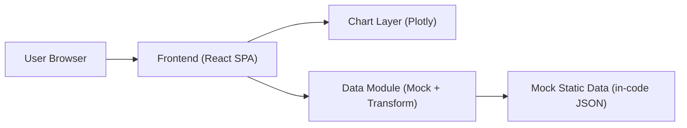
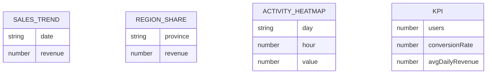

## 1. 架构设计

## 2. 技术说明
- Frontend：React@18 + TypeScript + Vite
- Styling：Tailwind CSS（统一卡片风格、栅格布局、主题变量）
- Charts：Plotly.js + react-plotly.js（折线图、饼图、热力图统一交互与主题）
- 数据：本地 mock（无后端），通过数据转换层生成近30天趋势、各省份占比、日-小时热力矩阵

## 3. 路由定义
| Route | Purpose |
|---|---|
| / | 默认重定向到看板页或直接展示看板 |
| /dashboard | 数据看板页（KPI + 3 图表） |

## 4. API 定义
无后端 API（使用本地 mock 数据）。如未来接入接口，建议保持前端数据层以适配不同口径：
- SalesTrend：[{ date: string, revenue: number }]
- RegionShare：[{ province: string, revenue: number }]
- ActivityHeatmap：{ days: string[], hours: number[], values: number[][] }
- KPI：{ users: number, conversionRate: number, avgDailyRevenue: number }

## 5. 数据模型（前端）

### 5.1 数据模型定义

## 6. 关键实现约束
- 主题一致性：颜色、字体、阴影、边框半径通过 Tailwind 变量/配置统一管理
- 视觉结构：卡片化容器 + 标题区 + 图表区；图表高度固定且可响应式缩放
- 可访问性：对比度达标；KPI 数字与图表标题语义化；Tooltip 作为辅助信息不承载唯一关键信息
